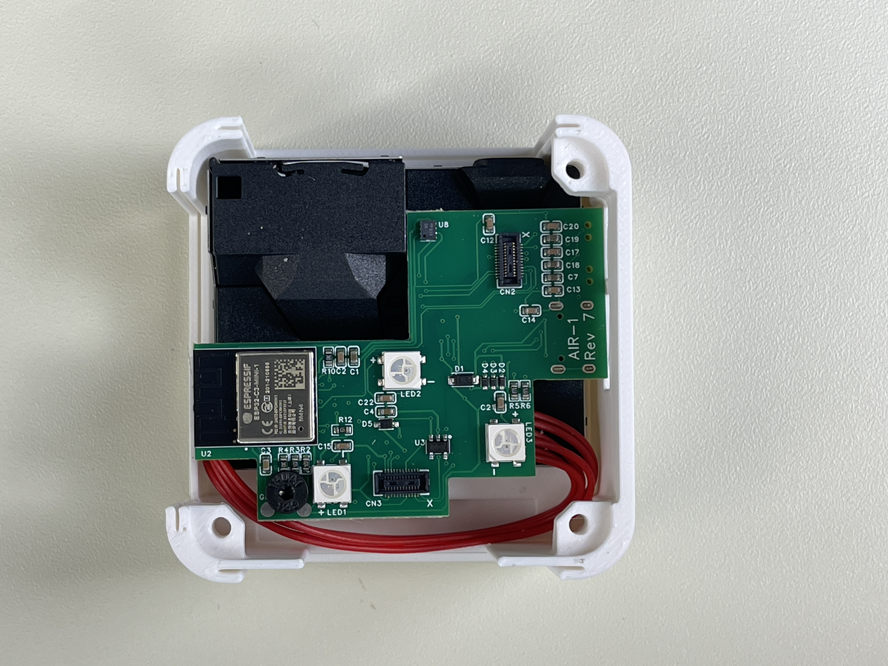
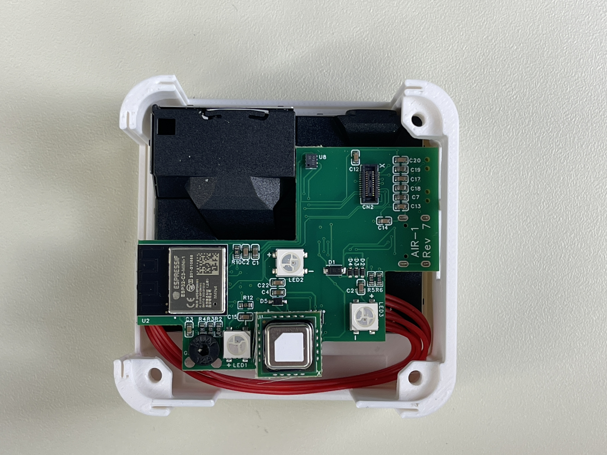

# Adding The SCD40 CO2 Sensor To The AIR-1

1\. Unplug your AIR-1 from power and remove the back

2\. At the bottom center there is a black connector. There is an x in the lower right corner of the connector

3\. Orientate the CO2 module so the white x on the module is also in the lower right and the gold dot is in the upper left as seen below

4\. Align the connector on the back of the CO2 module with the connector on the AIR-1. Once aligned, push down so the CO2 module fully seats itself

5\. Put your AIR-1 cover on. Please refer to our [CO2 calibration guide](https://wiki.apolloautomation.com/products/general/calibrating-and-updating/co2-calibration/ "CO2 Calibration") to calibrate the CO2 module.