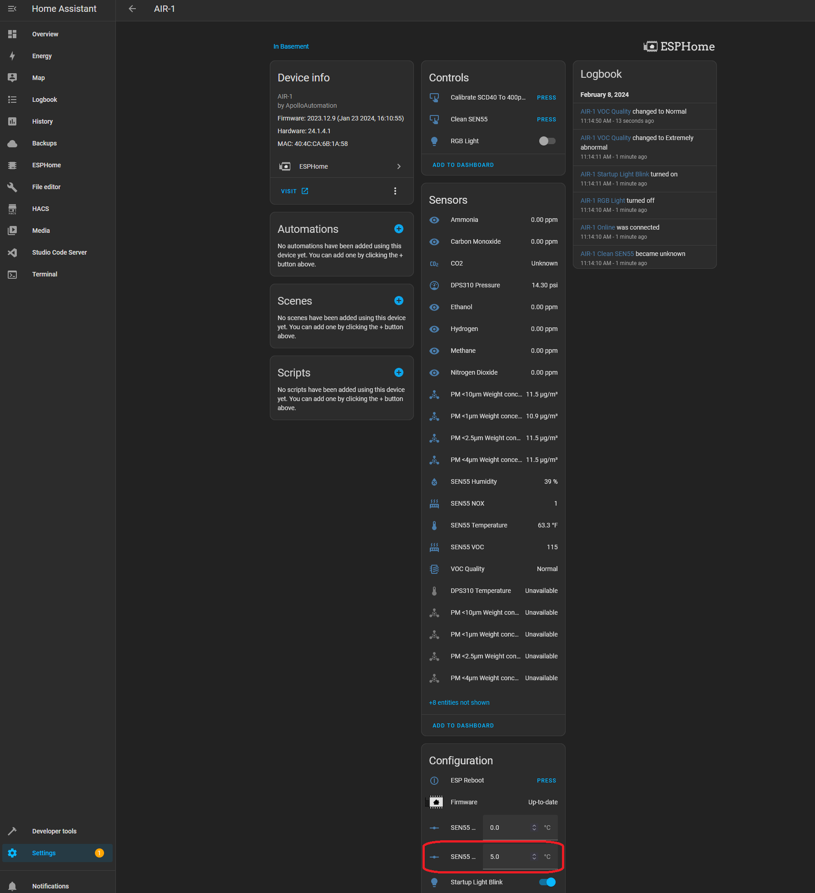
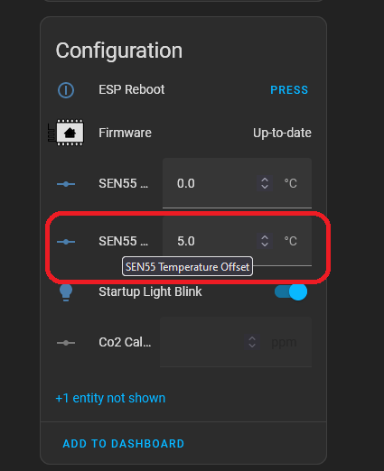

# AIR-1 Temperature Calibration

##### The AIR-1 uses the SEN55 for its temperature reading. Calibrating it to your environment is very similar to the MSR-1. See the link below for the temperature calibration guide.

