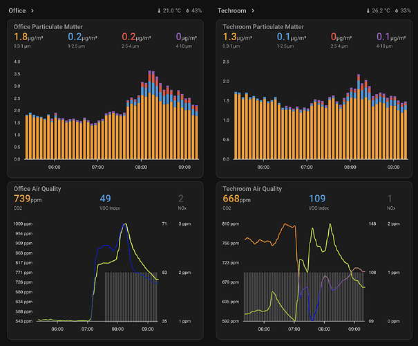
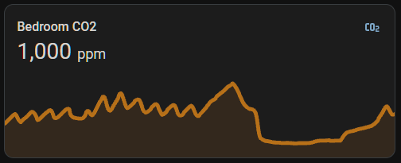
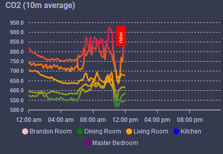
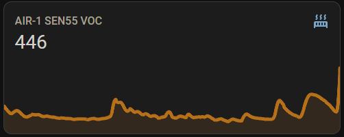
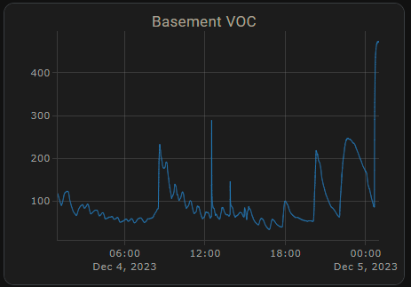
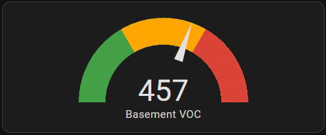

# AIR-1 Home Assistant Dashboard Examples

Really neat dashboard for your AIR-1 by user "keex"!



[https://community.home-assistant.io/t/apollo-air-1-dashboard/785311](https://community.home-assistant.io/t/apollo-air-1-dashboard/785311)

#### **CO2 Charts**

##### Home Assistant Sensor



```yaml
graph: line
type: sensor
entity: sensor.apollo_air_1_a79e38_co2
detail: 2
name: Bedroom CO2
hours_to_show: 24
```

#### Custom: Apexcharts Card



```yaml
type: custom:apexcharts-card
header:
  show: true
  title: CO2 (10m average)
  show_states: true
  colorize_states: true
graph_span: 24h
experimental:
  color_threshold: true
span:
  start: day
now:
  show: true
  label: now
  color: red
series:
  - entity: sensor.apollo_air_1_co2
    name: Brandon Room
    color: Pink
    stroke_width: 3
    fill_raw: last
    extend_to: now
    show:
      in_header: false
      legend_value: false
    group_by:
      func: avg
      duration: 10min
    color_threshold:
      - color: "#DE2349"
        value: 850
      - color: "#FFA500"
        value: 650
      - color: "#008055"
        value: 500
      - color: "#008000"
        value: 0
  - entity: sensor.dining_room_mmwave_sensor_co2
    name: Dining Room
    color: Green
    opacity: 1
    stroke_width: 3
    fill_raw: last
    extend_to: now
    show:
      in_header: false
      legend_value: false
    group_by:
      func: avg
      duration: 10min
    color_threshold:
      - color: "#DE2349"
        value: 850
      - color: "#FFA500"
        value: 650
      - color: "#008055"
        value: 500
      - color: "#008000"
        value: 0
  - entity: sensor.living_room_air_1_co2
    name: Living Room
    color: Orange
    opacity: 1
    stroke_width: 3
    fill_raw: last
    extend_to: now
    show:
      in_header: false
      legend_value: false
    group_by:
      func: avg
      duration: 10min
    color_threshold:
      - color: "#DE2349"
        value: 850
      - color: "#FFA500"
        value: 650
      - color: "#008055"
        value: 500
      - color: "#008000"
        value: 0
  - entity: sensor.kitchen_air_1_co2
    name: Kitchen
    color: Blue
    opacity: 1
    stroke_width: 3
    fill_raw: last
    extend_to: now
    show:
      in_header: false
      legend_value: false
    group_by:
      func: avg
      duration: 10min
    color_threshold:
      - color: "#DE2349"
        value: 850
      - color: "#FFA500"
        value: 650
      - color: "#008055"
        value: 500
      - color: "#008000"
        value: 0
  - entity: sensor.master_bedroom_air_1_co2
    name: Master Bedroom
    color: Purple
    opacity: 1
    stroke_width: 3
    fill_raw: last
    extend_to: now
    show:
      in_header: false
      legend_value: false
    group_by:
      func: avg
      duration: 10min
    color_threshold:
      - color: "#DE2349"
        value: 850
      - color: "#FFA500"
        value: 650
      - color: "#008055"
        value: 500
      - color: "#008000"
        value: 0
```

##### Custom: Plotly Graph Card


```plaintext
type: custom:plotly-graph
entities:
  - entity: sensor.apollo_air_1_a79e38_co2
hours_to_show: 24
refresh_interval: 10
title: Bedroom CO2
```

##### Home Assistant Guage


```plaintext
type: gauge
entity: sensor.apollo_air_1_a79e38_co2
needle: true
unit: ppm
min: 0
max: 3000
severity:
  green: 0
  yellow: 1000
  red: 2000
```

#### **VOC Charts**

##### Home Assistant Sensor



```
graph: line
type: sensor
detail: 2
entity: sensor.apollo_air_1_6b1a58_sen55_voc
hours_to_show: 24
name: Basement VOC
```

##### Custom: Plotly Graph Card



```
type: custom:plotly-graph
entities:
  - entity: sensor.apollo_air_1_6b1a58_sen55_voc
hours_to_show: 24
refresh_interval: 10
title: Basement VOC
```

##### Home Assistant Guage



```
type: gauge
entity: sensor.apollo_air_1_6b1a58_sen55_voc
name: Basement VOC
severity:
  green: 0
  yellow: 150
  red: 350
needle: true
min: 0
max: 500
```