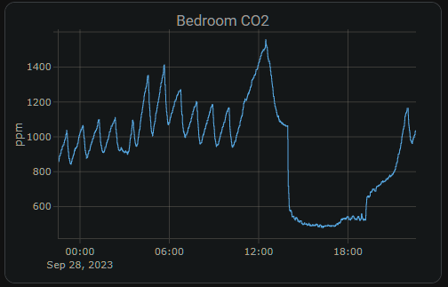

# AIR-1 Home Assistant Dashboard Examples

Really neat dashboard for your AIR-1 by user "keex"!

[https://community.home-assistant.io/t/apollo-air-1-dashboard/785311](https://community.home-assistant.io/t/apollo-air-1-dashboard/785311)

#### **CO2 Charts**

##### Home Assistant Sensor


```plaintext
graph: line
type: sensor
entity: sensor.apollo_air_1_a79e38_co2
detail: 2
name: Bedroom CO2
hours_to_show: 24
```

##### Custom: Plotly Graph Card



```plaintext
type: custom:plotly-graph
entities:
  - entity: sensor.apollo_air_1_a79e38_co2
hours_to_show: 24
refresh_interval: 10
title: Bedroom CO2
```

##### Home Assistant Guage


```plaintext
type: gauge
entity: sensor.apollo_air_1_a79e38_co2
needle: true
unit: ppm
min: 0
max: 3000
severity:
  green: 0
  yellow: 1000
  red: 2000
```

#### **VOC Charts**

##### Home Assistant Sensor


```
graph: line
type: sensor
detail: 2
entity: sensor.apollo_air_1_6b1a58_sen55_voc
hours_to_show: 24
name: Basement VOC
```

##### Custom: Plotly Graph Card


```
type: custom:plotly-graph
entities:
  - entity: sensor.apollo_air_1_6b1a58_sen55_voc
hours_to_show: 24
refresh_interval: 10
title: Basement VOC
```

##### Home Assistant Guage


```
type: gauge
entity: sensor.apollo_air_1_6b1a58_sen55_voc
name: Basement VOC
severity:
  green: 0
  yellow: 150
  red: 350
needle: true
min: 0
max: 500
```