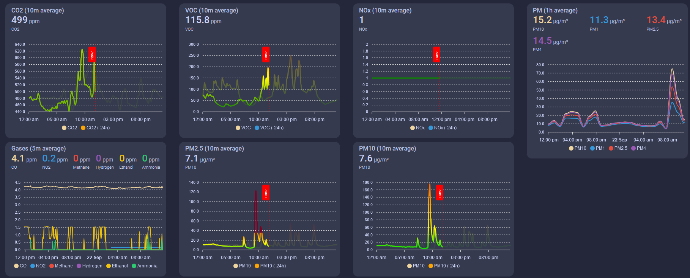
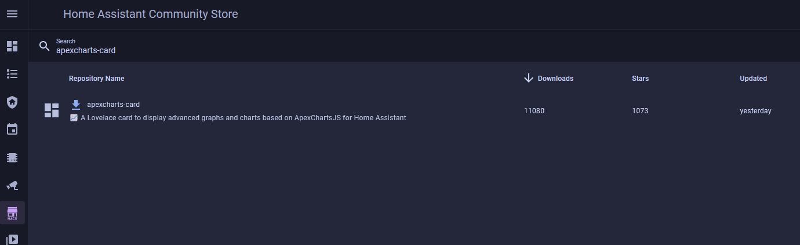
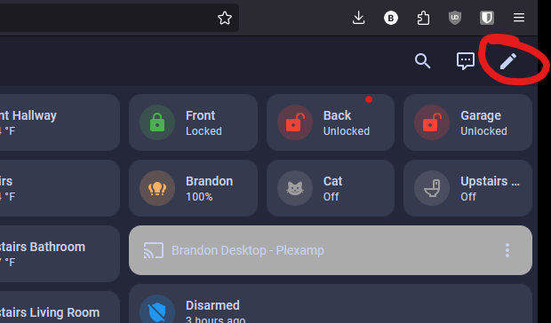
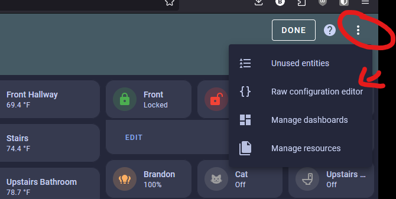
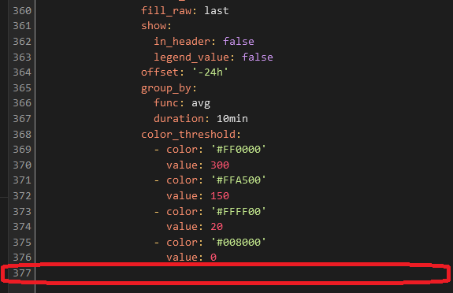
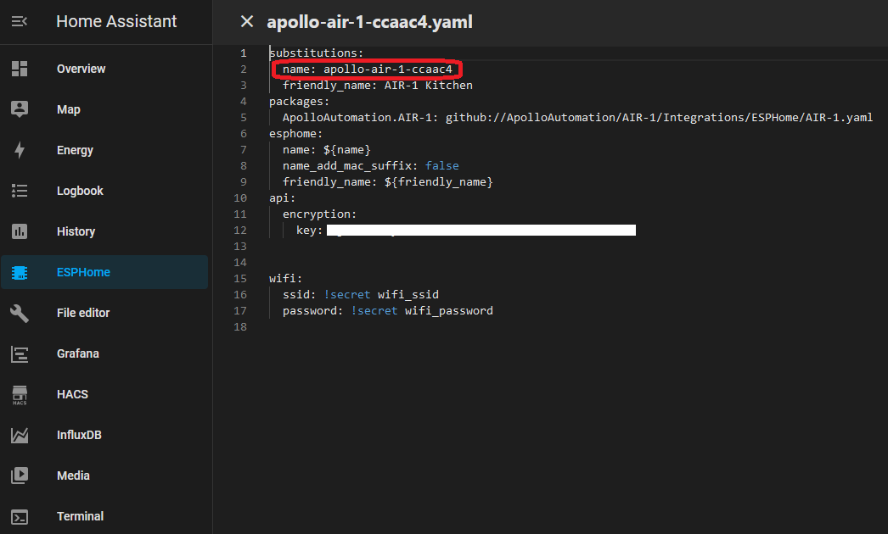
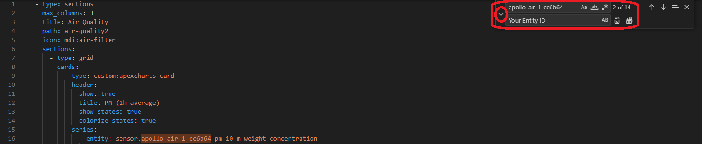
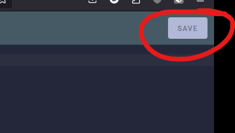
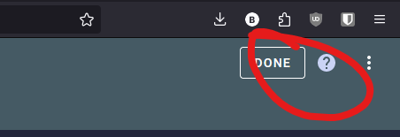
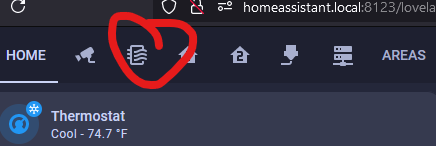

# Firstof9's AIR-1 Apex Charts Dashboard

Firstof9 has created this beautiful responsive dashboard with [Apexcharts-card](https://github.com/RomRider/apexcharts-card "ApexCharts-card") custom card from [HACS](https://hacs.xyz/ "Home Assistant Community Store")!

The colors will change as severity levels change for each of the sensors below.



This guide assumes you already have HACS installed. If you do not, please first [install HACS](https://hacs.xyz/docs/setup/prerequisites "Install HACS").

First, you need to install apexcharts-card by going to the HACS tab and searching "apexcharts-card".



Once downloaded, it is ready to be used for dashboards!

Next, you need to edit the dashboards here.



!!! danger "WARNING YOU ARE ABOUT TO BE ABLE TO WIPE OUT ALL YOUR DASHBOARDS PROCEED WITH CAUTION."

    You are entering an area where if you copy/paste to the wrong place you could delete other dashboards so please be careful!

Now choose "raw configuration editor"



Now you need to be VERY careful. You are editing all of your dashboards but we can avoid issues by scrolling to the very bottom and then copying and pasting the code seen below. (Picture below shows where we will paste the code) (Code below)



**Be sure to change the entity ID to match your device or else the card will not work.** You can find your entity ID by going to the ESPHome Device Builder and selecting the Edit option.



The easiest way to change all of the entity IDs in the code is by using AI (ChatGPT etc.) or by using a code editor like Visual Studio Code (VSC). In VSC you can Find (ctrl+f) the old ID and Replace (select the small arrow to toggle open the Replace box) it with your ID. Now you are ready to copy the code into the Raw configurator editor. (See code below)

VSC Find/Replace



**This is the code!**

```yaml
  - type: sections
    max_columns: 3
    title: Air Quality
    path: air-quality
    icon: mdi:air-filter
    sections:
      - type: grid
        cards:
          - type: custom:apexcharts-card
            header:
              show: true
              title: PM (1h average)
              show_states: true
              colorize_states: true
            series:
              - entity: sensor.downstairs_air_sensor_pm_10_m_weight_concentration
                name: PM10
                stroke_width: 2
                group_by:
                  func: avg
                  duration: 1h
                show:
                  legend_value: false
              - entity: sensor.downstairs_air_sensor_pm_1_m_weight_concentration
                name: PM1
                stroke_width: 2
                group_by:
                  func: avg
                  duration: 1h
                show:
                  legend_value: false
              - entity: sensor.downstairs_air_sensor_pm_2_5_m_weight_concentration
                name: PM2.5
                stroke_width: 2
                group_by:
                  func: avg
                  duration: 1h
                show:
                  legend_value: false
              - entity: sensor.downstairs_air_sensor_pm_4_m_weight_concentration
                name: PM4
                stroke_width: 2
                group_by:
                  func: avg
                  duration: 1h
                show:
                  legend_value: false
          - type: custom:apexcharts-card
            header:
              show: true
              title: PM10 (10m average)
              show_states: true
              colorize_states: true
            graph_span: 24h
            experimental:
              color_threshold: true
            span:
              start: day
            now:
              show: true
              label: now
              color: red
            series:
              - entity: sensor.downstairs_air_sensor_pm_10_m_weight_concentration
                name: PM10
                stroke_width: 3
                fill_raw: last
                extend_to: now
                show:
                  legend_value: false
                  header_color_threshold: true
                group_by:
                  func: avg
                  duration: 10min
                color_threshold:
                  - color: rgb(126,0,35)
                    value: 425
                  - color: rgb(143,63,151)
                    value: 355
                  - color: rgb(255,0,0)
                    value: 255
                  - color: rgb(255,126,0)
                    value: 155
                  - color: rgb(255,255,0)
                    value: 55
                  - color: rgb(0,228,0)
                    value: 0
              - entity: sensor.downstairs_air_sensor_pm_10_m_weight_concentration
                name: PM10
                color: orange
                opacity: 0.3
                stroke_width: 3
                fill_raw: last
                show:
                  in_header: false
                  legend_value: false
                offset: '-24h'
                group_by:
                  func: avg
                  duration: 10min
                color_threshold:
                  - color: rgb(126,0,35)
                    value: 425
                  - color: rgb(143,63,151)
                    value: 355
                  - color: rgb(255,0,0)
                    value: 255
                  - color: rgb(255,126,0)
                    value: 155
                  - color: rgb(255,255,0)
                    value: 55
                  - color: rgb(0,228,0)
                    value: 0
      - type: grid
        cards:
          - type: custom:apexcharts-card
            header:
              show: true
              title: PM2.5 (10m average)
              show_states: true
              colorize_states: true
            graph_span: 24h
            experimental:
              color_threshold: true
            span:
              start: day
            now:
              show: true
              label: now
              color: red
            series:
              - entity: sensor.downstairs_air_sensor_pm_2_5_m_weight_concentration
                name: PM2.5
                stroke_width: 3
                fill_raw: last
                extend_to: now
                show:
                  legend_value: false
                  header_color_threshold: true
                group_by:
                  func: avg
                  duration: 10min
                color_threshold:
                  - color: rgb(126,0,35)
                    value: 250.5
                  - color: rgb(143,63,151)
                    value: 150.5
                  - color: rgb(255,0,0)
                    value: 55.5
                  - color: rgb(255,126,0)
                    value: 35.5
                  - color: rgb(255,255,0)
                    value: 12.1
                  - color: rgb(0,228,0)
                    value: 0
              - entity: sensor.downstairs_air_sensor_pm_2_5_m_weight_concentration
                name: PM10
                color: orange
                opacity: 0.3
                stroke_width: 3
                fill_raw: last
                show:
                  in_header: false
                  legend_value: false
                offset: '-24h'
                group_by:
                  func: avg
                  duration: 10min
                color_threshold:
                  - color: rgb(126,0,35)
                    value: 250.5
                  - color: rgb(143,63,151)
                    value: 150.5
                  - color: rgb(255,0,0)
                    value: 55.5
                  - color: rgb(255,126,0)
                    value: 35.5
                  - color: rgb(255,255,0)
                    value: 12.1
                  - color: rgb(0,228,0)
                    value: 0
          - type: custom:apexcharts-card
            header:
              show: true
              title: CO2 (10m average)
              show_states: true
              colorize_states: true
            graph_span: 24h
            experimental:
              color_threshold: true
            span:
              start: day
            now:
              show: true
              label: now
              color: red
            series:
              - entity: sensor.downstairs_air_sensor_co2
                name: CO2
                stroke_width: 3
                fill_raw: last
                extend_to: now
                show:
                  legend_value: false
                  header_color_threshold: true
                group_by:
                  func: avg
                  duration: 10min
                color_threshold:
                  - color: '#FF0000'
                    value: 5000
                  - color: '#FFA500'
                    value: 2000
                  - color: '#FFFF00'
                    value: 1000
                  - color: '#008000'
                    value: 0
              - entity: sensor.downstairs_air_sensor_co2
                name: CO2
                color: orange
                opacity: 0.3
                stroke_width: 3
                fill_raw: last
                show:
                  in_header: false
                  legend_value: false
                offset: '-24h'
                group_by:
                  func: avg
                  duration: 10min
                color_threshold:
                  - color: '#FF0000'
                    value: 5000
                  - color: '#FFA500'
                    value: 2000
                  - color: '#FFFF00'
                    value: 1000
                  - color: '#008000'
                    value: 0
      - type: grid
        cards:
          - type: custom:apexcharts-card
            header:
              show: true
              title: VOC (10m average)
              show_states: true
              colorize_states: true
            experimental:
              color_threshold: true
            graph_span: 24h
            span:
              start: day
            now:
              show: true
              label: now
              color: red
            series:
              - entity: sensor.downstairs_air_sensor_sen55_voc
                name: VOC
                stroke_width: 3
                show:
                  legend_value: false
                  header_color_threshold: true
                extend_to: now
                fill_raw: last
                group_by:
                  func: avg
                  duration: 10min
                  fill: last
                color_threshold:
                  - color: '#FF0000'
                    value: 400
                  - color: '#FFA500'
                    value: 250
                  - color: '#FFFF00'
                    value: 150
                  - color: '#008000'
                    value: 0
              - entity: sensor.downstairs_air_sensor_sen55_voc
                name: VOC
                opacity: 0.5
                stroke_width: 3
                fill_raw: last
                show:
                  in_header: false
                  legend_value: false
                offset: '-24h'
                group_by:
                  func: avg
                  duration: 10min
                  fill: last
                color_threshold:
                  - color: '#FF0000'
                    value: 400
                  - color: '#FFA500'
                    value: 250
                  - color: '#FFFF00'
                    value: 150
                  - color: '#008000'
                    value: 0
          - type: custom:apexcharts-card
            header:
              show: true
              title: NOx (10m average)
              show_states: true
              colorize_states: true
            experimental:
              color_threshold: true
            graph_span: 24h
            span:
              start: day
            now:
              show: true
              label: now
              color: red
            series:
              - entity: sensor.downstairs_air_sensor_sen55_nox
                name: NOx
                show:
                  legend_value: false
                  header_color_threshold: true
                stroke_width: 3
                fill_raw: last
                extend_to: now
                group_by:
                  func: avg
                  duration: 10min
                color_threshold:
                  - color: '#FF0000'
                    value: 300
                  - color: '#FFA500'
                    value: 150
                  - color: '#FFFF00'
                    value: 20
                  - color: '#008000'
                    value: 0
              - entity: sensor.downstairs_air_sensor_sen55_nox
                name: NOx
                opacity: 0.5
                stroke_width: 3
                fill_raw: last
                show:
                  in_header: false
                  legend_value: false
                offset: '-24h'
                group_by:
                  func: avg
                  duration: 10min
                color_threshold:
                  - color: '#FF0000'
                    value: 300
                  - color: '#FFA500'
                    value: 150
                  - color: '#FFFF00'
                    value: 20
                  - color: '#008000'
                    value: 0
          - type: conditional
            conditions:
              - condition: or
                conditions:
                  - condition: numeric_state
                    entity: sensor.downstairs_air_sensor_nitrogen_dioxide
                    above: 0
                  - condition: numeric_state
                    entity: sensor.downstairs_air_sensor_methane
                    above: 0
                  - condition: numeric_state
                    entity: sensor.downstairs_air_sensor_hydrogen
                    above: 0
                  - condition: numeric_state
                    entity: sensor.downstairs_air_sensor_ethanol
                    above: 0
                  - condition: numeric_state
                    entity: sensor.downstairs_air_sensor_carbon_monoxide
                    above: 0
                  - condition: numeric_state
                    entity: sensor.downstairs_air_sensor_ammonia
                    above: 0
            card:
              type: custom:apexcharts-card
              header:
                show: true
                title: Gases (5m average)
                show_states: true
                colorize_states: true
              series:
                - entity: sensor.downstairs_air_sensor_carbon_monoxide
                  name: CO
                  stroke_width: 2
                  group_by:
                    func: avg
                    duration: 5m
                  show:
                    legend_value: false
                - entity: sensor.downstairs_air_sensor_nitrogen_dioxide
                  name: NO2
                  stroke_width: 2
                  group_by:
                    func: avg
                    duration: 5m
                  show:
                    legend_value: false
                - entity: sensor.downstairs_air_sensor_methane
                  name: Methane
                  stroke_width: 2
                  group_by:
                    func: avg
                    duration: 5m
                  show:
                    legend_value: false
                - entity: sensor.downstairs_air_sensor_hydrogen
                  name: Hydrogen
                  stroke_width: 2
                  group_by:
                    func: avg
                    duration: 5m
                  show:
                    legend_value: false
                - entity: sensor.downstairs_air_sensor_ethanol
                  name: Ethanol
                  stroke_width: 2
                  group_by:
                    func: avg
                    duration: 5m
                  show:
                    legend_value: false
                - entity: sensor.downstairs_air_sensor_ammonia
                  name: Ammonia
                  stroke_width: 2
                  group_by:
                    func: avg
                    duration: 5m
                  show:
                    legend_value: false
            layout_options:
              grid_columns: 4
              grid_rows: 6
```

Now click save in the top right and remember to not hit any buttons or make any other edits before saving!



Finally hit "done" in the top right.



Hit F5 on your keyboard or refresh your browser and then look for your new "Air Icon" as a new dashboard option and click on it!



Lastly, we do want to thank [firstof9](https://github.com/firstof9 "Thank firstof9") for creating this dashboard and sharing it.