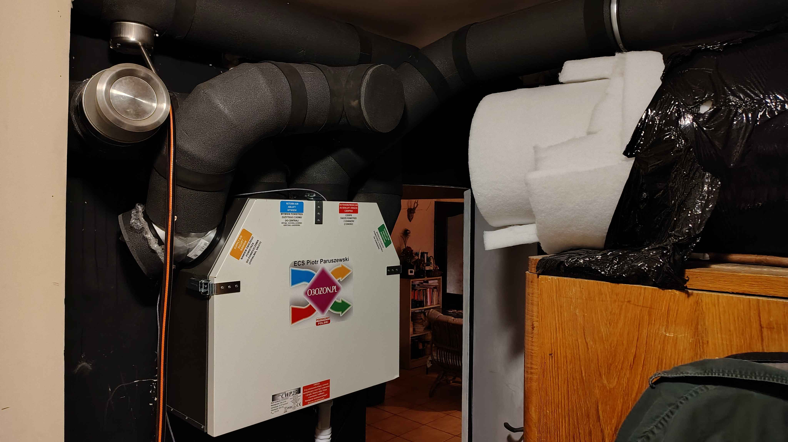
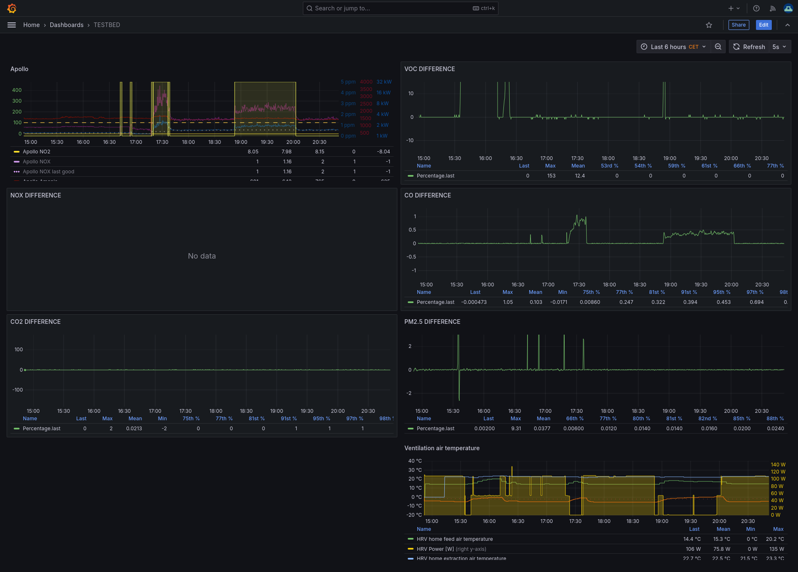

# Tim's AIR-1 ERV Whole Home Solution

esp32 C6 which drives two single phase inverters via two dac mcp4725 and four relays. Hrv is o3ozon cwp250. Ducts zinc plated steel at fi160 and max vents 90mm distribution.

Check out the data he's logging with the AIR-1 into his custom grafana dashboard!

!!! warning "Tim's warning to others:"

    I had constant sinuses burn due to lack of ventilation. Probably co poisoning in the past and also temperature inversion in my mountainous valley which cause massive spikes in smog. While relatively good air beyond that. Home was working as reservoir of smog.