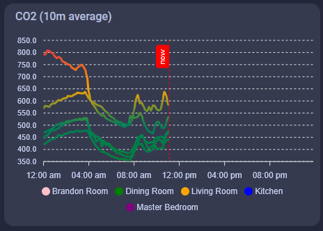

# AIR-1 General Tips

The AIR-1 has multiple different types of sensors and this guide will help you understand which ones you should be concerned with and expected safe or not safe thresholds to alert or automate on.

##### <a href="https://sensirion.com/products/catalog/SEN55" title="SEN55 Documentation" target="_blank" rel="noreferrer nofollow noopener">SEN55 Environmental Sensor</a>

The SEN55 is the powerhouse of the AIR-1 with multiple sensors such as particulate matter, volatile organic compounds (VOCs), oxidizing gases, such as nitrogen oxides (NOx), as well as humidity & temperature.

###### Particulate Matter

<a href="https://www.epa.gov/pm-pollution/particulate-matter-pm-basics" target="_blank" rel="noreferrer nofollow noopener">Per the EPA</a>: particulate matter (also called particle pollution): the term for a mixture of solid particles and liquid droplets found in the air. Some particles, such as dust, dirt, soot, or smoke, are large or dark enough to be seen with the naked eye. Others are so small they can only be detected using an electron microscope. <a href="https://www.epa.gov/indoor-air-quality-iaq/sources-indoor-particulate-matter-pm" target="_blank" rel="noreferrer nofollow noopener">Sources of pm particles here</a>.

**PM10** : inhalable particles, with diameters that are generally 10 micrometers and smaller; and

**PM2\.5** : fine inhalable particles, with diameters that are generally 2.5 micrometers and smaller.

* How small is 2.5 micrometers? Think about a single hair from your head. The average human hair is about 70 micrometers in diameter – making it 30 times larger than the largest fine particle.

!!! tip "We suggest triggering alert automations, hvac or a fan turning on, etc when PM particles are rising"

    <a href="https://www.epa.gov/indoor-air-quality-iaq/sources-indoor-particulate-matter-pm" target="_blank" rel="noreferrer nofollow noopener">This article</a> goes over lots of ways to reduce pm particles in your home!

# Safe PM Levels

Particulate Matter (PM) refers to a mixture of solid particles and liquid droplets found in the air. These are often classified by size, as smaller particles pose greater risks to health due to their ability to penetrate deeper into the lungs.

## What Do PM1, PM2.5, PM4, and PM10 Mean?

<table><thead><tr><th>
<strong>PM Type</strong>
</th><th>
<strong>Size (µm)</strong>
</th><th>
<strong>Description</strong>
</th></tr></thead><tbody><tr><td>
PM1
</td><td>
≤ 1.0
</td><td>
Ultrafine particles that can reach deep into the lungs and bloodstream.
</td></tr><tr><td>
PM2.5
</td><td>
≤ 2.5
</td><td>
Fine particles; linked to respiratory and cardiovascular issues.
</td></tr><tr><td>
PM4
</td><td>
≤ 4.0
</td><td>
Less commonly regulated; typically used in industrial settings.
</td></tr><tr><td>
PM10
</td><td>
≤ 10
</td><td>
Inhalable particles; may irritate eyes, nose, and throat.
</td></tr></tbody></table>

!!! note **PM2.5** and **PM10** are the most widely monitored and regulated for public health purposes.

---

## Recommended Safe Exposure Limits

### WHO Guidelines (2021)

The <a href="https://www.who.int/publications/i/item/9789240034228" target="_blank" rel="noreferrer nofollow noopener"><strong>World Health Organization (WHO)</strong></a> provides the following exposure limits for particulate matter:

<table><thead><tr><th>
<strong>PM Type</strong>
</th><th>
<strong>24-Hour Limit (µg/m³)</strong>
</th><th>
<strong>Annual Average (µg/m³)</strong>
</th></tr></thead><tbody><tr><td>
PM2.5
</td><td>
≤ 15
</td><td>
≤ 5
</td></tr><tr><td>
PM10
</td><td>
≤ 45
</td><td>
≤ 15
</td></tr></tbody></table>

---

## U.S. EPA Air Quality Index (AQI) – PM2.5

The **U.S. Environmental Protection Agency (EPA)**<a href="https://www.airnow.gov" target="_blank" rel="noreferrer nofollow noopener"> defines safety thresholds</a> for PM2.5 based on a 24-hour average:

<table><thead><tr><th>
<strong>PM2.5 (µg/m³)</strong>
</th><th>
<strong>AQI Category</strong>
</th><th>
<strong>Health Implications</strong>
</th></tr></thead><tbody><tr><td>
0.0 – 12.0
</td><td>
Good
</td><td>
Air quality is satisfactory.
</td></tr><tr><td>
12.1 – 35.4
</td><td>
Moderate
</td><td>
Acceptable; some risk for sensitive individuals.
</td></tr><tr><td>
35.5 – 55.4
</td><td>
Unhealthy for Sensitive Groups
</td><td>
Increased risk for those with heart/lung issues, children, and older adults.
</td></tr><tr><td>
55.5 – 150.4
</td><td>
Unhealthy
</td><td>
Everyone may begin to experience health effects.
</td></tr><tr><td>
150.5 – 250.4
</td><td>
Very Unhealthy
</td><td>
Health alert: serious effects possible.
</td></tr><tr><td>
&gt;250.5
</td><td>
Hazardous
</td><td>
Emergency conditions for all populations.
</td></tr></tbody></table>

---

## Indoor Air Quality Notes

* **PM1** and **PM2.5** are especially important for indoor air monitoring since these smaller particles are more likely to come from cooking, candles, smoking, or inadequate ventilation.
* Use an **air purifier with a HEPA filter** to reduce PM1–PM2.5 concentrations indoors.
* Keep **PM2.5 below 12 µg/m³** indoors for general safety; below **5 µg/m³** for ideal long-term health protection.

---

## Summary

<table><thead><tr><th>
<strong>PM Size</strong>
</th><th>
<strong>Safe Range</strong>
</th><th>
<strong>Health Concern</strong>
</th></tr></thead><tbody><tr><td>
PM1
</td><td>
No official limit — keep as low as possible
</td><td>
Ultrafine particles — most dangerous
</td></tr><tr><td>
PM2.5
</td><td>
≤ 12 µg/m³ (EPA), ≤ 5 µg/m³ (WHO annual)
</td><td>
Penetrates lungs and bloodstream
</td></tr><tr><td>
PM4
</td><td>
Industrial contexts only — no public health limits
</td><td>
Less regulated
</td></tr><tr><td>
PM10
</td><td>
≤ 45 µg/m³ (WHO 24-hour)
</td><td>
Triggers upper respiratory irritation
</td></tr></tbody></table>

---

###### <a href="https://sensirion.com/media/documents/02232963/6294E043/Info_Note_VOC_Index.pdf" target="_blank" rel="noreferrer nofollow noopener">VOC Index</a>

Per Sensirion,

> The VOC Index
>
> describes the current VOC status in a room relative to the sensor’s
>
> recent history. In this way, the VOC Index behaves like a human nose

!!! tip "We suggest triggering alert automations, hvac or a fan turning on, etc when the VOC Index rises above 100"

    Per Sensirion:

    > a VOC Index above 100 means that there are more
    >
    > VOCs compared to the average (e.g., induced by a VOC event from
    >
    > cooking, cleaning, breathing, etc.) while a VOC Index below 100 means
    >
    > that there are fewer VOCs compared to the average

###### VOC Quality

This uses the <a href="https://sensirion.com/media/documents/ACD82D45/6294DFC0/Info_Note_Integration_VOC_NOx_Sensor.pdf" target="_blank" rel="noreferrer nofollow noopener">VOC index and a scale to output an easier to use variable</a>.

0-79: **Improved** -&gt; 80-149: **Normal** -&gt; 150-249: **Abnormal** -&gt; 250-399: **Very abnormal** -&gt; 400+: **Extremely abnormal**

!!! tip "We suggest triggering alert automations, hvac or a fan turning on, etc when the VOC Quality changes to Abnormal or Very Abnormal or Extremely Abnormal."

    This is a very easy way to automate based on the air quality changing over the past 24 hours but you will still want to automate on particulate matter as well!

###### <a href="https://sensirion.com/media/documents/9F289B95/6294DFFC/Info_Note_NOx_Index.pdf" target="_blank" rel="noreferrer nofollow noopener">NOX Index</a>

Per Sensirion,

> The NO x Index describes the current NO x condition in a
>
> room relative to the sensor’s recent history. In this way, the NO x Index
>
> behaves like a human nose.

!!! tip "We suggest triggering alert automations, hvac or a fan turning on, etc when NOx rises above 1"

    Per Sensirion:

    > On the NO x Index scale, this offset is always mapped to
    >
    > the value of 1, making the readout as easy as possible: an NO x Index
    >
    > above 1 means that there are more NO x compounds compared to the
    >
    > average (e.g., induced by cooking on a gas stove), while an NO x Index
    >
    > close to 1 means that there are (nearly) no NO x gases present, which is
    >
    > the case most of the time (or induced by fresh air from an open window,
    >
    > using an air purifier, etc.).

---

##### <a href="https://sensirion.com/products/catalog/SCD40" target="_blank" rel="noreferrer nofollow noopener">SCD40 CO2 sensor</a>

The optional CO2 sensor addon is a great way to add the ability to track CO2. CO2 levels in a closed, poorly ventilated bedroom can quickly rise to concentrations that may impair focus or even pose health risks. Notice the CO2 levels dropping in the image below when the HVAC was turned on overnight!

<a href="https://www.dhs.wisconsin.gov/chemical/carbondioxide.htm" target="_blank" rel="noreferrer nofollow noopener">Wisconsin Department of Health CO2 Level Chart</a>

!!! tip "We suggest triggering alert automations, hvac or a fan turning on, etc when CO2 is over 1000"

    Opening a window, turning on a fan, the HVAC in the house, etc are all great ways to get CO2 to go down!

---

##### <a href="https://wiki.dfrobot.com/_SKU_SEN0377_Gravity__MEMS_Gas_Sensor_CO__Alcohol__NO2___NH3___I2C___MiCS_4514" target="_blank" rel="noreferrer nofollow noopener">MiCS-4514 Gas Sensor</a>

The MiCS-4514 is a very unique sensor able to distinguish between multiple gases such as Carbon Monoxide, Nitrogen, Ethanol, Hydrogen, Ammonia, and Methane.