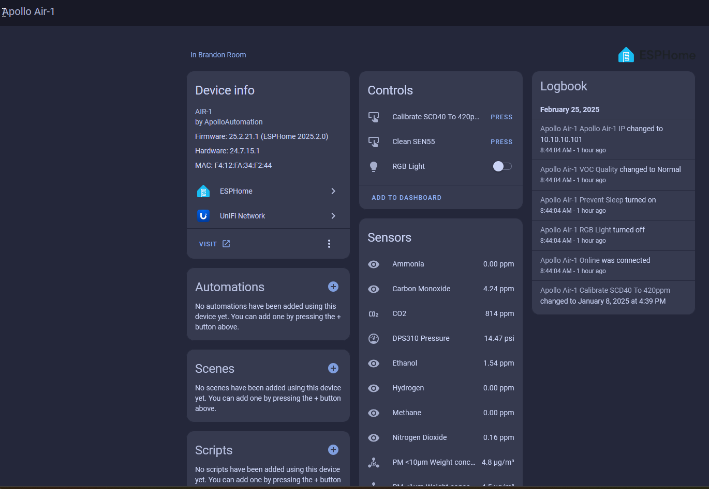

# Sensor Definitions

Once added to Home Assistant you can configure different settings for your sensor. Below is what each setting does.

### Controls

**Calibrate SCD40 to 420ppm** **CO2**

* A control option to <a href="https://wiki.apolloautomation.com/products/general/calibrating-and-updating/co2-calibration/" target="_blank" rel="noopener">calibrate the SCD40 CO₂ sensor</a> to <a href="https://climate.nasa.gov/vital-signs/carbon-dioxide/?intent=121" target="_blank" rel="noopener">outdoor baseline levels.</a>

**Clean SEN55**

* This control allows you to clean the SEN55 sensor, likely clearing any temporary issues or re-calibrating.

**RGB Light**

* Three RGB Neopixel LEDs. Click on the light bulb or color wheel to change the color. Click on the toggle to turn on or off.

### Sensors

**Ammonia (NH₃)**

* Measures the concentration of ammonia in the air, which can come from agricultural emissions, cleaning products, or industrial processes.

**Carbon Monoxide (CO)**

* Detects the concentration of carbon monoxide, a dangerous, odorless gas typically produced by combustion.
* **Baseline is 4.16ppm not 0 ppm**.

**(Carbon Dioxide (CO₂)**

* Tracks CO₂ levels in parts per million (ppm), which can indicate poor ventilation and impact overall air quality and cognitive performance. True NDIR CO2 reading from the SCD40. This will be Unknown if you do not have the CO2 module. You can <a href="https://wiki.apolloautomation.com/products/general/calibrating-and-updating/co2-calibration/" target="_blank" rel="noopener">re-calibrate the SCD40 CO₂ sensor</a> to <a href="https://climate.nasa.gov/vital-signs/carbon-dioxide/?intent=121" target="_blank" rel="noopener">outdoor baseline levels.</a>

**DPS310 Pressure**

* Measures air pressure in psi (pounds per square inch), providing insights into atmospheric changes and enhancing the accuracy of CO₂ readings.

**Ethanol (C₂H₅OH)**

* Detects ethanol vapors, commonly found in cleaning agents, sanitizers, or alcohol-based products.

**Hydrogen (H₂)**

* Monitors the concentration of hydrogen gas, which can indicate leaks or industrial processes.

**Methane (CH₄)**

* Detects methane concentrations, which can indicate natural gas leaks or emissions from agricultural activities.
* **Detects measurements of greater than 1000ppm**(Methane CH4 )

**Nitrogen Dioxide (NO₂)**

* Measures the levels of nitrogen dioxide, a harmful gas often produced by vehicle emissions and industrial processes.

**PM &lt;10µm Weight Concentration**

* Tracks particulate matter smaller than 10 micrometers (PM10), which includes dust, pollen, and mold.

**PM &lt;1µm Weight Concentration**

* Monitors the concentration of ultra-fine particles smaller than 1 micrometer, often present in smoke or exhaust.

**PM &lt;2.5µm Weight Concentration**

* Measures particles smaller than 2.5 micrometers (PM2.5), which are generated by combustion and industrial activities.

**PM &lt;4µm Weight Concentration**

* Detects particulate matter smaller than 4 micrometers.

**SEN55 Temperature**

* Tracks ambient air temperature to help assess comfort levels and environmental conditions.

**SEN55 Humidity**

* Measures relative humidity in the air, which impacts comfort and the overall environment.

**SEN55 NOX Index**

* Monitors nitrogen oxides (NOX index), harmful gases produced by burning fossil fuels and industrial processes.

**SEN55 VOC Index**

Detects volatile organic compounds (VOC Index), which are emitted from paints, cleaning products, and industrial chemicals. <a href="https://sensirion.com/media/documents/02232963/6294E043/Info_Note_VOC_Index.pdf" target="_blank" rel="noreferrer nofollow noopener">VOC index from the SEN55</a>.

**VOC Quality** -This uses the <a href="https://sensirion.com/media/documents/ACD82D45/6294DFC0/Info_Note_Integration_VOC_NOx_Sensor.pdf" target="_blank" rel="noreferrer nofollow noopener">VOC index and a scale to output an easier to use variable</a>

0-79: **Improved** -&gt; 80-149: **Normal** -&gt; 150-249: **Abnormal** -&gt; 250-399: **Very abnormal** -&gt; 400+: **Extremely abnormal**

**PM 0.3 To 1 µm**

* Monitors particles in the range of 0.3 to 1 micrometer. Disabled by default.

**PM 1 To 2.5 µm**

* Tracks particles between 1 and 2.5 micrometers. Disabled by default.

**PM 2.5 To 4 µm**

* Measures particulate matter between 2.5 and 4 micrometers. Disabled by default.

**PM 4 To 10 µm**

* Detects particles between 4 and 10 micrometers. Disabled by default.

### Configuration

* **ESP Reboot**
  * Performs a restart of the sensor
* **SEN55 Temperature Offset**
  * Allows you to calibrate the SEN55 temperature. Please refer to our [calibration guide](https://wiki.apolloautomation.com/products/general/temp-hum-calibration/ "MSR-1 Temperature &amp; Humidity Offsets").
* **SEN55 Humidity Offset**
  * Allows you to calibrate the SEN55 humidity. Please refer to our [calibration guide](https://wiki.apolloautomation.com/products/general/temp-hum-calibration/ "MSR-1 Temperature &amp; Humidity Offsets").

#### Configuration:

**ESP Reboot**

* A button to restart the ESP32 microcontroller running the AIR-1 sensor, helpful for troubleshooting or refreshing connections.

**Prevent Sleep**

* Ability to put AIR-1 to sleep to get better temperature and humidity measurements.

**SEN55 Humidity Offset**

* Allows you to adjust the humidity readings for calibration purposes.

**SEN55 Temperature Offset**

* Lets you calibrate the temperature sensor by adjusting the offset in degrees Celsius.

#### Diagnostic:

**ESP Temperature**

* Displays the internal temperature of the ESP32 microcontroller (112.6°F shown), which is often higher than ambient due to the processor’s activity.

**Firmware Update**

* Shows the status of firmware updates (currently unavailable).

**Online**

* Shows the connection status of the device (Connected).

**RSSI**

* Displays the signal strength of the Wi-Fi connection (-61 dBm shown), which can impact the sensor’s performance if too weak.

**Uptime**

* How long the device has been online without rebooting.