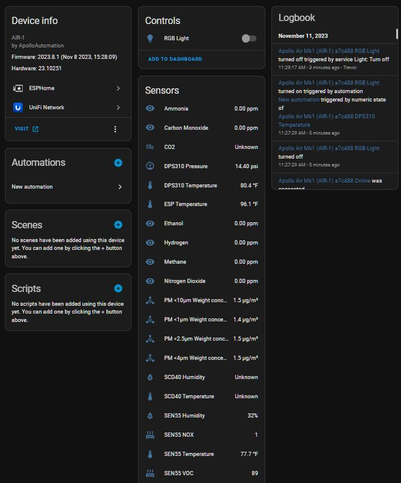

# Sensor Definitions

Once added to Home Assistant you can configure different settings for your sensor. Below is what each setting does.

### Controls

* **RGB Light**
  * 3 RGB Neopixels. Click on the light bulb to change the color. Click on the toggle to turn on or off
* **Calibrate SCD40**
  * Refer to the [CO2 calibration guide](https://wiki.apolloautomation.cloud/books/general/page/co2-calibration). Place your sensor outside and click this button to calibrate the CO2 levels

### Sensors

* **Ammonia**
  * Measurement from MiCS-4514 gas sensor
* **Carbon Monoxide**
  * Measurement from MiCS-4514 gas sensor
* **CO2**
  * True CO2 reading from the SCD40. This will be Unknown if you do not have the CO2 module. This can be calibrated following this guide but does come precalibrated: [Here](https://wiki.apolloautomation.cloud/books/general/page/co2-calibration)
* **DPS310 Pressure**
  * Atmospheric pressure, used to better calibrate the SCD40 CO2 module
* **DPS310 Temperature**
  * A worse measurement of temperature. This is more susceptible to internal heat buildup. Please use the SEN55 temperature
* **ESP Temperature**
  * This is the temperature of the internal ESP chip. Think of it like your measured CPU temp on your PC
* **Ethanol**
  * Measurement from MiCS-4514 gas sensor
* **Hydrogen**
  * Measurement from MiCS-4514 gas sensor
* **Methane**
  * Measurement from MiCS-4514 gas sensor
* **Nitrogen Dioxide**
  * Measurement from MiCS-4514 gas sensor
* **PM &lt; 10 µM**
  * Measurement of particulates **smaller** than 10 µM
* **PM &lt; 1 µM**
  * Measurement of particulates **smaller** than 1 µM
* **PM &lt; 2.5 µM**
  * Measurement of particulates **smaller** than 2.5 µM
* **PM &lt; 4 µM**
  * Measurement of particulates **smaller** than 4 µM
* **SEN55 Humidity**
  * Humidity measurement from SEN55, will be most accurate
* **SEN55 NOX**
  * Measurement of nitrogen oxides from the SEN55
* **SEN55 Temperature**
  * Measurement of temperature from the SEN55, will be most accurate
* **SEN55 VOC**
  * VOC index from the SEN55
* **VOC Quality**
  * This uses the VOC index and a scale to output an easier to use variable
    * 0-79: Improved
    * 80-119: Normal
    * 120-199: Abnormal
    * 200-299: Very abnormal
    * 300+: Extremely abnormal
* **PM 0.3 To 1 µm**
  * Disabled by default but can be enabled in HA. Shows particulate count that are from 0.3 to 1.0 µm
* **PM 1 To 2.5 µm**
  * Disabled by default but can be enabled in HA. Shows particulate count that are from 1 to 2.5 µm
* **PM 2.5 To 4 µm**
  * Disabled by default but can be enabled in HA. Shows particulate count that are from 2.5 to 4.0 µm
* **PM 4 To 10 µm**
  * Disabled by default but can be enabled in HA. Shows particulate count that are from 4.0 to 10.0 µm

### Configuration

* **ESP Reboot**
  * Performs a restart of the sensor
* **SEN55 Temperature Offset**
  * Allows you to calibrate the SEN55 temperature. Please refer to our [calibration guide](https://wiki.apolloautomation.cloud/books/msr-1/page/msr-1-temperature-humidity-offsets "MSR-1 Temperature &amp; Humidity Offsets")
* **SEN55 Humidity Offset**
  * Allows you to calibrate the SEN55 humidity. Please refer to our [calibration guide](https://wiki.apolloautomation.cloud/books/msr-1/page/msr-1-temperature-humidity-offsets "MSR-1 Temperature &amp; Humidity Offsets")
* Startup Light Blink
  * Controls if the led blinks after power on when trying to connect to HA

### Detailed Sensor Definitions

#### Controls:

• Calibrate SCD40 to 420ppm: A control option to calibrate the SCD40 CO₂ sensor to a specific concentration, typically outdoor levels.

• Clean SEN55: This control allows you to clean the SEN55 sensor, likely clearing any temporary issues or recalibrating.

• RGB Light: Control to toggle the RGB LED light on or off, which can be used for visual notifications.

#### Sensors:

•	Ammonia (NH₃): Measures the concentration of ammonia in the air, which can come from agricultural emissions, cleaning products, or industrial processes.

•	Carbon Monoxide (CO): Detects the concentration of carbon monoxide, a dangerous, odorless gas typically produced by combustion.

•	CO₂ (Carbon Dioxide): Tracks CO₂ levels in parts per million (ppm), which can indicate poor ventilation and impact overall air quality and cognitive performance.

•	DPS310 Pressure: Measures air pressure in psi (pounds per square inch), providing insights into atmospheric changes and enhancing the accuracy of CO₂ readings.

•	Ethanol (C₂H₅OH): Detects ethanol vapors, commonly found in cleaning agents, sanitizers, or alcohol-based products.

•	Hydrogen (H₂): Monitors the concentration of hydrogen gas, which can indicate leaks or industrial processes.

•	Methane (CH₄): Detects methane concentrations, which can indicate natural gas leaks or emissions from agricultural activities.

•	Nitrogen Dioxide (NO₂): Measures the levels of nitrogen dioxide, a harmful gas often produced by vehicle emissions and industrial processes.

•	PM &lt;10µm Weight Concentration: Tracks particulate matter smaller than 10 micrometers (PM10), which includes dust, pollen, and mold.

•	PM &lt;1µm Weight Concentration: Monitors the concentration of ultra-fine particles smaller than 1 micrometer, often present in smoke or exhaust.

•	PM &lt;2.5µm Weight Concentration: Measures particles smaller than 2.5 micrometers (PM2.5), which are generated by combustion and industrial activities.

•	PM &lt;4µm Weight Concentration: Detects particulate matter smaller than 4 micrometers.

•	PM 0.3 To 1 µm: Monitors particles in the range of 0.3 to 1 micrometer.

•	PM 1 To 2.5 µm: Tracks particles between 1 and 2.5 micrometers.

•	PM 2.5 To 4 µm: Measures particulate matter between 2.5 and 4 micrometers.

•	PM 4 To 10 µm: Detects particles between 4 and 10 micrometers.

•	SEN55 Humidity: Measures relative humidity in the air, which impacts comfort and the overall environment.

•	SEN55 NOX: Monitors nitrogen oxides (NOX), harmful gases produced by burning fossil fuels and industrial processes.

•	SEN55 Temperature: Tracks ambient air temperature to help assess comfort levels and environmental conditions.

•	SEN55 VOC: Detects volatile organic compounds (VOCs), which are emitted from paints, cleaning products, and industrial chemicals.

•	VOC Quality: Provides an assessment of air quality based on the concentration of VOCs, ranging from normal to abnormal.

•	SEN55 Temperature: Measures ambient air temperature (73.9°F shown), used to assess the thermal conditions in the environment.

•	SEN55 VOC: Detects volatile organic compounds (VOCs), which are often found in cleaning products, paints, and other household chemicals. The value is 191 ppm.

•	VOC Quality: Assesses overall air quality based on VOC levels. In this case, it is marked as “Abnormal.”

•	SEN55 Humidity: Measures the relative humidity of the environment (30.9% shown), which affects comfort and air quality.

•	SEN55 NOX: Detects nitrogen oxides, harmful gases often produced by combustion and vehicle emissions. The reading is 1.

#### Configuration:

•	ESP Reboot: A button to restart the ESP32 microcontroller running the AIR-1 sensor, helpful for troubleshooting or refreshing connections.

•	Firmware Update: Shows the status of firmware updates (currently unavailable).

•	SEN55 Humidity Offset: Allows you to adjust the humidity readings for calibration purposes.

•	SEN55 Temperature Offset: Lets you calibrate the temperature sensor by adjusting the offset in degrees Celsius.

•	Startup Light Blink: An option to enable or disable a startup blink from the RGB LED when the sensor powers on.

#### Diagnostic:

•	ESP Temperature: Displays the internal temperature of the ESP32 microcontroller (112.6°F shown), which is often higher than ambient due to the processor’s activity.

•	Online: Shows the connection status of the device (Connected).

•	RSSI: Displays the signal strength of the Wi-Fi connection (-61 dBm shown), which can impact the sensor’s performance if too weak.

•	Uptime: Shows how long the device has been online without rebooting (258:25:54 shown, meaning it has been up for over 258 hours).