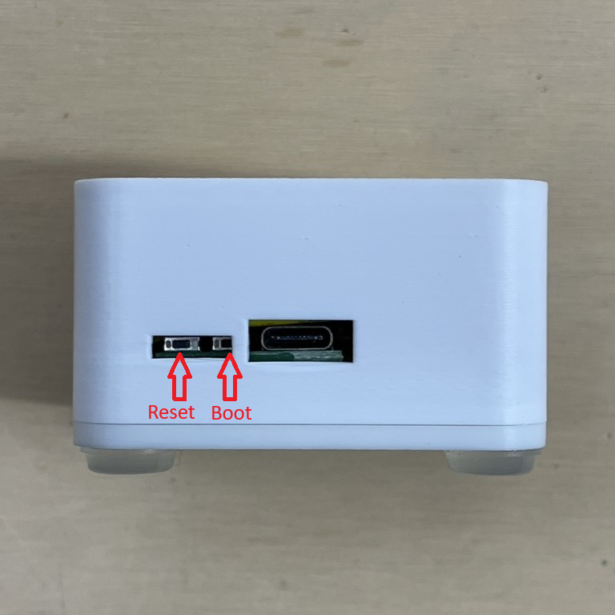

# Putting The AIR-1 In Boot Mode

This will cover how to put the AIR-1 into boot mode. This is sometimes needed for uploading new firmware if the device is struggling.

**Boot Button Only**

1. Plug in the device
2. See the photo below to help access the boot button through the back of the case
3. Use a pin to press and hold the boot button, while holding the boot button plug it back into your computer/power and then release the boot button
4. Continue with [Uploading your Code via our ESPHome Web Flasher](https://apolloautomation.github.io/docs/products/air1/troubleshooting/air1-code/ "Uploading your Code via our ESPHome Web Flasher")

**Boot and Reset Button**

1. Plug it into your computer
2. Press and hold the boot button, while holding it press and release the reset button, then release the boot button  
3. Continue with [Uploading your Code via our ESPHome Web Flasher](https://apolloautomation.github.io/docs/products/air1/troubleshooting/air1-code/ "Uploading your Code via our ESPHome Web Flasher")