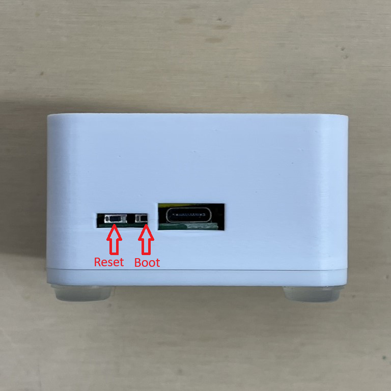

# Reset Wi-Fi Credentials (old mesh case design)

1. Plug the device into power
2. Long press the Boot button for 10 seconds  
3. The Wi-Fi credentials should be reset and it will broadcast its hotspot again

# Reset Wi-Fi Credentials

1\. Plug the device into power.

2\. Press and hold the Boot button for 10 seconds.

3\. The Wi-Fi credentials should be reset and it will broadcast its hotspot again.

4\. Connect to the hotspot titled "Apollo AIR-1 Hotspot" and enter your new Wi-Fi details!