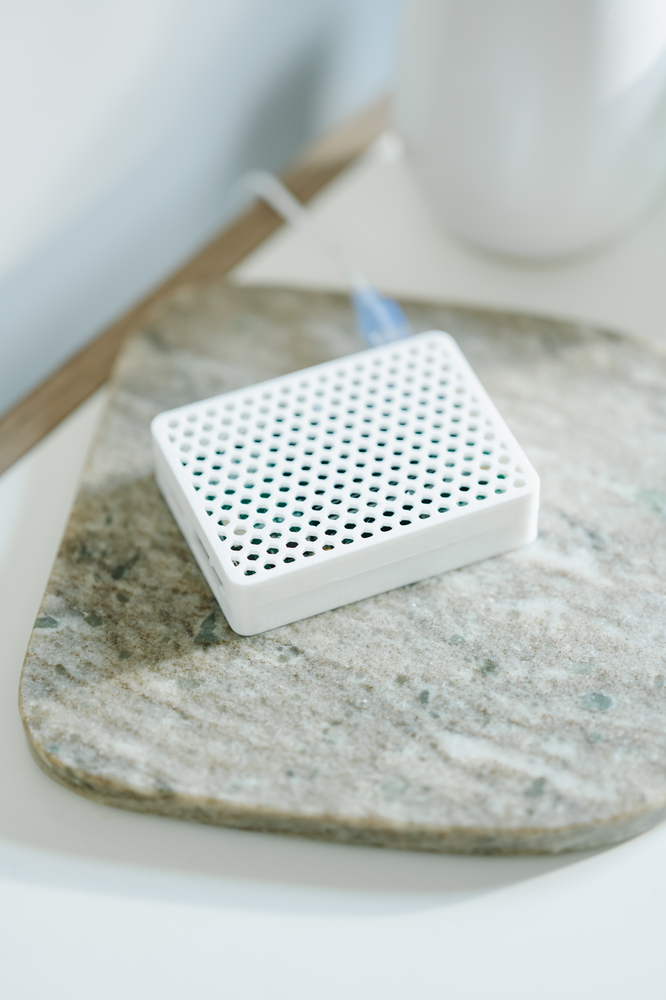

The Apollo Odroid is a pre-configured, ready-to-use device designed to kickstart your smart home journey with ease. Built on the powerful ODROID-M1S platform with 8GB of RAM and 64GB of onboard eMMC storage, this unit comes pre-flashed with Home Assistant OS. This means that from the moment you unbox it, you can dive right into automating your home without any complex setup or flashing processes.

Perfect for both beginners and seasoned Home Assistant users, the Apollo Odroid offers a streamlined experience. It’s housed in an Apollo Automation-designed case, powered via a USB-C connection, and includes everything you need, such as a USA power supply and an Ethernet cable. Whether you’re looking to manage lights, climate, security, or any other smart home devices, the Apollo Odroid is your reliable gateway to full local control without the need for cloud services.

With this device, we aim to provide a plug-and-play solution that’s affordable, powerful, and community-driven, allowing you to focus on what matters most—building the smart home of your dreams.