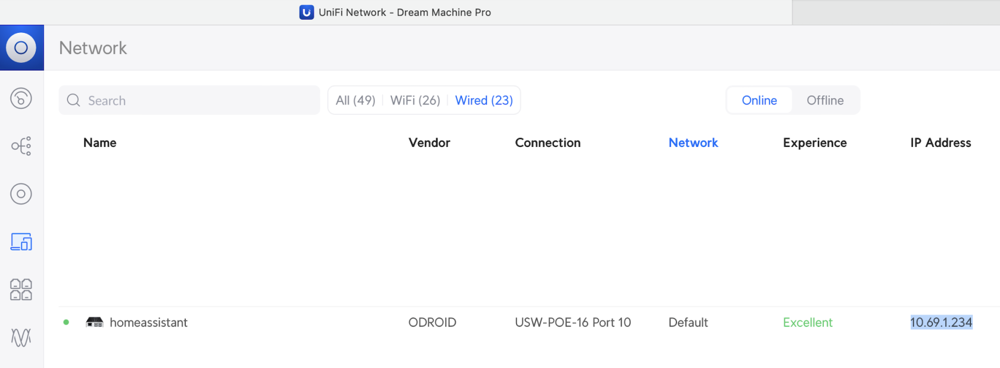
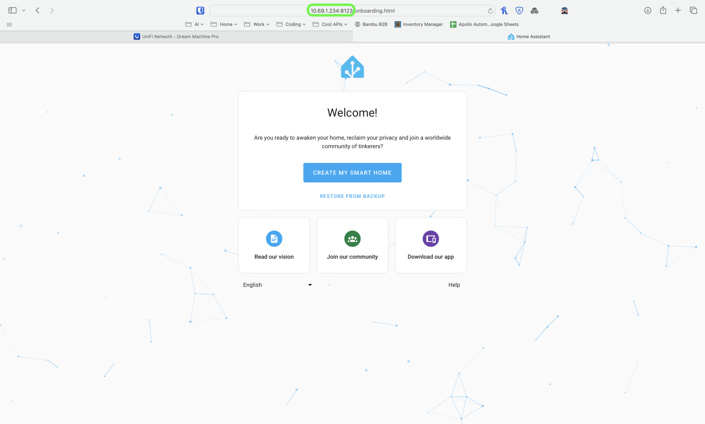
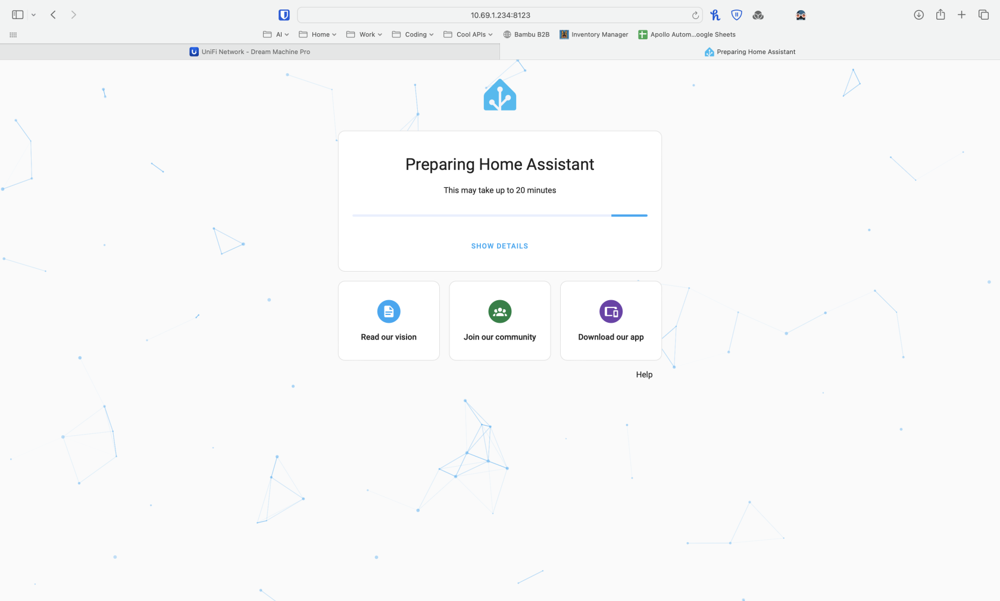

# Getting Started With Apollo Odroid Flashed With Home Assistant (Odroid M1S)

This guide will walk you through setting up your Apollo Home Assistant hub aka the Apollo Odroid.

1\. Plug in your hub with the included power adapter.

2\. Attach the included ethernet cable from the hub to an available ethernet port on your router or switch.

3\.From a phone or computer connected to your home's internet open your web browser and navigate to <a href="http://homeassistant.local:8123" target="_blank" rel="noreferrer nofollow noopener">http://homeassistant.local:8123</a>.

!!! tip "You can also access your device from it's IP address instead of the default hostname of homeassistant.local"

    If you'd prefer, you can go into your router and find the IP address that your Odroid received and use the IP address with port 8123 at the end such as: <a href="http://192.168.1.30:8123" title="Change yours to the correct IP address on your subnet!" target="_blank" rel="noreferrer nofollow noopener">http://192.168.1.30:8123</a>

4\. Click on "Create My Smart Home" and wait for the Home Assistant installer to finish.

5\. Now that you've got Home Assistant running, your Apollo Automation devices are ready to use!

[Click here to head to our general getting started guide!](https://wiki.apolloautomation.com/products/general/setup/getting-started/){        .md-button .md-button--primary }