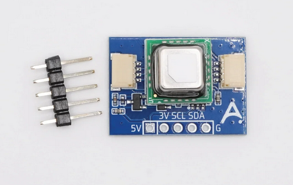
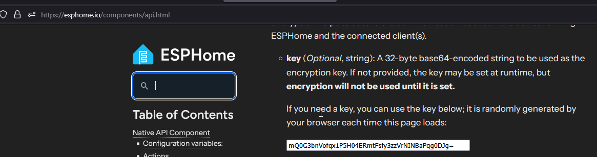

The **SCD40 Breakout Board** is a compact PCB kit featuring the <a href="https://sensirion.com/products/catalog/SCD40" target="_blank" rel="noreferrer nofollow noopener"><strong>SCD40</strong></a>, making it easy to add CO<sub>2</sub> monitoring to any new or existing project.

Please <a href="https://esphome.io/components/api.html#configuration-variables" target="_blank" rel="noopener">go to this website</a> and copy the randomly generated API key inside the code block as shown below then paste it in the code below where you see "use-a-randomly-generated-key-here".



**GPIO Pins Listed:**

```yaml
#These are the i2c pins
i2c:
  sda: GPIO1
  scl: GPIO0
```

```yaml
#This is the onboard LED pin
GPIO3
```

The <a href="https://apolloautomation.com/products/apollo-dev-2" target="_blank" rel="noreferrer nofollow noopener">Apollo DEV-2</a> is an ideal starter board for tinkerers, available on its own or bundled with a breadboard and Dupont (jumper) wires. The example YAML below uses the DEV-2 (ESP32 C6 Mini 4MB flash or 8MB flash if newest revision).

**Example ESPHome yaml:**

```yaml
#Define Project
substitutions:
  name: scd40-breakout-board
  version:  "1"
  device_description: ${name} made by Apollo Automation - version ${version}.

esphome:
  name: "${name}"
  friendly_name: SCD40 Breakout Board
  comment: SCD40-Breakout-Board With Apollo DEV-2
#  platformio_options:
#    board_build.flash_mode: dio

  project:
    name: "ApolloAutomation.DEV-2"
    version: "${version}"

# Define Board
esp32:
  board: esp32-c6-devkitc-1
  framework:
    type: esp-idf

# Enable logging
logger:

# Enable Home Assistant API
api:
  encryption:
    key: "use-a-randomly-generated-key-here"
  actions:
    #Co2 Calibration Action
    - action: calibrate_co2_value
      variables:
        co2_ppm: float
      then:
        - scd4x.perform_forced_calibration:
            value: !lambda "return co2_ppm;"
            id: scd40
  reboot_timeout: 0s

ota:
  - platform: esphome
    password: "a53d93acd493275512730c776f88722a"

wifi:
  ssid: !secret wifi_ssid
  password: !secret wifi_password

  # Enable fallback hotspot (captive portal) in case wifi connection fails
  ap:
    ssid: "Apollo-Dev-2 Fallback Hotspot"
    password: !secret wifi_password

captive_portal:

web_server:
  port: 80
  version: 3

i2c:
  sda: GPIO1
  scl: GPIO0
  id: bus_a

#onboard LED using pin GPIO3 as shown below
light:
  - platform: esp32_rmt_led_strip
    id: rgb_onboard_light
    name: "RGB Onboard Light"
    pin: GPIO3
    default_transition_length: 0s
    chipset: WS2812
    num_leds: 1
    rgb_order: grb
    effects:
      - pulse:
          name: "Slow Pulse"
          transition_length: 1000ms
          update_interval: 1000ms
          min_brightness: 50%
          max_brightness: 100%
      - pulse:
          name: "Fast Pulse"
          transition_length: 100ms
          update_interval: 100ms
          min_brightness: 50%
          max_brightness: 100%

button:
  - platform: restart
    icon: mdi:power-cycle
    name: "ESP Reboot"

  - platform: factory_reset
    disabled_by_default: True
    name: "Factory Reset ESP"
    id: factory_reset_all

  - platform: template
    name: "Calibrate SCD40 To 420ppm"
    id: set_SCD40_calibrate
    on_press:
      - scd4x.perform_forced_calibration:
          value: 420
          id: scd40

sensor:
  - platform: internal_temperature
    name: "ESP Temperature"
    id: sys_esp_temperature

  - platform: uptime
    name: Uptime
    id: sys_uptime
    update_interval: 60s

  - platform: wifi_signal
    name: RSSI
    id: wifi_signal_db
    update_interval: 60s
    entity_category: "diagnostic"

  - platform: scd4x
    id: scd40
    co2:
      name: "CO2"
      id: "co2"
    automatic_self_calibration: false
    update_interval: 60s
    measurement_mode: "periodic"
    i2c_id: bus_a

  - platform: wifi_info
    ip_address:
      name: "${name} IP"
      icon: "mdi:ip-outline"
```