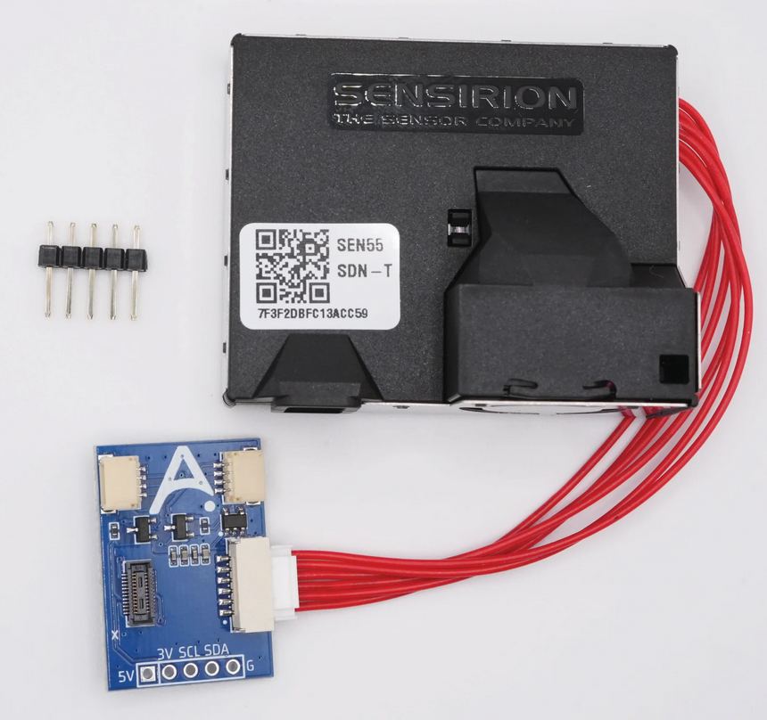

The **SEN55 and SCD40 Breakout Board** is a compact PCB kit featuring the <a href="https://sensirion.com/products/catalog/SEN55/" target="_blank" rel="noreferrer nofollow noopener"><strong>SEN55</strong></a> sensor and an optional <a href="https://sensirion.com/products/catalog/SCD40" target="_blank" rel="noreferrer nofollow noopener"><strong>SCD40</strong></a>, making it easy to add high-quality air monitoring to any new or existing project.

Please <a href="https://esphome.io/components/api.html#configuration-variables" target="_blank" rel="noopener">go to this website</a> and copy the randomly generated API key inside the code block as shown below then paste it in the code below where you see "use-a-randomly-generated-key-here".


**GPIO Pins Listed:**

```yaml
#These are the i2c pins
i2c:
  sda: GPIO1
  scl: GPIO0
```

```yaml
#This is the onboard LED pin
GPIO3
```

The <a href="https://apolloautomation.com/products/apollo-dev-2" target="_blank" rel="noreferrer nofollow noopener">Apollo DEV-2</a> is an ideal starter board for tinkerers, available on its own or bundled with a breadboard and Dupont (jumper) wires. The example YAML below uses the DEV-2 (ESP32 C6 Mini 4MB flash or 8MB flash if newest revision).

!!! success "Make sure to power it via 5V!"

    The SEN55 requires 4.5v or higher so powering via the QWIIC port at 3.3v will not give the SEN55 enough power to work properly.

**Example ESPHome yaml:**

```yaml
#Define Project
substitutions:
  name: sen55-scd40-breakout-board
  version:  "1"
  device_description: ${name} made by Apollo Automation - version ${version}.

esphome:
  name: "${name}"
  friendly_name: SEN55 SCD40 Breakout Board
  comment: SEN55-SCD40-Breakout-Board With Apollo DEV-2
#  platformio_options:
#    board_build.flash_mode: dio

  project:
    name: "ApolloAutomation.DEV-2"
    version: "${version}"

# Define Board
esp32:
  board: esp32-c6-devkitc-1
  framework:
    type: esp-idf

# Enable logging
logger:

# Enable Home Assistant API
api:
  encryption:
    key: "use-a-randomly-generated-key-here"
  actions:
    #Co2 Calibration Action
    - action: calibrate_co2_value
      variables:
        co2_ppm: float
      then:
        - scd4x.perform_forced_calibration:
            value: !lambda "return co2_ppm;"
            id: scd40
    - action: sen55_clean
      then:
        - sen5x.start_fan_autoclean: sen55
  reboot_timeout: 0s

ota:
  - platform: esphome
    password: "a53d93acd493275512730c776f88722a"

wifi:
  ssid: !secret wifi_ssid
  password: !secret wifi_password

  # Enable fallback hotspot (captive portal) in case wifi connection fails
  ap:
    ssid: "Apollo-Dev-2 Fallback Hotspot"
    password: !secret wifi_password

captive_portal:

web_server:
  port: 80
  version: 3

i2c:
  sda: GPIO1
  scl: GPIO0
  id: bus_a

number:
  - platform: template
    name: SEN55 Temperature Offset
    id: sen55_temperature_offset
    restore_value: true
    initial_value: 6.0
    min_value: -70.0
    max_value: 70.0
    entity_category: "CONFIG"
    unit_of_measurement: "°C"
    optimistic: true
    update_interval: never
    step: 0.1
    mode: box
  - platform: template
    name: SEN55 Humidity Offset
    id: sen55_humidity_offset
    restore_value: true
    initial_value: 0
    min_value: -70.0
    max_value: 70.0
    entity_category: "CONFIG"
    unit_of_measurement: "%"
    optimistic: true
    update_interval: never
    step: 0.1
    mode: box


#onboard LED using pin GPIO3 as shown below
light:
  - platform: esp32_rmt_led_strip
    id: rgb_onboard_light
    name: "RGB Onboard Light"
    pin: GPIO3
    default_transition_length: 0s
    chipset: WS2812
    num_leds: 1
    rgb_order: grb
    effects:
      - pulse:
          name: "Slow Pulse"
          transition_length: 1000ms
          update_interval: 1000ms
          min_brightness: 50%
          max_brightness: 100%
      - pulse:
          name: "Fast Pulse"
          transition_length: 100ms
          update_interval: 100ms
          min_brightness: 50%
          max_brightness: 100%

button:
  - platform: restart
    icon: mdi:power-cycle
    name: "ESP Reboot"

  - platform: factory_reset
    disabled_by_default: True
    name: "Factory Reset ESP"
    id: factory_reset_all

  - platform: template
    name: "Calibrate SCD40 To 420ppm"
    id: set_SCD40_calibrate
    on_press:
      - scd4x.perform_forced_calibration:
          value: 420
          id: scd40

  - platform: template
    name: "Clean SEN55"
    id: clean_sen55
    on_press:
      - sen5x.start_fan_autoclean: sen55

sensor:
  - platform: internal_temperature
    name: "ESP Temperature"
    id: sys_esp_temperature

  - platform: uptime
    name: Uptime
    id: sys_uptime
    update_interval: 60s

  - platform: wifi_signal
    name: RSSI
    id: wifi_signal_db
    update_interval: 60s
    entity_category: "diagnostic"

  - platform: scd4x
    id: scd40
    co2:
      name: "CO2"
      id: "co2"
    automatic_self_calibration: false
    update_interval: 60s
    measurement_mode: "periodic"
    i2c_id: bus_a

  - platform: sen5x
    id: sen55
    pm_1_0:
      name: "PM <1µm Weight concentration"
      id: pm_1_0
      accuracy_decimals: 1
    pm_2_5:
      name: "PM <2.5µm Weight concentration"
      id: pm_2_5
      accuracy_decimals: 1
    pm_4_0:
      name: "PM <4µm Weight concentration"
      id: pm_4_0
      accuracy_decimals: 1
    pm_10_0:
      name: "PM <10µm Weight concentration"
      id: pm_10_0
      accuracy_decimals: 1
    temperature:
      name: "SEN55 Temperature"
      accuracy_decimals: 1
      filters:
        - lambda: return x - id(sen55_temperature_offset).state;
    humidity:
      name: "SEN55 Humidity"
      filters:
        - lambda: return x - id(sen55_humidity_offset).state;
      accuracy_decimals: 1
    voc:
      name: "SEN55 VOC"
      id: sen55_voc

      algorithm_tuning:
        #https://sensirion.com/media/documents/25AB572C/62B463AA/Sensirion_Engineering_Guidelines_SEN5x.pdf
        index_offset: 100
        learning_time_offset_hours: 72
        learning_time_gain_hours: 72
        gating_max_duration_minutes: 180
        std_initial: 50
        gain_factor: 230
    nox:
      name: "SEN55 NOX"
      id: sen55_nox
    acceleration_mode: low
    store_baseline: true
    address: 0x69
    update_interval: 10s

  - platform: template
    name: "PM 0.3 To 1 µm"
    id: pm0_3_to_1
    disabled_by_default: true
    lambda: return id(pm_1_0).state;
    unit_of_measurement: "µg/m³"
    state_class: measurement
    icon: mdi:air-filter
    update_interval: 10s

  - platform: template
    name: "PM 1 To 2.5 µm"
    id: pm1_to_2_5
    disabled_by_default: true
    lambda: return std::max(0.0f, id(pm_2_5).state - id(pm_1_0).state);
    unit_of_measurement: "µg/m³"
    state_class: measurement
    icon: mdi:air-filter
    update_interval: 10s

  - platform: template
    name: "PM 2.5 To 4 µm"
    id: pm2_5_to_4
    disabled_by_default: true
    lambda: return std::max(0.0f, id(pm_4_0).state - id(pm_2_5).state);
    unit_of_measurement: "µg/m³"
    state_class: measurement
    icon: mdi:air-filter
    update_interval: 10s

  - platform: template
    name: "PM 4 To 10 µm"
    id: pm4_to_10
    disabled_by_default: true
    lambda: return std::max(0.0f, id(pm_10_0).state - id(pm_4_0).state);
    unit_of_measurement: "µg/m³"
    state_class: measurement
    icon: mdi:air-filter
    update_interval: 10s

text_sensor:
    # Convert VOC Index To Text:
    # https://sensirion.com/media/documents/02232963/6294E043/Info_Note_VOC_Index.pdf
    # https://sensirion.com/media/documents/ACD82D45/6294DFC0/Info_Note_Integration_VOC_NOx_Sensor.pdf
  - platform: template
    name: "VOC Quality"
    id: voc_quality
    icon: mdi:air-filter
    lambda: |-
      if (id(sen55_voc).state < 80) {
        return std::string("Improved");}
      else if (id(sen55_voc).state < 150) {
        return std::string("Normal");}
      else if (id(sen55_voc).state < 250) {
        return std::string("Abnormal");}
      else if (id(sen55_voc).state < 400) {
        return std::string("Very abnormal");}
      else if (id(sen55_voc).state >= 400) {
        return std::string("Extremely abnormal");}
      else {
        return std::string("Unknown");}
  - platform: wifi_info
    ip_address:
      name: "${name} IP"
      icon: "mdi:ip-outline"
```