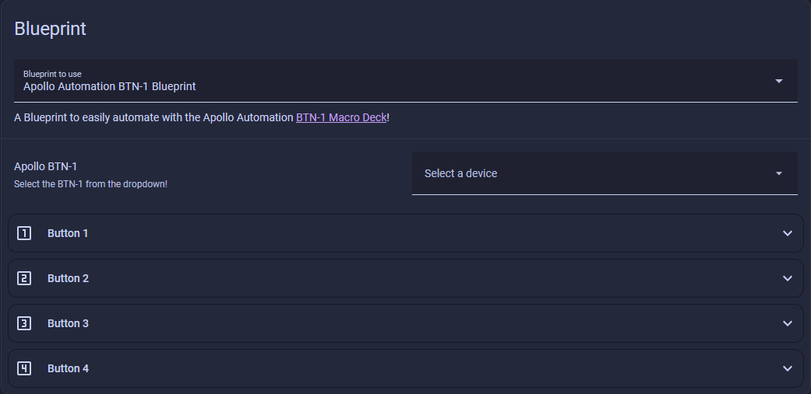

# Blueprint Setup

### Automatic Import

1\. Click the Import Blueprint button below and then click **Open link**.

2\. Click **Preview** then click **Import blueprint**.

3\. Click on **Apollo Automation BTN-1 Blueprint** and click on **Select a device** then choose your **Apollo BTN-1** from the dropdown menu.

4\. For the **Single Click** event, click **Add Action**, then search for **Light: Toggle** and select it. Next, choose the entity you want to control, such as **BTN-1 Light**, and click **Save**. Name your automation something like **Apollo BTN-1 Blueprint**. You can repeat this process for **Double Click**, **Triple Click**, and **Hold** events.

!!! success "You can do this for all four buttons all in one blueprint!"

    This blueprint is packed with features - you can do a Single Click, a Double Click, Three Clicks, or a Hold on each of the four buttons. Just click Add action and set them all up!

5\. Your blueprint is now live. Click the button 1 button and it should toggle whatever light you selected in the blueprint. This can be anything in Home Assistant such as your light, fan, scene, etc!

### Manual Import

1\. Head to the <a href="http://homeassistant.local:8123/config/automation/dashboard" target="_blank" rel="noreferrer nofollow noopener">automations page</a> and click on **Blueprints** in the top right then select **Import Blueprint**.

2\. Copy <a href="https://my.home-assistant.io/redirect/blueprint_import/?blueprint_url=https%3A%2F%2Fraw.githubusercontent.com%2FApolloAutomation%2FBlueprints%2Frefs%2Fheads%2Fmain%2FBTN-1%2FBTN-1.yaml" target="_blank" rel="noreferrer nofollow noopener">this link</a> and paste it into the **Blueprint address** box and click **Preview** then click **Import blueprint**.

3\. Click on **Apollo Automation BTN-1 Blueprint** and click on **Select a device** then choose your **Apollo BTN-1** from the dropdown menu.

3\. For the **Single Click** event, click **Add Action**, then search for **Light: Toggle** and select it. Next, choose the entity you want to control, such as **BTN-1 Light**, and click **Save**. Name your automation something like **Apollo BTN-1 Blueprint**. You can repeat this process for **Double Click**, **Triple Click**, and **Hold** events.

!!! success "You can do this for all four buttons all in one blueprint!"

    This blueprint is packed with features - you can do a Single Click, a Double Click, Three Clicks, or a Hold on each of the four buttons. Just click Add action and set them all up!

4\. Your blueprint is now live. Click the button 1 button and it should toggle whatever light you selected in the blueprint. This can be anything in Home Assistant such as your light, fan, scene, etc.