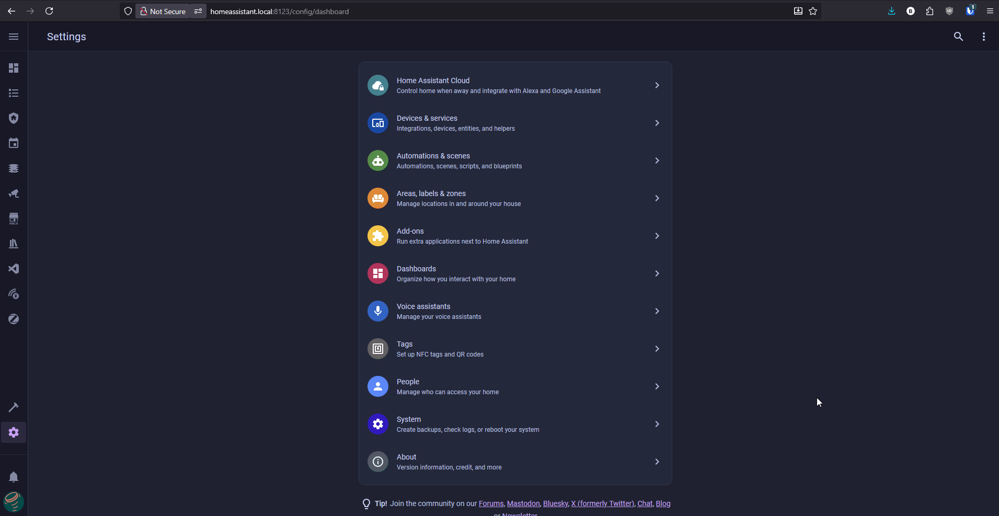
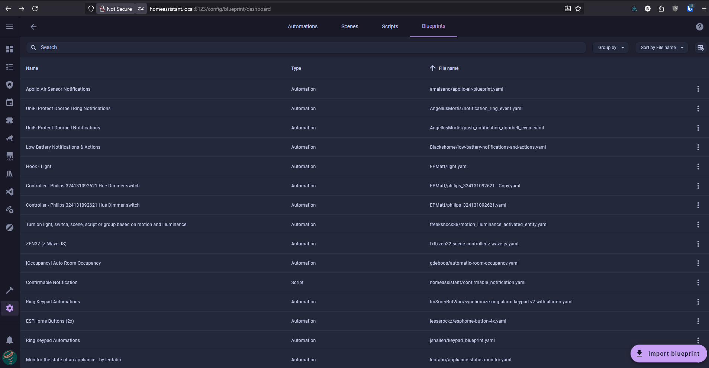
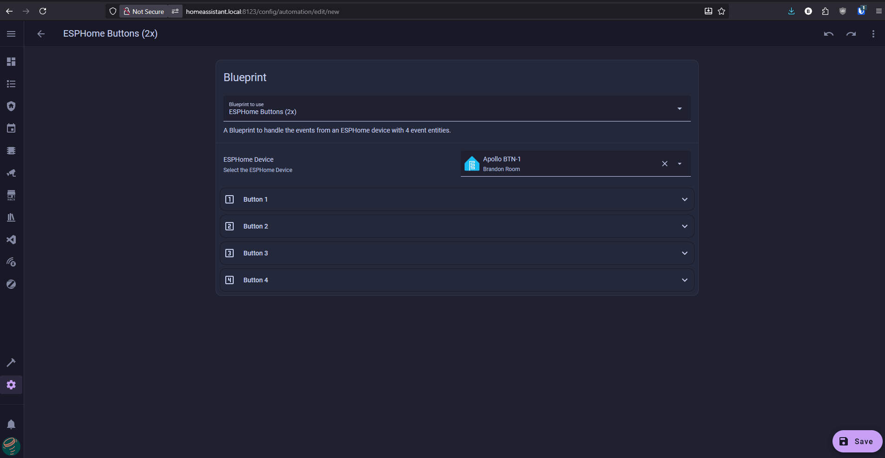

# Examples

1\. Head to the <a href="http://homeassistant.local:8123/config/automation/dashboard" target="_blank" rel="noreferrer nofollow noopener">automations page</a> and click on **Blueprints** in the top right then select **Import Blueprint**.

2\. Copy <a href="https://github.com/jesserockz/blueprints/blob/main/esphome-button-4x.yaml" target="_blank" rel="noreferrer nofollow noopener">this link</a> and paste it into the **Blueprint address** box and click **Preview** then click **Import blueprint**. <a href="https://github.com/jesserockz/blueprints/blob/main/LICENSE" target="_blank" rel="noreferrer nofollow noopener"><em>Thanks Jesse at ESPHome</em></a>*!*

3\. Click on **ESPHome Buttons (2x)** and click on **Select a device** then choose the **Apollo BTN-1.**

3\. For the **Single Click** event, click **Add Action**, then search for **Light: Toggle** and select it. Next, choose the entity you want to control, such as **BTN-1 Light**, and click **Save**. Name your automation something like **ESPHome BTN-1 Blueprint**. You can repeat this process for **Double Click**, **Four Clicks**, and **Hold** events.

!!! success "You can do this for all four buttons all in one blueprint!"

    This blueprint is packed with features - you can do a Single Click, a Double Click, Four Clicks, or a Hold on each of the four buttons. Just click Add action and set them all up!

4\. Your blueprint is now live. Click the button 1 button and it should toggle whatever light you selected in the blueprint. This can be anything in Home Assistant such as your light, fan, scene, etc!