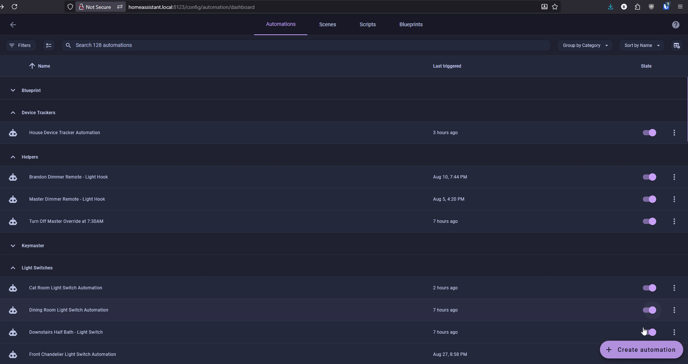
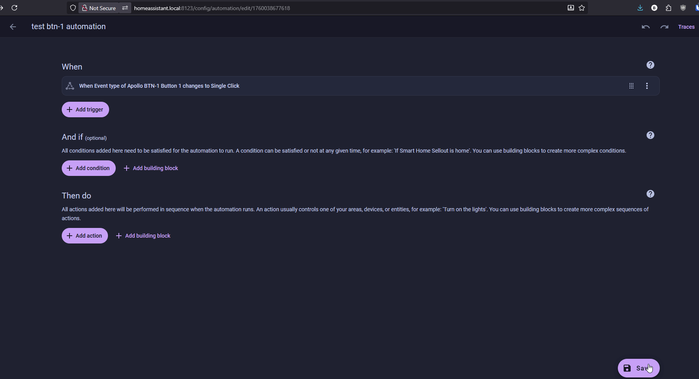

# Examples

1\. Head to the <a href="http://homeassistant.local:8123/config/automation/dashboard" target="_blank" rel="noreferrer nofollow noopener">automations page</a> and click on **Create Automation** in the bottom right then select **Create new automation**.

2\. Click on **Add trigger** then select **Entity** and then **State**. Then search for your btn-1 and select the btn-1 event. Then select the **Event Type** attribute and select **Single Click** in the box labeled **To**.

3\. Next click on **Add action** and search **Light: Toggle** and select it. Then choose your entity to turn on such as btn-1 light. Check the box next to Brightness and type in 100 then click Save and name your automation.

!!! tip "This is a very simple example automation."

    This example will work, however, it will require the attribute such as "Single Click" to change to Double Click or Long Press before it will toggle the light on a Single Click. You can get around this with advanced jinja templating - ChatGPT or Claude is great at helping with this!