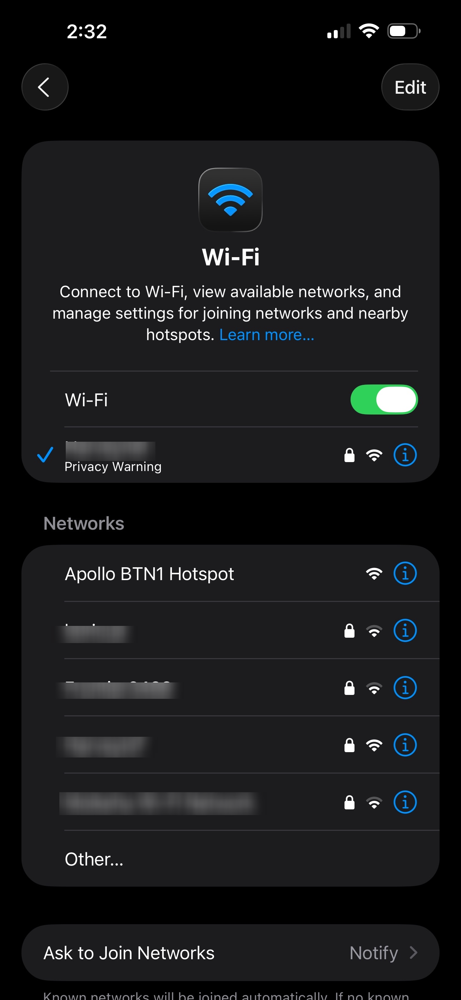

# BTN-1 Getting Started

### Installing the Brown Switches

1\.

### Installing the Keycaps

1\.

### Connecting Through Hotspot

To connect through the sensor's onboard hotspot follow the below:

1\. Plug the BTN-1 in via USB-C. A 5v 1amp power supply will work fine

!!! ! failure "If your sensor is restarting or not broadcasting Wi-Fi try another usb-c cable and power supply!"

    ESP devices are sensitive to power fluctuations and require constant 5v power. Our devices use 1amp or less so most used phone chargers will work - just make sure it's a quality one!

2\. On your phone or PC, open the WiFi settings and connect to "Apollo BTN-1 Hotspot".



3\. Once connected it should automatically open a dashboard for your sensor. If this does not automatically open the dashboard, please open your web browser and go to [http://192.168.4.1](http://192.168.4.1)

4\. Select the Wi-Fi network that you would like your sensor to connect to or scroll to the bottom and type in your Wi-Fi network then click "**Save**".


!!! tip "Tip for Mesh Wi-Fi systems or multiple Access Points"

    If you have multiple access points or a mesh system please manually type in your Wi-Fi network so it will join with the strongest signal!

5\. Once connected, the sensor's dashboard will automatically close. You've successfully connected your sensor to your Wi-Fi.

[Click here for next steps!](https://wiki.apolloautomation.com/products/btn1/setup/getting-started/#connecting-to-home-assistant-via-esphome-integration){                                .md-button .md-button--primary }

### Connecting with <a href="https://www.home-assistant.io/integrations/improv_ble" target="_blank" rel="noopener">Improv via BLE</a>

!!! note "Pre-requirement: Bluetooth proxy or Bluetooth Home Assistant hardware required"

    Bluetooth built in such as a raspberry pi or at least one <a href="https://wiki.apolloautomation.com/products/general/setup/bluetooth-proxy/" target="_blank" rel="noreferrer nofollow noopener">ESP32 BLE Proxy</a> is required to use this to setup your Apollo device. If you have already followed the "Connecting through Hotspot" please skip this section.

1\. Navigate to settings -&gt; integrations then click the "**ADD**" button below your new Apollo device then click **Submit**.


2\. Once prompted, type in your Wi-Fi name and password in the two fields then click **Submit**. Click on **Close** once it finishes.


3\. Click on **Add** then click on **Submit**. Choose an area and then click **Finish**.


4\. Your device is now added to your Wi-Fi and added to the ESPHome Integration in Home Assistant. You should now be ready to <a href="https://wiki.apolloautomation.com/products/btn1/examples/btn-1-blueprint" target="_blank" rel="noreferrer nofollow noopener">setup a blueprint</a> and start using your BTN-1!

### Connecting To ESPHome Device Builder

!!! tip "Skip the ESPHome Device Builder unless..."

    Feel free to [skip to the next section by clicking here](https://wiki.apolloautomation.com/products/general/setup/getting-started/#connecting-to-home-assistant-via-esphome-integration "Click to jump to the ESPHome Integration steps!") unless you need to rename your sensor or do manual edits to the yaml

You can add the ESPHome Device Builder addon in Home Assistant to easily update your device or edit the yaml. If you don't have ESPHome Device Builder addon installed you can <a href="http://homeassistant.local:8123/hassio/store" target="_blank" rel="noreferrer nofollow noopener">search esphome device builder on the addon store</a> and install it.

Make sure to fill out your Wi-Fi details in the SECRETS section by clicking on the SECRETS Image below.


```yaml
# Your Wi-Fi SSID and password - keep the quotes and just replace the name and password between the quotes!
wifi_ssid: "your-wifi-ssid-here"
wifi_password: "your-wifi-pass-here"
```

1\. Click "Show" in the top right to show your discovered devices!


2\. Click the ESPHome Builder in your sidebar then click "**TAKE CONTROL**" for your new Apollo Device!


3\. Rename your sensor here (this only renames the sensor in the ESPHome Device Compiler's Dashboard) or skip it and continue on by clicking "**TAKE CONTROL**" again as shown below.


4\. Click "**INSTALL**" (DO NOT click skip!) and let your device get adopted into the ESPHome Device Builder. Please have patience as this takes a few minutes to compile and then install to your new Apollo device!


5\. Once you see "**INFO OTA successful**" you are done. Click "**STOP**" to exit.


6\. Your new device is now adopted into the ESPHome Device Builder and you can move on to Integrating with Home Assistant via the ESPHome Integration below!

### Connecting to Home Assistant via ESPHome Integration:

1\. Click the "**Notifications**" Icon in the bottom left.


2\. Click "**Check it out**" to go to the integrations page and see the new device that was found.


3\. Click "**ADD**" to begin adding the device to home assistant.


4\. Click "**SUBMIT**" to confirm you want to add your new Apollo device to home assistant.


5\. Give it an area and click "**FINISH**".


6\. Your device is now added to home assistant via the ESPHome integration, and you can easily navigate to it by going to settings -&gt; <a href="http://homeassistant.local:8123/config/integrations/integration/esphome" target="_blank" rel="noopener">ESPHome integration</a> -&gt; click on the name of your new device!

[Click here to join our Discord for fast support! :simple-discord:](https://dsc.gg/apolloautomation){                                  .md-button .md-button--primary }