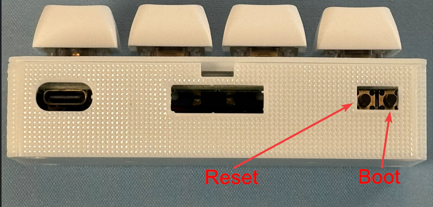

# Putting The BTN-1 In Boot Mode

!!! info "This will cover how to put the BTN-1 into boot mode."

    This is needed to force the device into boot mode to reflash the firmware.

##### Method 1: Boot Button Only

!!! success "If you have the battery model skip to Method 2!"

    If your BTN-1 has a battery in it, it will not properly enter boot mode while the battery is connected and has a charge. Please move to [Method 2 of the guide](https://wiki.apolloautomation.com/products/btn1/troubleshooting/btn1-boot-mode/#method-2-boot-and-reset-buttons).

1\. Plug in a USB cable that supports power and data into your computer.

2\. Disconnect power from your BTN-1, then hold the right (boot) button while plugging in a USB-C data cable to the BTN-1. Once connected, release the button.

4\. You are now ready to reflash your device!

[Click here to go to the reflashing guide!](https://wiki.apolloautomation.com/products/btn1/troubleshooting/btn1-reflash/){       .md-button .md-button--primary }

##### Method 2: Boot and Reset Buttons

1\. Plug in a USB cable that supports power and data into your computer and connect the other end to your BTN-1.

2\. With the device facing you, locate the reset (left) and boot (right) buttons.

2\. Hold down the boot button (the right button), then press and release the reset button (the left button) while keeping the boot button pressed. Finally, release the boot button.

3\. You are now ready to reflash your device!

[Click here to go to the reflashing guide!](https://wiki.apolloautomation.com/products/btn1/troubleshooting/btn1-reflash/){       .md-button .md-button--primary }