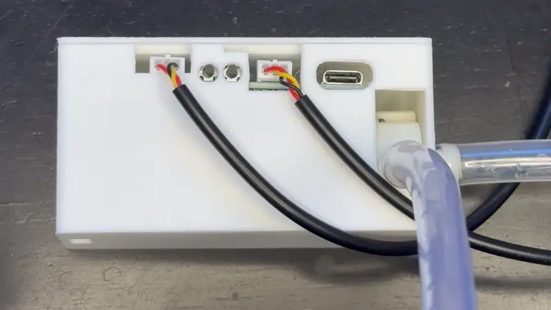
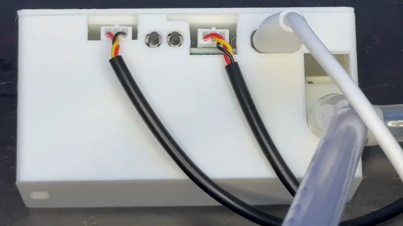

# Putting The BTN-1 In Boot Mode

!!! info "This will cover how to put the BTN-1 into boot mode."

    This is needed to force the device into boot mode to reflash the firmware.

##### Method 1: Boot Button Only

!!! danger "Empty the water reservoir and make sure no water is present in the tubes"

    Make sure that there is no water which is able to damage the device. This is a precautionary measure just to be safe!

1\. Disconnect your BTN-1 from power. With the device facing you, locate the boot button—it’s the button on the left.

2\. Plug in a USB cable that supports power and data into your computer.

3\. Push and hold the boot button (the left button). While still holding the button down, plug in a USB-C cable into the USB-C port of your BTN-1 then let go of the button.

4\. You are now ready to reflash your device!

[Click here to go to the reflashing guide!](https://wiki.apolloautomation.com/products/pump1/troubleshooting/btn1-reflash/){     .md-button .md-button--primary }

##### Method 2: Boot and Reset Buttons

1\. Plug in a USB cable that supports power and data into your computer and connect the other end to your BTN-1. With the device facing you, locate the reset (right) and boot (left) buttons.

2\. Hold down the boot button (the left button), then press and release the reset button (the right button) while keeping the boot button pressed. Finally, release the boot button.

3\. You are now ready to reflash your device!

[Click here to go to the reflashing guide!](https://wiki.apolloautomation.com/products/pump1/troubleshooting/btn1-reflash/){     .md-button .md-button--primary }