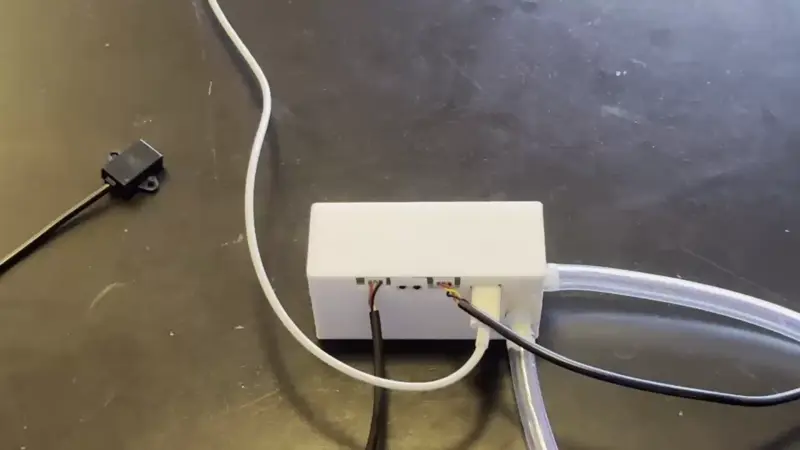
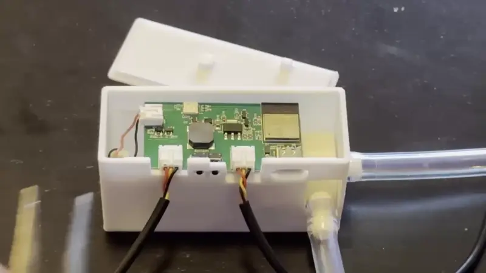
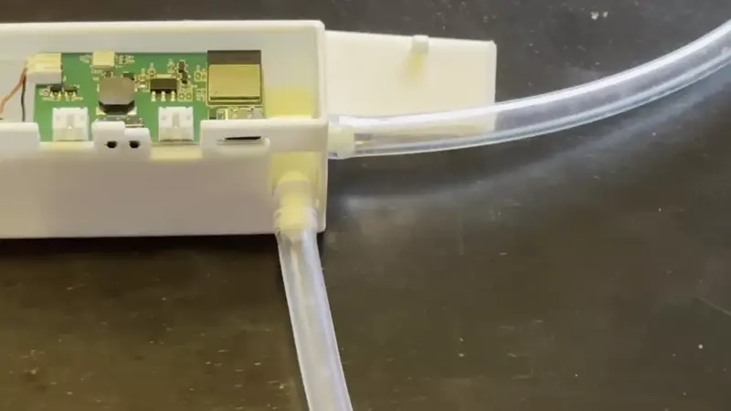
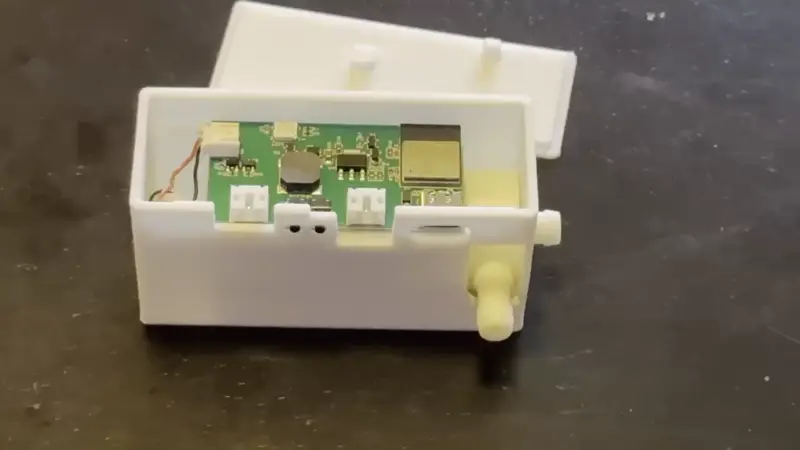
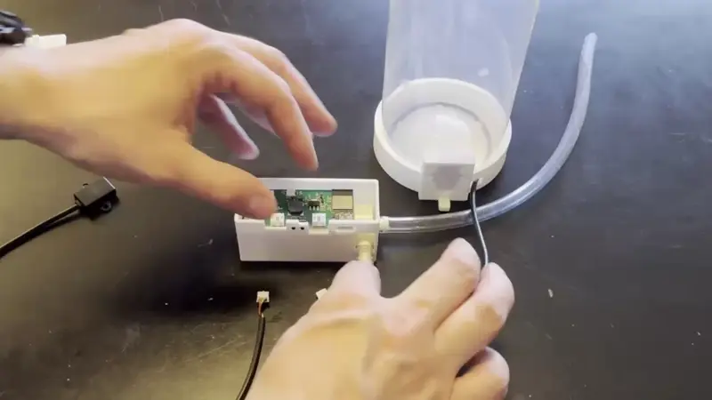

# Teardown and Reassembly Of BTN-1

###### Disassembly

!!! danger "Drain all liquid from the PUMP-1 before disassembling!"

    Ensure the PUMP-1 is fully drained of liquid before removing any tubes. Failure to do so may result in damage to the unit.

1\. Unplug the USB-C cable and remove the lid.

2\. Remove the 3 pin JST connectors using your fingers or needle nose pliers.

3\. Detach both the inlet and outlet tubes by pinching near the connection point and twisting gently while pulling - this makes removal much easier.

###### Reassembly

1\. Attach the two tubes to the pump as shown below. The fluid input tube is the left tube on the same side as the USB-C port and the fluid output tube is the tube on the right on the side of the PUMP-1.

2\. Insert the JST connector coming from your bottle's sensor into the **right-side port** on your PUMP-1 device. Ensure it is fully seated for proper operation. The small bump on top of the white connector must be facing **upwards** when inserting it. This ensures proper alignment and a secure connection. Follow up by inserting the second JST connector from the optional fluid output sensor into the **left-side port** on your PUMP-1 device. Ensure it is fully seated for proper operation. Finally, place the lid on top of the pump-1 case and gently snap it in place.

