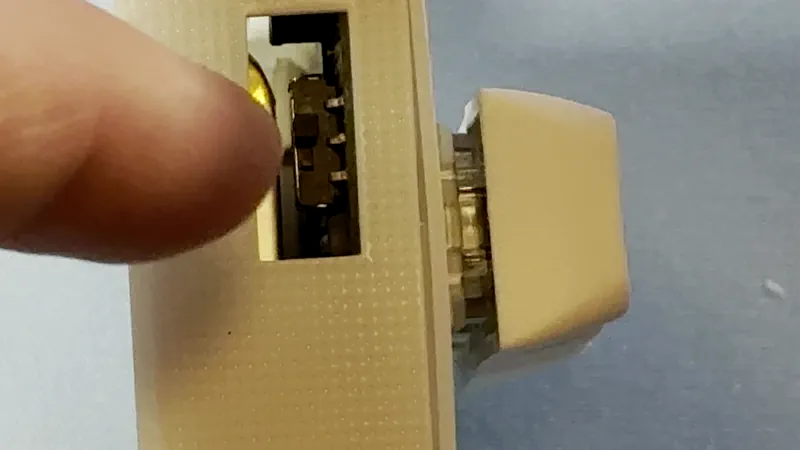
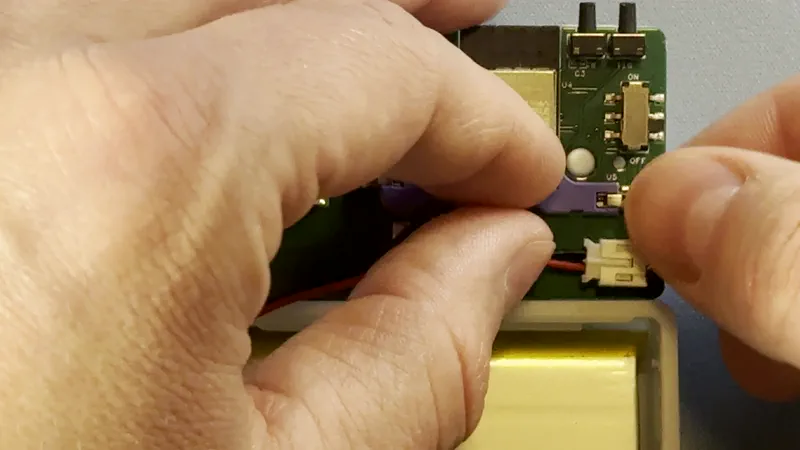

# Teardown and Reassembly Of BTN-1

###### Disassembly

!!! warning "If you have a BTN-1 with a battery you should flip the power switch to off"

    The BTN-1 ships with a lithium ion battery, however, this means it needs a master shutoff switch, which is on the left side of your BTN-1

1\. Flip the battery switch towards you to the off position. Users with no battery skip to step 2.

2\. With the BTN-1 USB-C port facing upwards, unplug the USB-C cable and remove the lid.

3\. Gently lift the BTN-1 green PCB out of the device at an angle so the buttons clear the case easier.

4\. Remove the 2-pin JST connector and remove the battery.

###### Reassembly

1\. Re-attach the 2-pin JST connector and place the battery writing side down with the wires on the left side of the case.

2\. Gently place the BTN-1 green PCB back in the case at an angle so the buttons will slide into cutout in the case.

3\. Line up the lid of the case with the holes for the rgb leds then gently press down to snap it into place.

4\. Flip the power switch back on.

