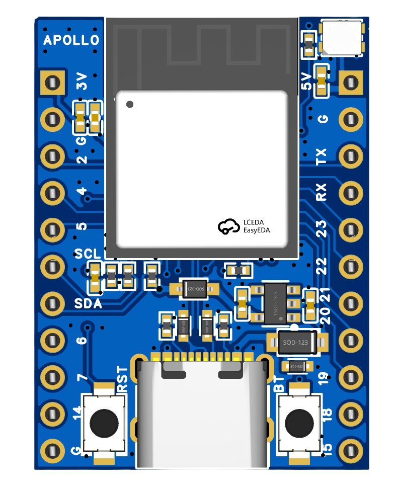
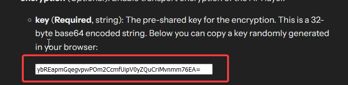

The Apollo DEV-2 is a very small dev board that we use to prototype before creating other new products. It has a built in RGB light (using GPIO3) and can push up to 600mA out of the 3.3v pin however 100-200mA of that will be used by the microcontroller itself. You are able to back-feed power via the 5v and G (ground) pins or use the USB-C port to power it, but NOT both at the same time.

The DEV-2 is a great starter device for tinkerers and can be purchased on its own or with a breadboard and dupont wires (jumper wires) if you need those too.

The DEV-2 does NOT come pre-flashed with ESPHome or WLED and requires you to flash it yourself, however there is a getting started video we've made here on the older DEV-1 board. The information is still the same except you'll be using a slightly differently yaml as shared below:

<div class="cms-embed">
  <iframe width="560" height="315" src="https://www.youtube.com/embed/oiKnTH1gg0Q?si=nNFDbHxZBuWIXHyH" title="YouTube video player" frameborder="0" allow="accelerometer; autoplay; clipboard-write; encrypted-media; gyroscope; picture-in-picture; web-share" referrerpolicy="strict-origin-when-cross-origin" allowfullscreen="">
  </iframe>
</div>

Please <a href="https://esphome.io/components/api.html#configuration-variables" target="_blank" rel="noopener">go to this website</a> and copy the randomly generated API key inside the code block as shown below then paste it in the code below where you see "use-a-randomly-generated-key-here".



**GPIO Pins Listed:**

```yaml
#These are the i2c pins
i2c:
  sda: GPIO1
  scl: GPIO0
```

```yaml
#This is the onboard LED pin
GPIO3
```

**Example ESPHome yaml:**

```yaml
#Define Project
substitutions:
  name: apollo-dev-2
  version:  "1"
  device_description: ${name} made by Apollo Automation - version ${version}.

esphome:
  name: "${name}"
  friendly_name: Apollo DEV-2
  comment: Apollo DEV-2
  platformio_options:
    board_build.flash_mode: dio

  project:
    name: "ApolloAutomation.DEV-2"
    version: "${version}"

# Define Board
esp32:
  board: esp32-c6-devkitm-1
  variant: esp32c6
  framework:
    type: esp-idf
    version: 5.3.1
    platform_version: 6.9.0

# Enable logging
logger:

# Enable Home Assistant API
api:
  encryption:
    key: "use-a-randomly-generated-key-here"

ota:
  - platform: esphome
    password: "a53d93acd493275512730c776f88722a"

wifi:
  ssid: !secret wifi_ssid
  password: !secret wifi_password

  # Enable fallback hotspot (captive portal) in case wifi connection fails
  ap:
    ssid: "Apollo-Dev-2 Fallback Hotspot"
    password: !secret wifi_password

captive_portal:

web_server:
  port: 80

#onboard LED using pin GPIO3 as shown below
light:
  - platform: esp32_rmt_led_strip
    id: rgb_onboard_light
    name: "RGB Onboard Light"
    pin: GPIO3
    default_transition_length: 0s
    chipset: WS2812
    num_leds: 1
    rgb_order: grb
    effects:
      - pulse:
          name: "Slow Pulse"
          transition_length: 1000ms
          update_interval: 1000ms
          min_brightness: 50%
          max_brightness: 100%
      - pulse:
          name: "Fast Pulse"
          transition_length: 100ms
          update_interval: 100ms
          min_brightness: 50%
          max_brightness: 100%

button:
  - platform: restart
    icon: mdi:power-cycle
    name: "ESP Reboot"

sensor:
  - platform: internal_temperature
    name: "ESP Temperature"
    id: sys_esp_temperature

  - platform: uptime
    name: Uptime
    id: sys_uptime
    update_interval: 60s

  - platform: wifi_signal
    name: RSSI
    id: wifi_signal_db
    update_interval: 60s
    entity_category: "diagnostic"

text_sensor:
  - platform: wifi_info
    ip_address:
      name: "${name} IP"
      icon: "mdi:ip-outline"
```