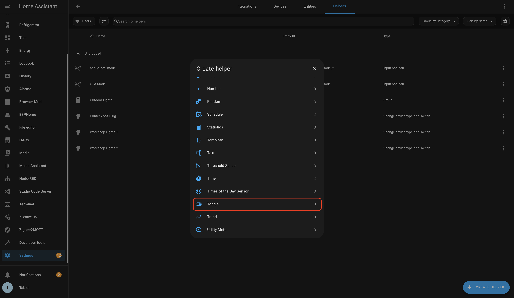

# How to keep your sensor awake using the Home Assistant Helper

1. Select HA Settings
2. Select Devices and Services

   

3. Select Helpers
4. Select Create Helper

   

5. Select Toggle

   

6. Under Name input: apollo\_ota\_mode

   

7. Select desired icon
8. Select Create
9. Should be all set!

   