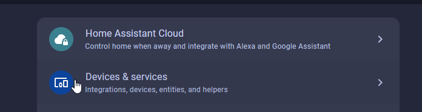
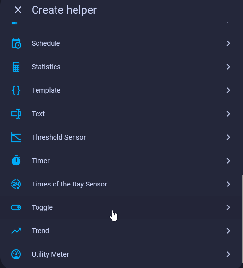
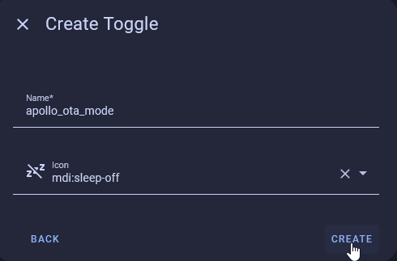
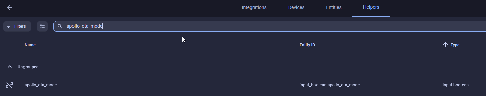
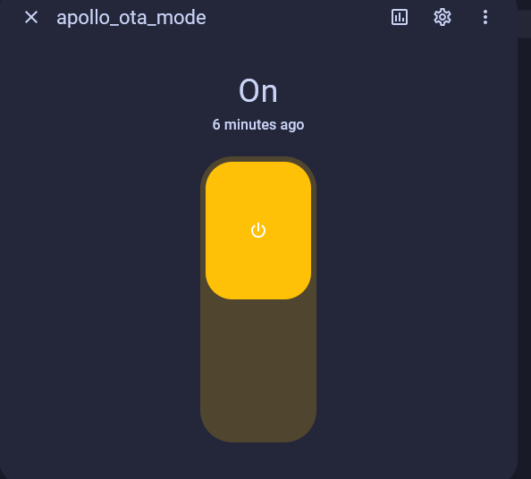
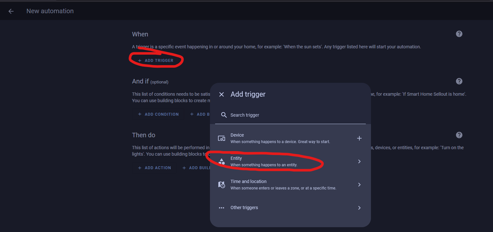
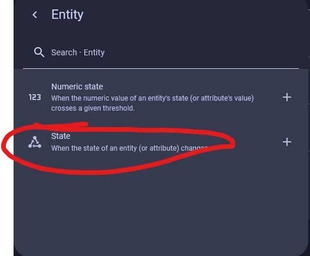
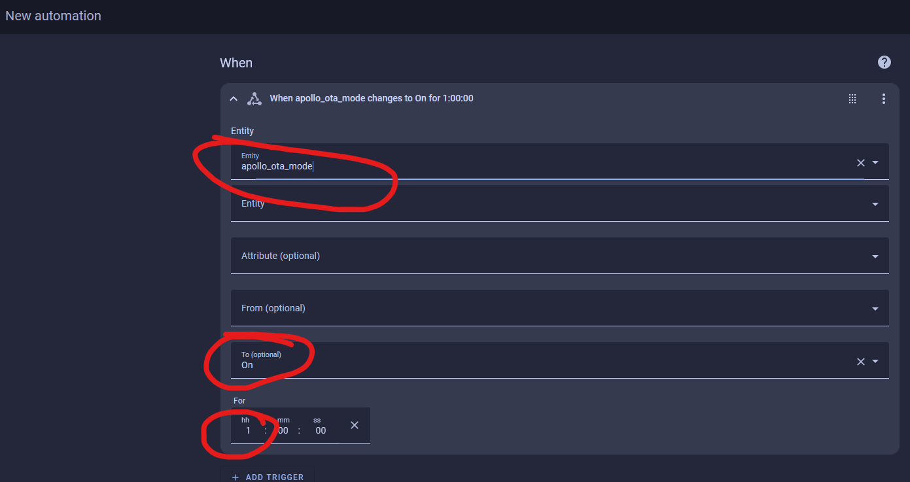
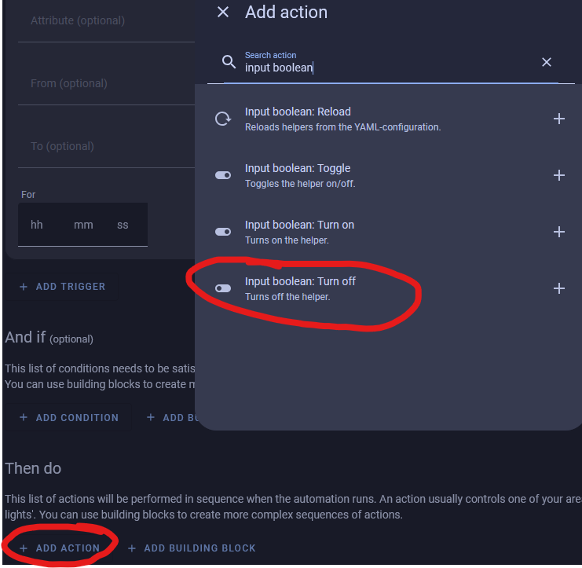
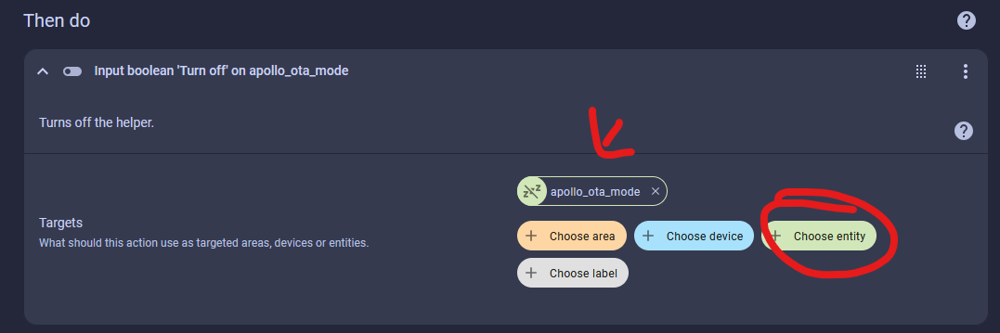

# How to keep your sensor awake using the Home Assistant Helper

1\. Open your Home Assistant dashboard and go to settings then select Devices and services and select helpers in the top right. <a href="http://homeassistant.local:8123/config/helpers" title="Open Helpers Page" target="_blank" rel="noopener">Or click here to go straight there</a>.

2\. Select Create Helper in the bottom right. 

 3\. Scroll down to the bottom and select Toggle.

 4\. For name use "apollo\_ota\_mode" and choose desired icon such as "mdi:sleep-off" then click Create.

5\. Search "apollo\_ota\_mode" and click on the helper shown.

 6\. Toggle the OTA mode on as shown below.

7\. Now when you reboot your device or when it wakes up on its wake timer, it will no longer go back to sleep.

!!! null "Warning: This will keep ALL of your apollo devices from sleeping."

    Please keep reading to create an automation to turn this helper off after one hour of it being on.

8\. Create a new automation and select "add trigger" then select entity then select state.

9\. Type in "apollo\_ota\_mode" in the box for entity and then select "On" and finally put a 1 in the hours box under "For". This is telling home assistant if the apollo\_ota\_mode is on for one hour then this trigger will fire (trigger).

10\. Scroll down to "Then do" and click "Add Action" and type in "input boolean" and choose the option that says "Input Boolean: Turn off".

11\. Now select choose entity and select apollo\_ota\_mode as shown below.

12\. Now you are done! You can toggle your OTA mode on so that you can update your devices and after one hour it will automatically be turned off for you!

&nbsp;