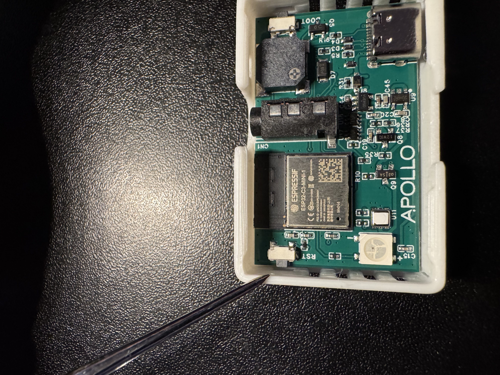
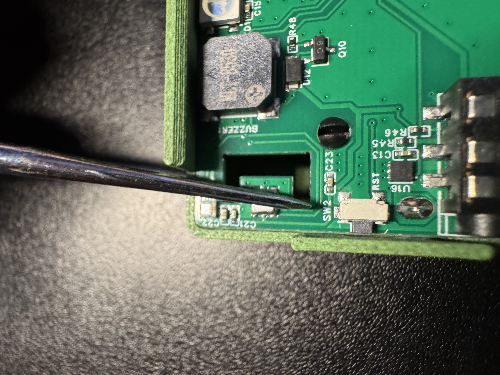
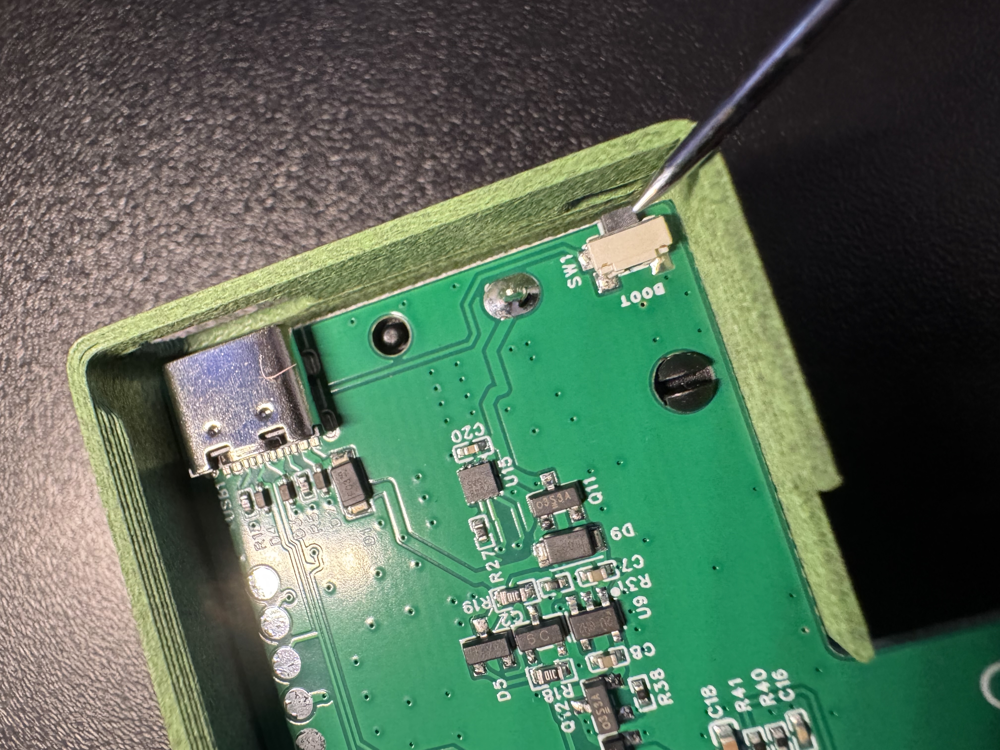

# Sensor Connection Check

1\. Press the reset button and let go to restart the device <a href="https://wiki.apolloautomation.com/products/temp1b/troubleshooting/temp1b-boot-mode" target="_blank" rel="noopener"><strong>TEMP-1B reset button</strong></a>

<a href="https://apolloautomation.github.io/docs/products/plt1/plt1-boot-mode/" target="_blank" rel="noopener"><strong>PLT-1B reset button</strong></a>

2\. Press the boot button and let go <a href="https://wiki.apolloautomation.com/products/temp1b/troubleshooting/temp1b-boot-mode" target="_blank" rel="noopener"><strong>TEMP-1B boot button</strong></a>

<a href="https://apolloautomation.github.io/docs/products/plt1/general-tips/" target="_blank" rel="noopener"><strong>PLT-1B boot button</strong></a>

The RGB Light on your device should flash green if connected to Wi-Fi, blue if connected to Wi-Fi and Home Assistant, or yellow if no Wi-Fi or Home Assistant connection.

Yellow: No connection to Wi-Fi or Home Assistant Green: Connection to Wi-Fi only Blue: Connection to Wi-Fi and Home Assistant

!!! tip "Head to the awake helper wiki article"

    If you need to keep your sensor awake for extended periods of time we suggest using our [OTA awake helper](https://wiki.apolloautomation.com/products/general/battery-sensors/awake-ha-helper/).