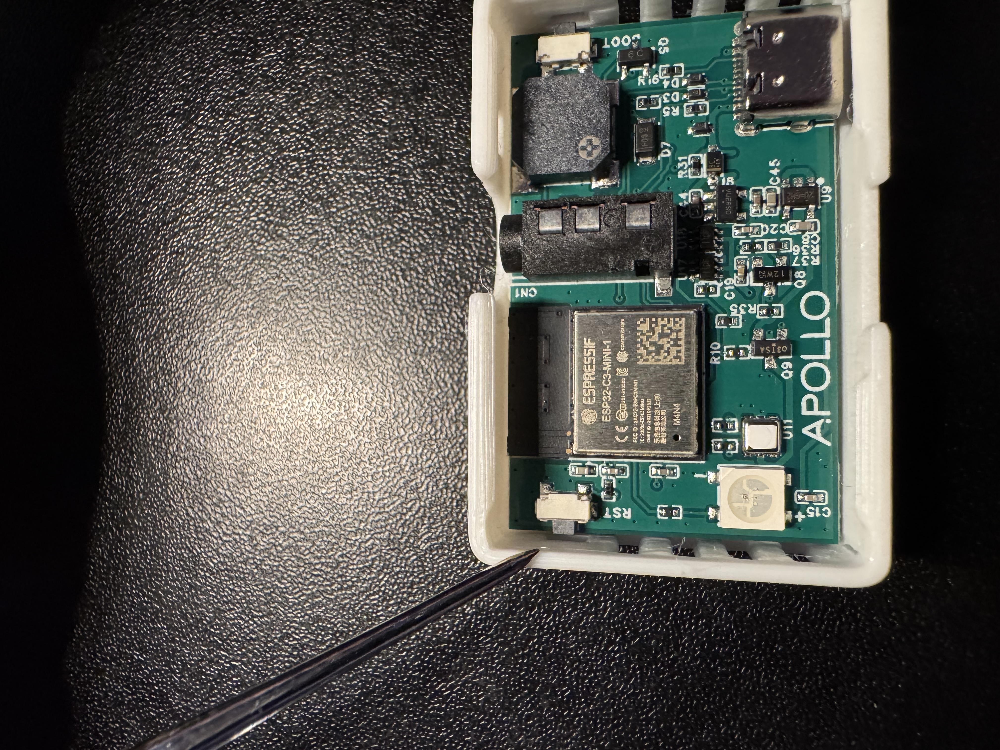
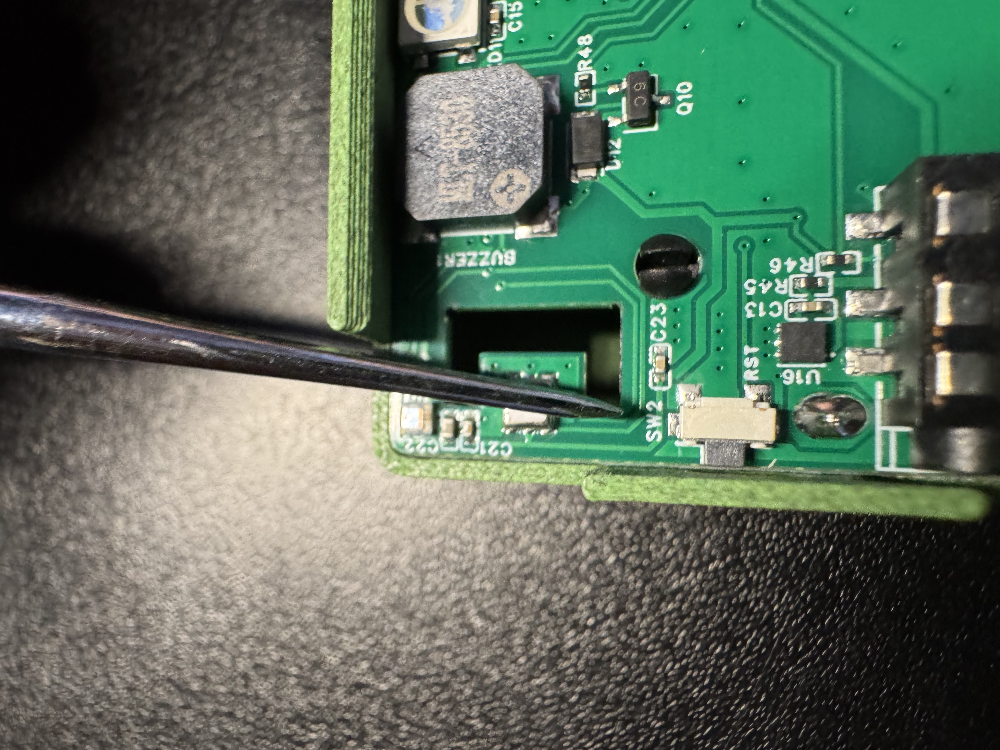
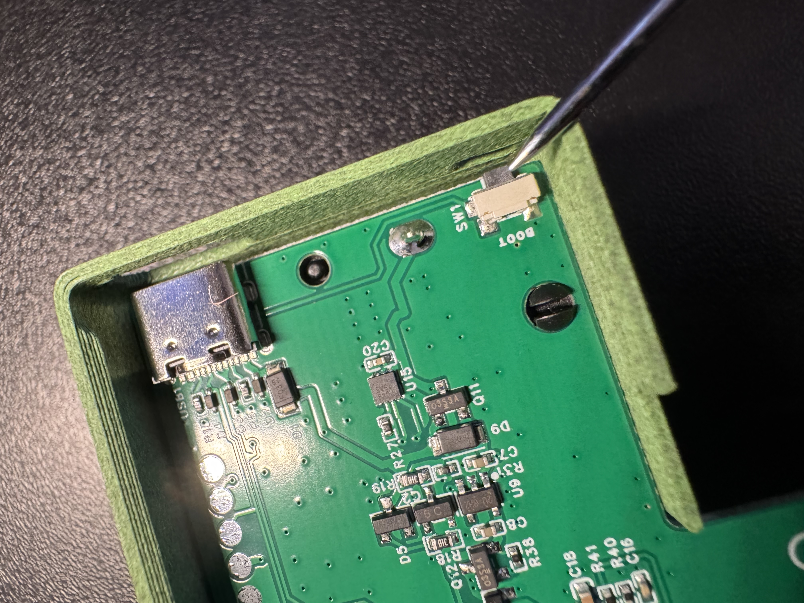

###### Method 1

Press the reset button and let go to restart the device <a href="https://wiki.apolloautomation.com/products/temp1b/troubleshooting/temp1b-boot-mode" target="_blank" rel="noreferrer nofollow noopener"><strong>TEMP-1B reset button</strong></a>

 <a href="https://wiki.apolloautomation.com/products/plt1b/troubleshooting/plt1b-boot-mode/" target="_blank" rel="noreferrer nofollow noopener"><strong>PLT-1B reset button</strong></a>

###### Method 2

Quickly press and hold the boot button for 4-5 seconds

<a href="https://wiki.apolloautomation.com/products/temp1b/troubleshooting/temp1b-boot-mode" target="_blank" rel="noopener"><strong>TEMP-1B boot button</strong></a>

<a href="https://wiki.apolloautomation.com/products/plt1b/troubleshooting/plt1b-boot-mode/" target="_blank" rel="noreferrer nofollow noopener"><strong>PLT-1B boot button</strong></a>

Your device is now "awake" but it will not stay awake on its own yet. Click the "prevent sleep" button on your device page in Home Assistant or directly on the device web server such as plt-1.local or its IP address.

!!! success "Head to the awake helper wiki article"

    If you need to keep your sensor awake for extended periods of time we suggest using our [OTA awake helper](https://wiki.apolloautomation.com/products/general/battery-sensors/awake-ha-helper/).