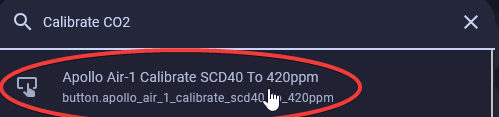
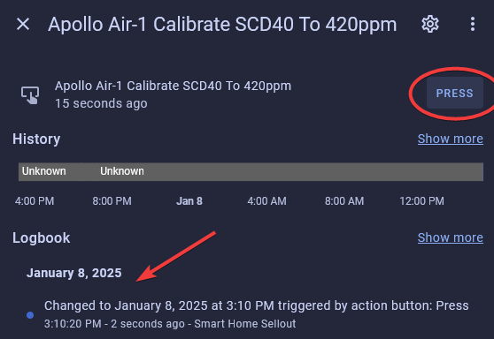

# CO2 Calibration - The Quick method - Desktop Only not mobile

This article will guide you through a simple calibration of your CO2 sensor for any Apollo Automation device!

1\. Plug in your sensor outdoors and leave it for at least 5 minutes to allow the readings to stabilize. This should be around [420 ppm per NASA](https://climate.nasa.gov/vital-signs/carbon-dioxide/?intent=121 "NASA CO2 levels").

2\. Go to your home assistant dashboard and hit the letter "e" - It will pop up with an entity filter and here we will type in "Calibrate CO2" and select the correct device.

!!! tip "Hint"

    If you cannot get this menu to pop-up, click somewhere on the [Home Assistant](https://www.home-assistant.io/) dashboard then press your "e" key.

3\. Click on the button that says "PRESS" and then you are done.

