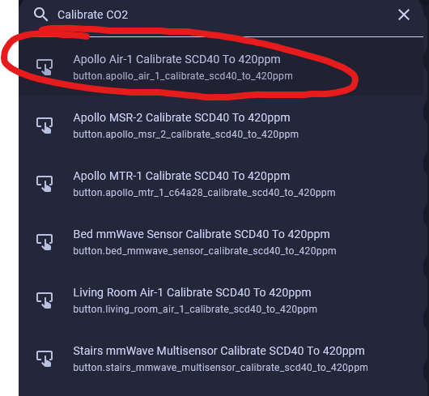
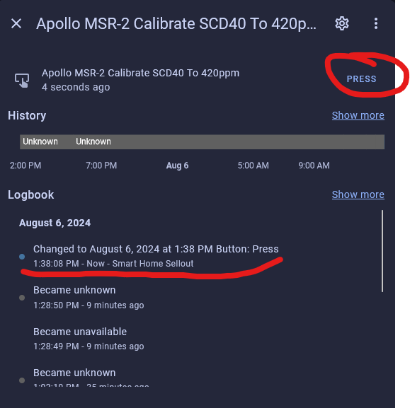

# CO2 Calibration - The Quick method - Desktop Only not mobile

This article will guide you through a simple calibration of your CO2 sensor for any Apollo Automation device!

1\. Go to your home assistant dashboard and hit the letter "e" - It will pop up with an entity filter and here we will type in "Calibrate CO2" and select the correct device.

!!! tip "Hint"

    If you cannot get this menu to pop-up, click somewhere on the home assistant dashboard then press your "e" key

2\. Plug your sensor in outside and let it sit for 5 minutes or more to get normalized readings.

3\. Click on the button that says "PRESS" and then you are done.

4\. Go get your sensor from outside and plug your sensor in wherever you want it!