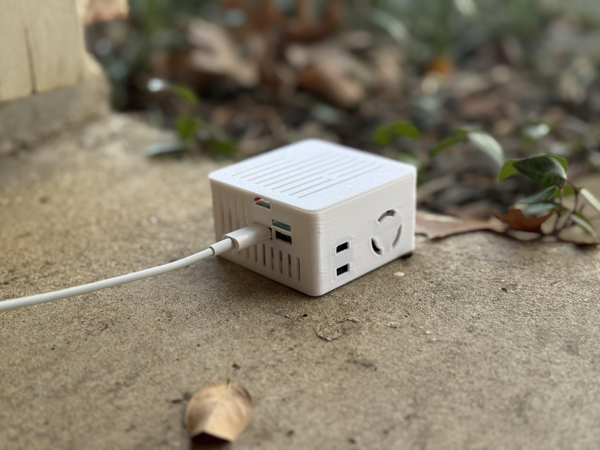

# CO2 Calibration - The Quick method - Desktop Only not mobile

!!! tip "This should be done every 1-2 years."

    The <a href="https://sensirion.com/products/catalog/SCD40" title="Documentation on SCD40 CO2 Sensor!" target="_blank" rel="noreferrer nofollow noopener">SCD40 CO2 sensor</a> has a long lifetime (<a href="https://sensirion.com/media/documents/48C4B7FB/66E05452/CD_DS_SCD4x_Datasheet_D1.pdf" title="scd10 datasheet showing lifetime over 10 years" target="_blank" rel="noreferrer nofollow noopener">over 10 years</a>) but it requires re-calibration after 1-2 years back to a 420 ppm baseline!

This article will guide you through a simple calibration of your CO2 sensor for any Apollo Automation device!

1\. Plug in your sensor outdoors and leave it for at least 5 minutes to allow the readings to stabilize. This should be around <a href="https://climate.nasa.gov/vital-signs/carbon-dioxide/?intent=121" title="NASA CO2 levels" target="_blank" rel="noreferrer nofollow noopener">420 ppm per NASA</a>.

2\. Go to your Home Assistant dashboard and hit the letter "e" - It will pop up with an entity filter then type in "Calibrate CO2" and select the correct device.

!!! tip "Hint"

    If you cannot get this menu to pop-up, click somewhere on the <a href="https://www.home-assistant.io/" target="_blank" rel="noreferrer nofollow noopener">Home Assistant</a> dashboard then press your "e" key.

3\. Click on the button that says "PRESS" and then you are done.

