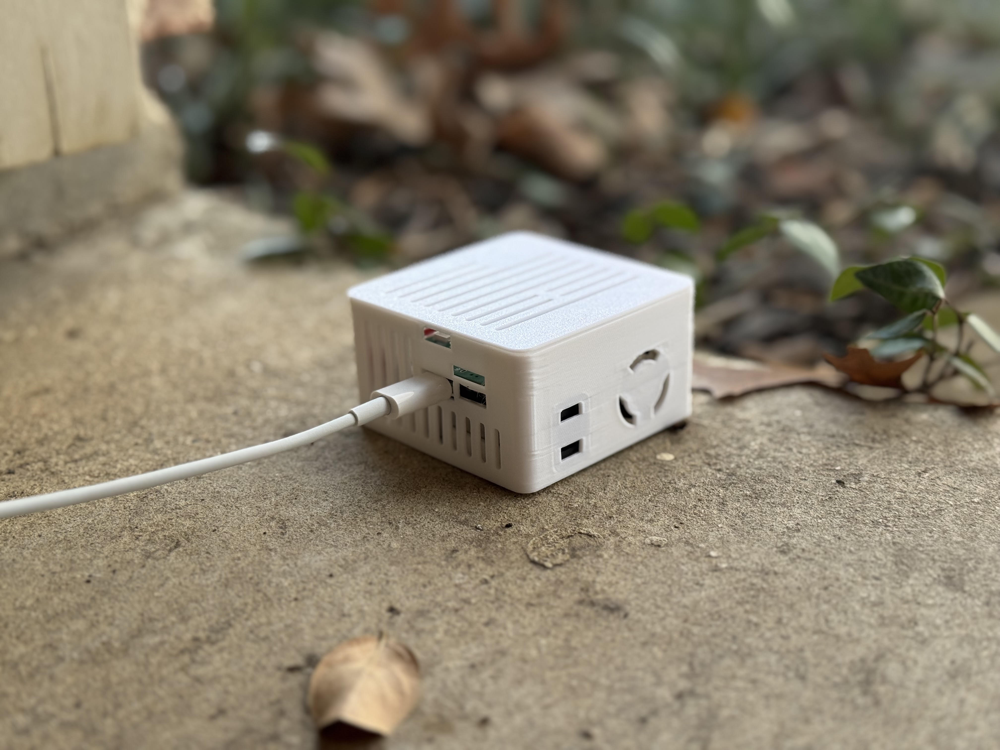
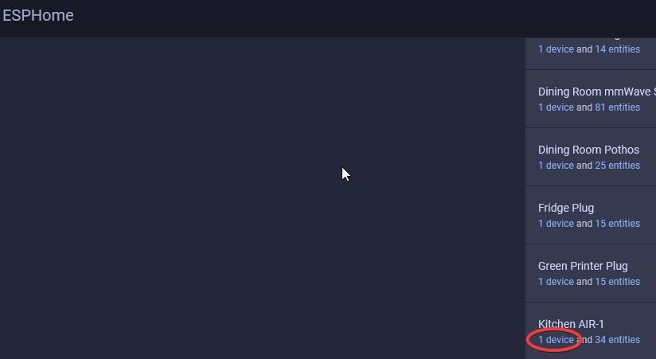
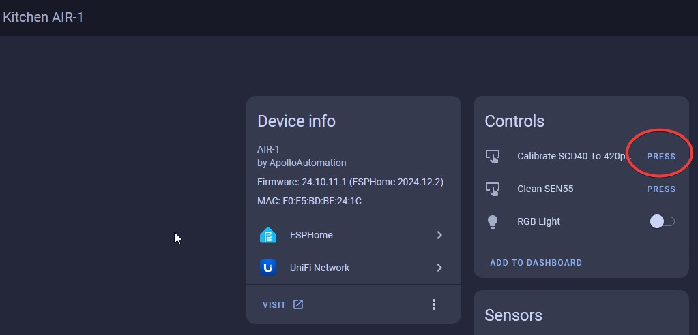
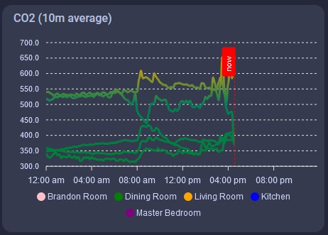
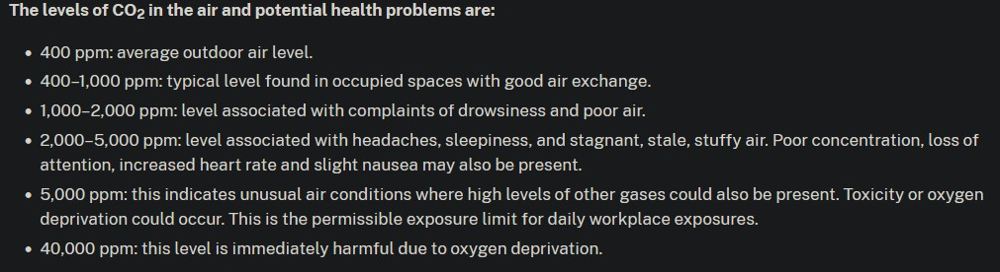
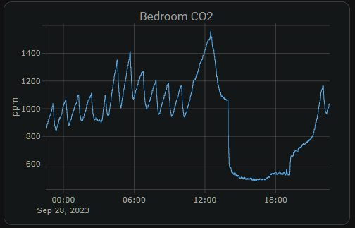

# CO2 Calibration

!!! tip "This should be done every 1-2 years."

    The <a href="https://sensirion.com/products/catalog/SCD40" title="Docmentation on SCD40 CO2 Sensor!" target="_blank" rel="noreferrer nofollow noopener">SCD40 CO2 sensor</a>\{:target="\_blank" rel="noopener noreferrer"\} has a long lifetime (<a href="https://sensirion.com/media/documents/48C4B7FB/66E05452/CD_DS_SCD4x_Datasheet_D1.pdf" title="scd10 datasheet showing lifetime over 10 years" target="_blank" rel="noreferrer nofollow noopener">over 10 years</a>) but it requires re-calibration after 1-2 years back to a 420 ppm baseline!

1\. Bring your sensor outside and plug it in. You might need a USB battery bank if you live in an apartment or otherwise cannot get power outside of your building.

2\. Head to the <a href="http://homeassistant.local:8123/config/integrations/integration/esphome" title="Click me to go to the ESPHome integrations page" target="_blank" rel="noreferrer nofollow noopener">ESPHome Integrations page</a>.

3\. Click device as shown in the image below.

4\. Click the "Press" button next to Calibrate SCD40 to 420 ppm and you should see the CO2 readings at 420 ppm or near it.

It can take a few times clicking the calibrate for it to equalize correctly sometimes. If you don't see the SCD40 reporting 400-500 ppm then click the button again.

5\. Now your CO2 sensor should be calibrated! Be sure to setup some nice cards on your dashboard so you can monitor the CO2 levels.

!!! danger "Dangerous CO2 level considerations"

    The CO2 levels in a bedroom with the door closed and no ventilation can easily spike to levels where you lose focus or worse!

Note the steep decline in CO2 ppm detected due to the door and window being opened and fan turned on.

<a href="https://www.dhs.wisconsin.gov/chemical/carbondioxide.htm" target="_blank" rel="noreferrer nofollow noopener">Wisconsin Department of Health CO2 Level Chart</a>

&nbsp;

!!! example "CO2 levels dropping due to HVAC Fan on a schedule"

    This could be improved by increasing air exchange to get below 1000 ppm for a safer environment.

