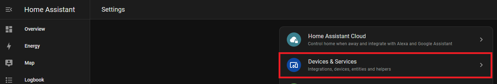

# CO2 Calibration

1\. Take your sensor outside (for a walk :D) and plug it in. Make sure it is connected to Home Assistant and let it sit powered on for 3-5 minutes outside before starting the calibration.

2\. Navigate to your Home Assistant Dashboard and select settings

3\. Select Devices & Services

4\. Select ESPHome

5\. Find your sensor and click on the blue “1 device” link

6\. Press the Calibrate SCD40 button and you are all set!

If you do not see this button, either [update your firmware](https://wiki.apolloautomation.com/products/general/calibrating-and-updating/updating-firmware/).

It can take a few times clicking the calibrate for it to equalize correctly. If you don't see the SCD40 reporting 400-500 ppm then click it again.

7\. Now your CO2 sensor should be calibrated! Be sure to setup some nice cards on your dashboard so you can monitor the CO2 levels. My bedroom's CO2 levels got dangerously high and I had to run my HVAC more frequently at night to circulate the air. See examples of cards and data below.

Example Home Assistant Card

Dangerous CO2 levels in bedroom. Steep decline in level due to opening door, window and running fan.

Wisconsin Department of Health CO2 Level Chart

CO2 levels staying below 1500 ppm after changing HVAC fan schedule to circulate air more frequently. Need to increase air exchange to get below 1000 ppm for a safer environment.

