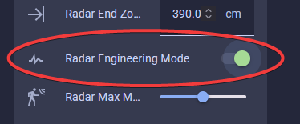
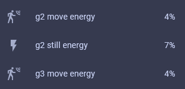
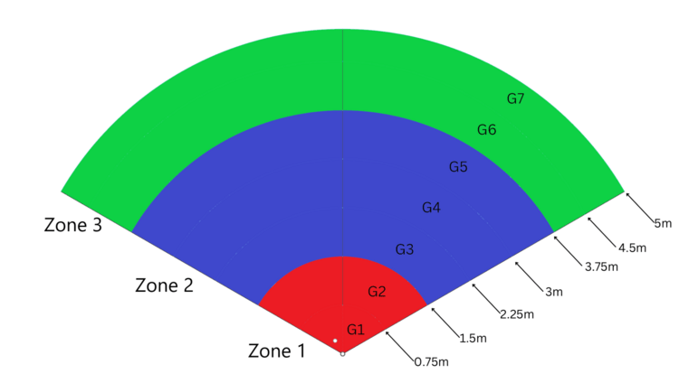
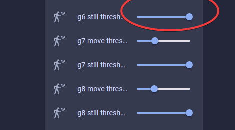
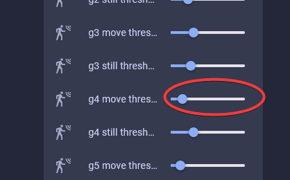

!!! tip "Radar Engineering Mode (REM)"

    If you're experiencing false triggers, we recommend using Radar Engineering Mode (REM) to monitor the gate energy and adjust the gate threshold to eliminate them.

Quick introduction video of the LD2410B gates and zones.

  <iframe width="560" height="315" 
    src="https://www.youtube.com/embed/w_Gq62Edsnc?si=IxNE-pt-3u2FHMzT" 
    title="YouTube video player" 
    frameborder="0" 
    allow="accelerometer; autoplay; clipboard-write; encrypted-media; gyroscope; picture-in-picture; web-share" 
    referrerpolicy="strict-origin-when-cross-origin" 
    allowfullscreen>
  </iframe>

How to tune the mmWave sensor using radar engineering mode.

  <iframe width="560" height="315" 
    src="https://www.youtube.com/embed/6VrTfaFyMPk?si=KI9gcbJB0EgAT3uW" 
    title="YouTube video player" 
    frameborder="0" 
    allow="accelerometer; autoplay; clipboard-write; encrypted-media; gyroscope; picture-in-picture; web-share" 
    referrerpolicy="strict-origin-when-cross-origin" 
    allowfullscreen>
  </iframe>

1\. Open Home Assistant.

2\. Navigate to the ESPHome integration by going to settings -&gt; <a href="http://homeassistant.local:8123/config/integrations/integration/esphome" target="_blank" rel="noopener">esphome integration</a> -&gt; click on the name of your new device!

3\. Scroll down to the Configuration section.

4\. Turn on Radar Engineering Mode (REM).

5\. Scroll down to the Diagnostic section and you will see that REM shows the move and still energy for gates 0-8.

6\. The gates are different distances from the sensor 

7\. Moving the gate still and move threshold slider to the right increases the amount of energy needed to trigger the sensor. Do this if you want the gate to be less sensitive. 

8\. Moving the gate still and move threshold slider to the left decreases the amount of energy needed to trigger the sensor. Do this if you want the gate to be more sensitive. 

!!! quote "Quote from popular Youtuber Make It Work Tech"

    I ended up maxing out the sliders on all gates and then bringing them down just enough to pick up human presence. Definitely easier than using the LD2410B app. - <a href="https://www.youtube.com/@makeitworktech" title="Make it Work" target="_blank" rel="noreferrer nofollow noopener">MakeItWorkTech</a>

!!! example "Open-Concept kitchen and living room with MSR-2 to activate the under-cabinet lights only when person in the kitchen"

    1. Stand in the desired trigger locations.
    2. Observe the gate energy.
    3. Adjust the gate threshold slider to the right, increasing the energy required to trigger the mmWave sensor. This ensures that your kitchen lights only come on when you're actually in the kitchen, not just walking by in the living room. Also, you can lower the gate threshold in the kitchen by moving the slider to the left. This makes the mmWave sensor more sensitive, even when standing still. This way, you avoid having the lights go off while reading a recipe or doing the dishes.

**<u>References</u>**

* [https://youtu.be/dAzHXpP3FcI?t=431](https://youtu.be/dAzHXpP3FcI?t=431)
* [https://community.home-assistant.io/t/ld2410-esphome-tips/477058/316](https://community.home-assistant.io/t/ld2410-esphome-tips/477058/316)
* [https://www.youtube.com/watch?v=l212Lvo1R6s](https://www.youtube.com/watch?v=l212Lvo1R6s)