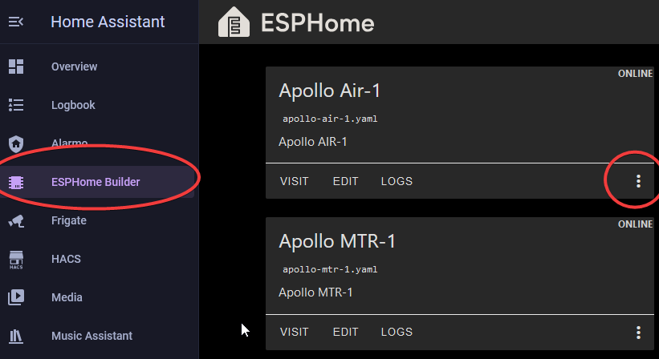
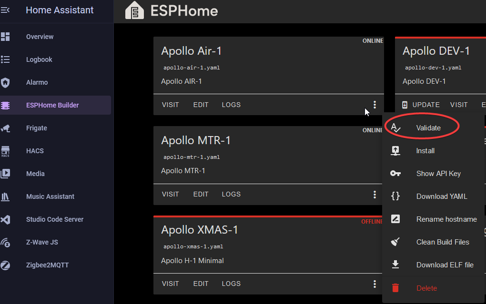
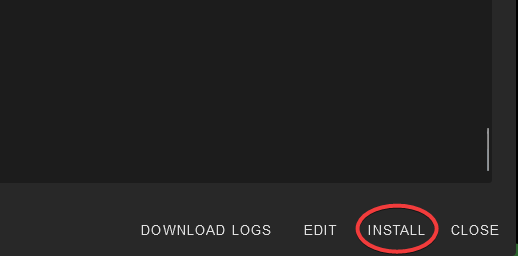
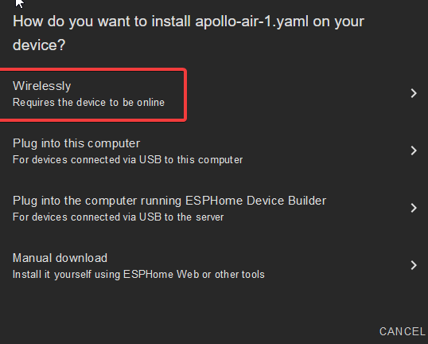
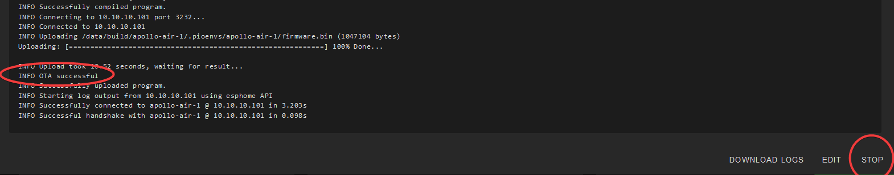

# Updating with ESPHome Device Builder

1\. In Home Assistant open the <a href="https://esphome.io/guides/getting_started_hassio.html" target="_blank" rel="noopener"><strong>ESPHome Device Builder</strong></a>**.**

!!! tip "Make sure you are running the latest version of ESPHome"

    You should be fully up to date with the ESPHome Device Builder before updating our sensors for ideal performance and ease of troubleshooting!

2\. Find the sensor you want to update and click the three dots on the far right.

3\. Select “**Validate**” from the list.

4\. Once the validation completes, click “**Install**” in the bottom right.

5\. Click "**Wirelessly**".

6\. Once you see "**INFO OTA successful**" you are done. Click "**STOP**" to exit.

