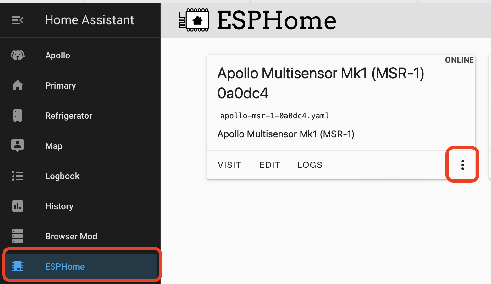
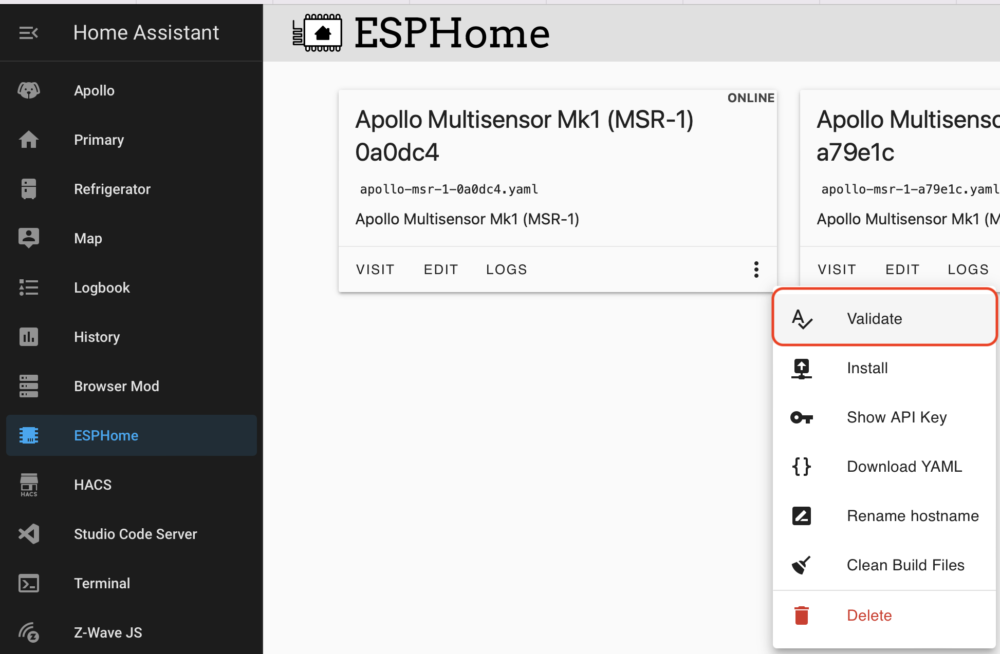
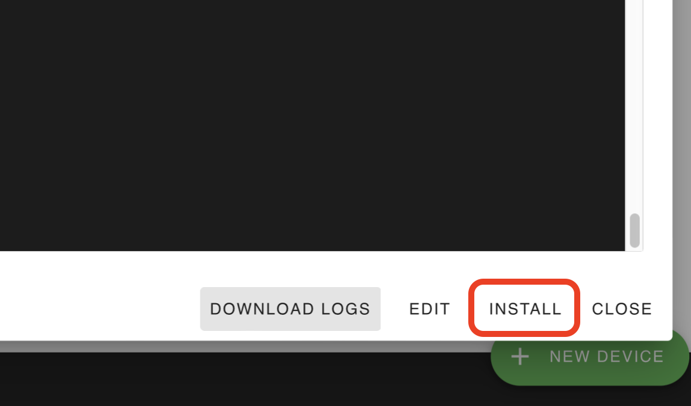

# Updating Firmware

## Updating Through ESPHome Addon

1. **In HomeAssistant open the** <a href="https://esphome.io/guides/getting_started_hassio.html" target="_blank" rel="noreferrer nofollow noopener"><strong>ESPHome addon</strong></a>

   

   

2. **Or click this to** [**Open your Home Assistant instance and show the dashboard of the ESPHome add-on.**](https://my.home-assistant.io/redirect/supervisor_addon/?addon=5c53de3b_esphome&amp;repository_url=https%3A%2F%2Fgithub.com%2Fesphome%2Fhome-assistant-addon "Open your Home Assistant instance and show the dashboard of the ESPHome add-on.")
3. **Make sure you are running the latest version of ESPHome**
4. **On older hardware, it will not auto-update so you will have to uninstall and reinstall ESPHome**
5. **Find the sensor you want to update and click the three dots in the bottom right**

****

**5\. Select “Validate” from the list**

**6\. Once the validation completes, click “Install” in the bottom right**

**7\. Complete!**