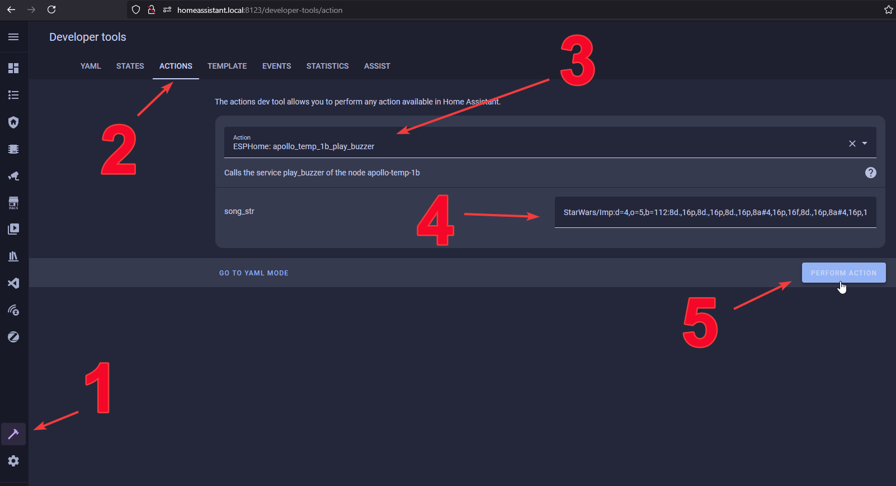

# Piezo Buzzer

This guide will walk you through using the buzzer on your MSR-1. You can also call the below service through automations in Home Assistant.

1\. Open Home Assistant and navigate to developer tools in the bottom left.

2\. Select Actions

3\. Select your devices buzzer in the Action box by typing in "buzzer" and selecting it.

4\. Input a RTTTL tone into the the string box such as one of the examples below.



**Mario:**

```yaml
smb:d=4,o=5,b=100:16e6,16e6,32p,8e6,16c6,8e6,8g6,8p,8g,8p,8c6,16p,8g,16p,8e,16p,8a,8b,16a#,8a,16g.,16e6,16g6,8a6,16f6,8g6,8e6,16c6,16d6,8b,16p,8c6,16p,8g,16p,8e,16p,8a,8b,16a#,8a,16g.,16e6,16g6,8a6,16f6,8g6,8e6,16c6,16d6,8b,8p,16g6,16f#6,16f6,16d#6,16p,16e6,16p,16g#,16a,16c6,16p,16a,16c6,16d6,8p,16g6,16f#6,16f6,16d#6,16p,16e6,16p,16c7,16p,16c7,16c7,p,16g6,16f#6,16f6,16d#6,16p,16e6,16p,16g#,16a,16c6,16p,16a,16c6,16d6,8p,16d#6,8p,16d6,8p,16c6
```

??? example "Mario"

    ``` yaml
    smb:d=4,o=5,b=100:16e6,16e6,32p,8e6,16c6,8e6,8g6,8p,8g,8p,8c6,16p,8g,16p,8e,16p,8a,8b,16a#,8a,16g.,16e6,16g6,8a6,16f6,8g6,8e6,16c6,16d6,8b,16p,8c6,16p,8g,16p,8e,16p,8a,8b,16a#,8a,16g.,16e6,16g6,8a6,16f6,8g6,8e6,16c6,16d6,8b,8p,16g6,16f#6,16f6,16d#6,16p,16e6,16p,16g#,16a,16c6,16p,16a,16c6,16d6,8p,16g6,16f#6,16f6,16d#6,16p,16e6,16p,16c7,16p,16c7,16c7,p,16g6,16f#6,16f6,16d#6,16p,16e6,16p,16g#,16a,16c6,16p,16a,16c6,16d6,8p,16d#6,8p,16d6,8p,16c6
    ```

??? example "Cantina"

    ``` yaml
    Cantina:d=4,o=5,b=250:8a,8p,8d6,8p,8a,8p,8d6,8p,8a,8d6,8p,8a,8p,8g#,a,8a,8g#,8a,g,8f#,8g,8f#,f.,8d.,16p,p.,8a,8p,8d6,8p,8a,8p,8d6,8p,8a,8d6,8p,8a,8p,8g#,8a,8p,8g,8p,g.,8f#,8g,8p,8c6,a#,a,g
    ```

??? example "Star Wars Imperial Death March"

    ``` yaml
    StarWars/Imp:d=4,o=5,b=112:8d.,16p,8d.,16p,8d.,16p,8a#4,16p,16f,8d.,16p,8a#4,16p,16f,d.,8p,8a.,16p,8a.,16p,8a.,16p,8a#,16p,16f,8c#.,16p,8a#4,16p,16f,d.,8p,8d.6,16p,8d,16p,16d,8d6,8p,8c#6,16p,16c6,16b,16a#,8b,8p,16d#,16p,8g#,8p,8g,16p,16f#,16f,16e,8f,8p,16a#4,16p,2c#
    ```

**Cantina:**

```
Cantina:d=4,o=5,b=250:8a,8p,8d6,8p,8a,8p,8d6,8p,8a,8d6,8p,8a,8p,8g#,a,8a,8g#,8a,g,8f#,8g,8f#,f.,8d.,16p,p.,8a,8p,8d6,8p,8a,8p,8d6,8p,8a,8d6,8p,8a,8p,8g#,8a,8p,8g,8p,g.,8f#,8g,8p,8c6,a#,a,g
```

**Star Wars Imperial Death March:**

```
StarWars/Imp:d=4,o=5,b=112:8d.,16p,8d.,16p,8d.,16p,8a#4,16p,16f,8d.,16p,8a#4,16p,16f,d.,8p,8a.,16p,8a.,16p,8a.,16p,8a#,16p,16f,8c#.,16p,8a#4,16p,16f,d.,8p,8d.6,16p,8d,16p,16d,8d6,8p,8c#6,16p,16c6,16b,16a#,8b,8p,16d#,16p,8g#,8p,8g,16p,16f#,16f,16e,8f,8p,16a#4,16p,2c#
```

RTTTL Website: [https://picaxe.com/rtttl-ringtones-for-tune-command/](https://picaxe.com/rtttl-ringtones-for-tune-command/)

This is a good site to test RTTTL tones: <a href="https://adamonsoon.github.io/rtttl-play/" target="_blank" rel="noopener">https://adamonsoon.github.io/rtttl-play/</a>

5\. Click on the Perform Action button.

!!! tip "You can also use the buzzer as an Action through automations in Home Assistant"

    This might still be called a "Service Call" depending on the version of ESPHome firmware your device is using!

### Check out these Holiday themed buzzer examples too!

[https://wiki.apolloautomation.com/products/h1/holiday-songs/](https://wiki.apolloautomation.com/products/h1/holiday-songs/ "Holiday Song Buzzer Examples")