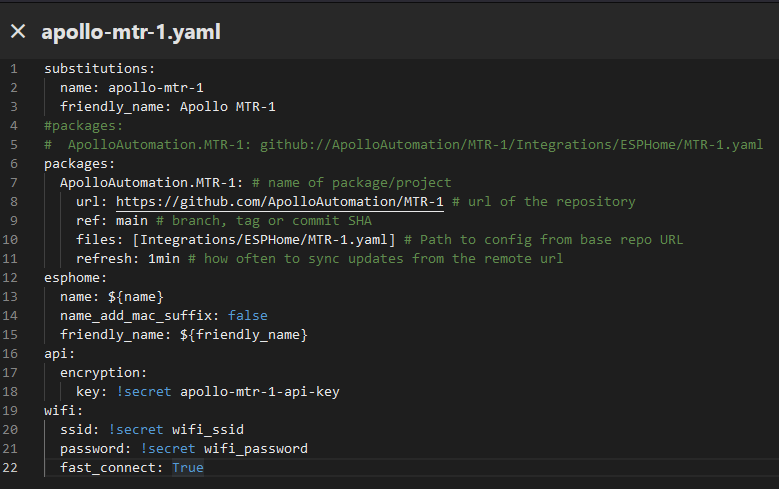
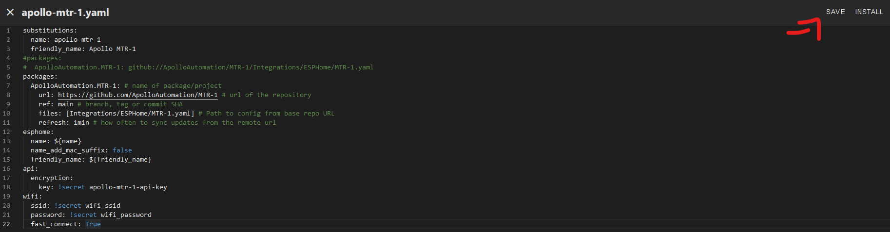
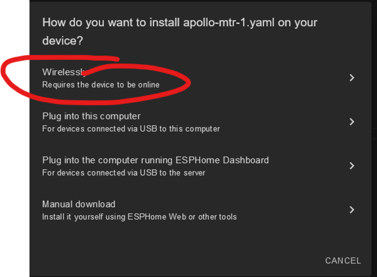
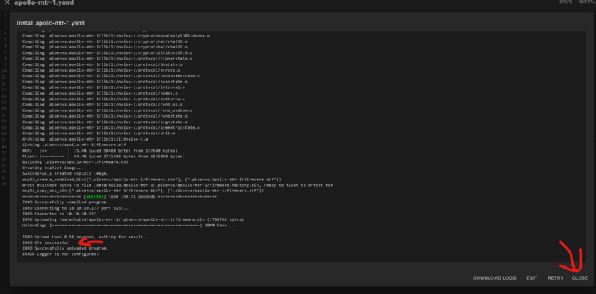

# Adding Apollo Devices To Hidden Networks

1\. Open the Esphome Device Builder.


2\. If you do not have it installed, [go here](https://esphome.io/guides/getting_started_hassio.html#installing-esphome-device-compiler "Install Esphome Device Builder.") and then move on to step 3.

3\. Click "Edit" as shown below.


4\. Copy the code inside the codeblock below.

```yaml
  fast_connect: True
```

5\. Paste the code as shown below directly below the yaml you just edited above. Make sure the spaces look the same and there are no red lines under any of the code.



6 Click save then Install in the top right.



7\. Click "Wirelessly" and let it finish compiling then installing.



8\. When you see this "OTA Successful" it has finished and you can click "Close" in the bottom right.



9\. You are finished and your Apollo device is now able to connect to your Wi-Fi with a hidden SSID! Make sure you understand the downsides as [mentioned here](https://esphome.io/components/wifi.html "downsides of fast_connect: true").<br><br>**fast\_connect** (*Optional*, boolean): If enabled, directly connects to WiFi network without doing a full scan first. This is required for hidden networks and can significantly improve connection times. Defaults to `off`. The downside is that this option connects to the first network the ESP sees, even if that network is very far away and better ones are available.