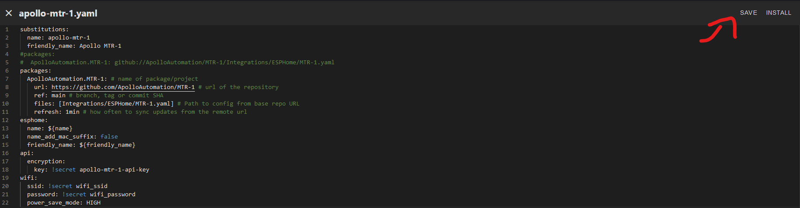
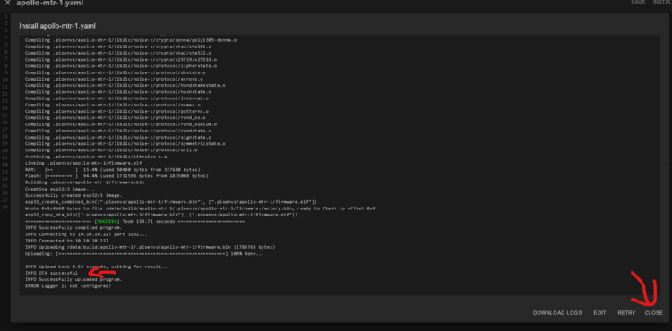

# Adjusting Wifi Power Save

The ESP chips produce a significant amount of energy (heat) constantly using Wi-Fi. This guide explains how to [adjust the wifi power save mode to high](https://esphome.io/components/wifi.html#power-save-mode) to combat this.

1\. Open the Esphome Device Builder.


2\. If you do not have it installed, [go here](https://esphome.io/guides/getting_started_hassio.html#installing-esphome-device-compiler "Install Esphome Device Builder.") and then move on to step 3.

3\. Click "Edit" as shown below.


4\. Copy the code inside the codeblock below.

```yaml
  power_save_mode: HIGH
```

5\. Paste the code as shown below - make sure the spaces look the same and there are no red lines under any of the code.


6\. Click save then Install in the top right.



7\. When you see this "OTA Successful" it has finished and you can click "Close" in the bottom right.



8\. You are finished and your Apollo device is now