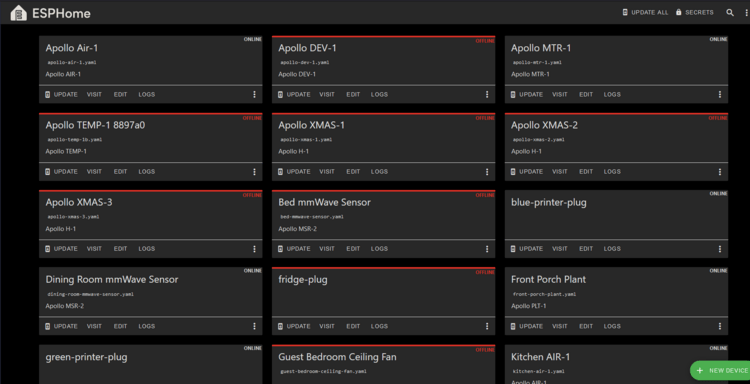
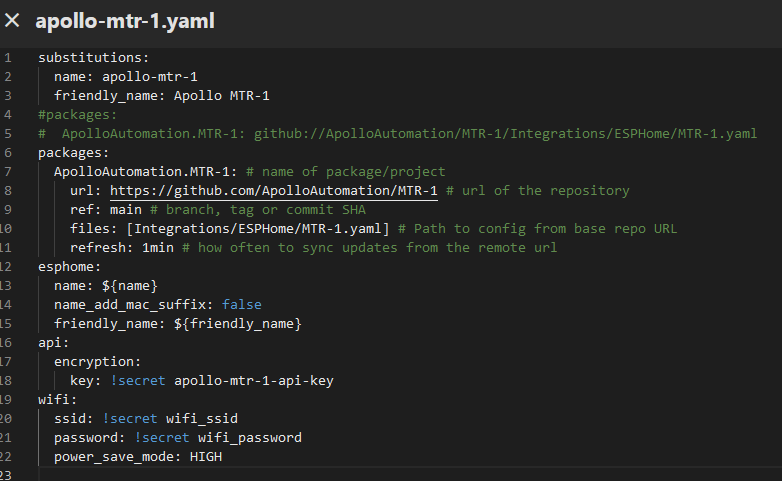
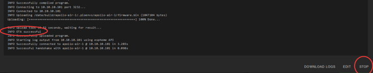

# Adjusting Wifi Power Save

The ESP chips produce a significant amount of energy (heat) constantly using Wi-Fi. This guide explains how to <a href="https://esphome.io/components/wifi.html#power-save-mode" target="_blank" rel="noreferrer nofollow noopener">adjust the wifi power save mode to high</a> to combat this.

!!! warning "This will negatively effect your Wi-Fi performance!"

    While some options *can* reduce the power usage of the ESP, they generally also decrease the reliability of the WiFi connection, with frequent disconnections from the router in the highest power saving mode.

1\. Open the ESPHome Device Builder.



2\. If you do not have it installed, [go here](https://esphome.io/guides/getting_started_hassio.html#installing-esphome-device-compiler "Install Esphome Device Builder.") and then move on to step 3.

3\. Click "Edit" as shown below.


4\. Copy the code inside the codeblock below.

```yaml
  power_save_mode: HIGH
```

5\. Paste the code as shown below - make sure the spaces look the same and there are no red lines under any of the code.



6\. In the top right of the same screen click "SAVE" and then "INSTALL".


7\. Once you see "INFO OTA successful" you are done. Click "STOP" to exit.



8\. You are finished and your Apollo device now has power\_save\_mode set to high!