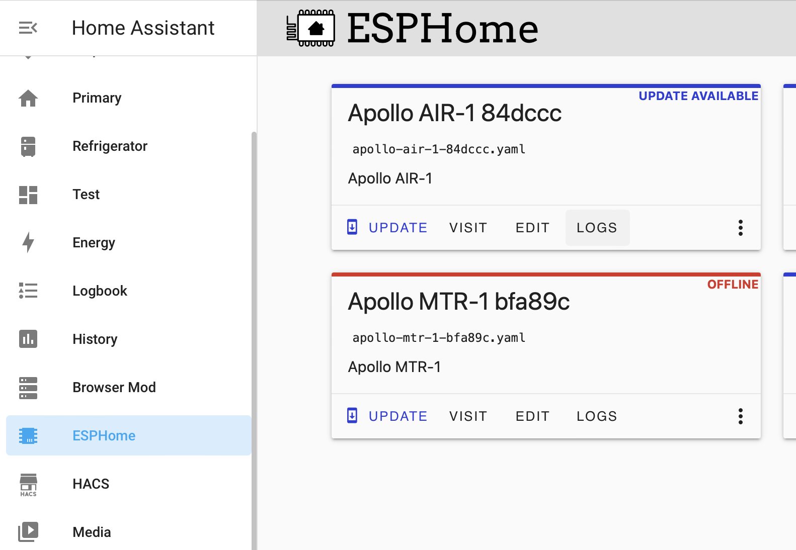
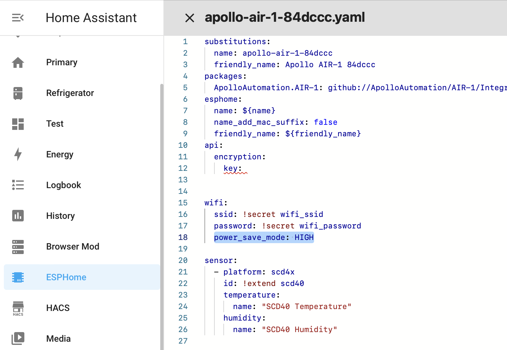

# Adjusting Wifi Power Save

The ESP chips produce a significant amount of energy constantly using wifi. Here is how to adjust the wifi power save mode

1. In ESPHome's addon, click on "Edit" for the sensor you want to adjust 
    1. 
2. Add the code to adjust the power 
    1. ```
        wifi:
          ssid: !secret wifi_ssid
          password: !secret wifi_password
          power_save_mode: HIGH
        ```
    2. 
3. In the top right, click on "Save" then "Install"