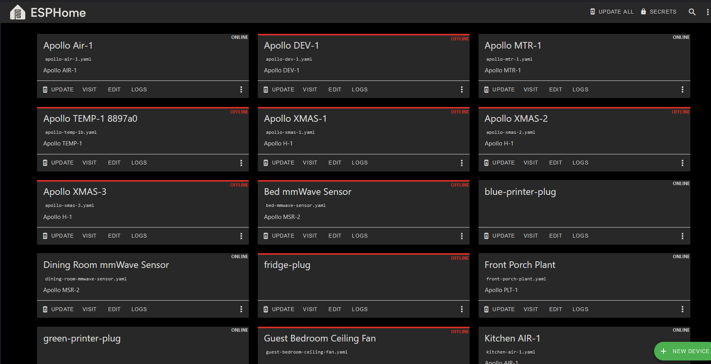
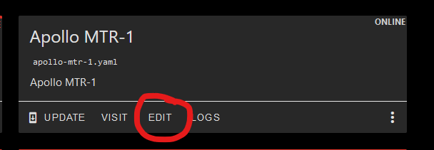
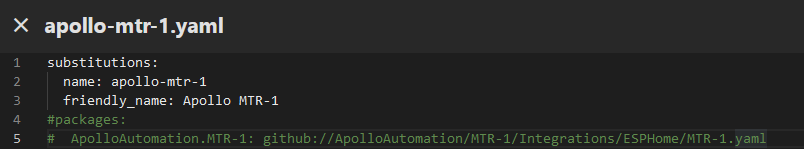
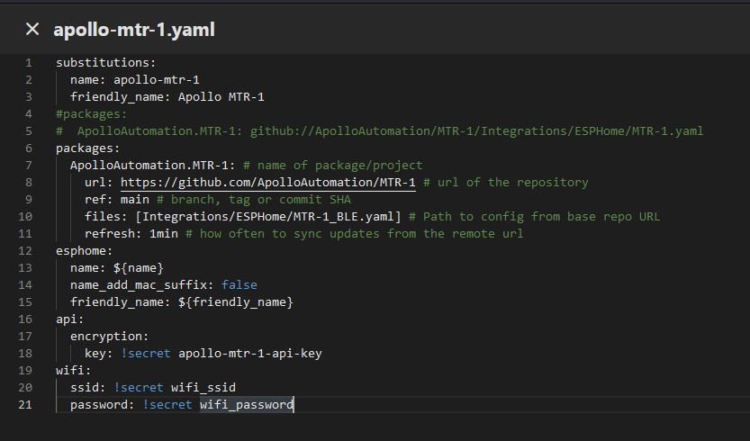
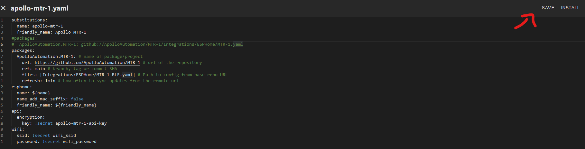
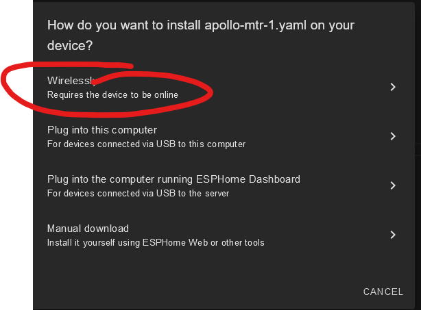
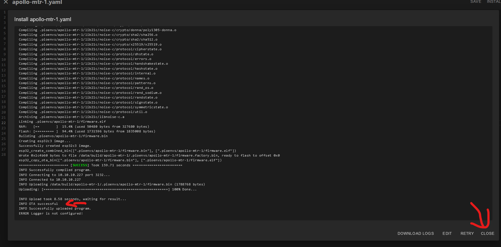
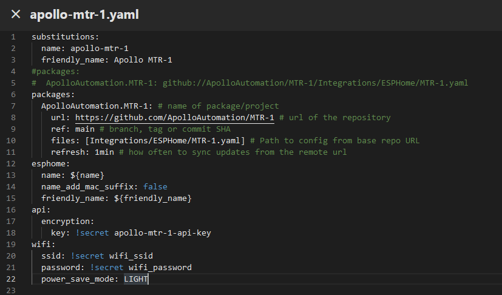
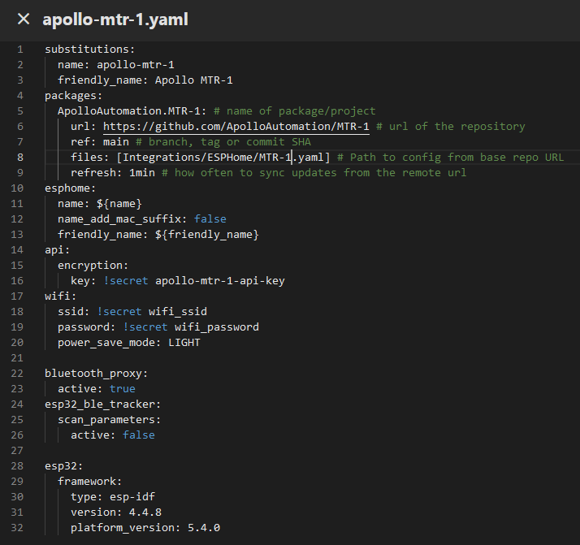
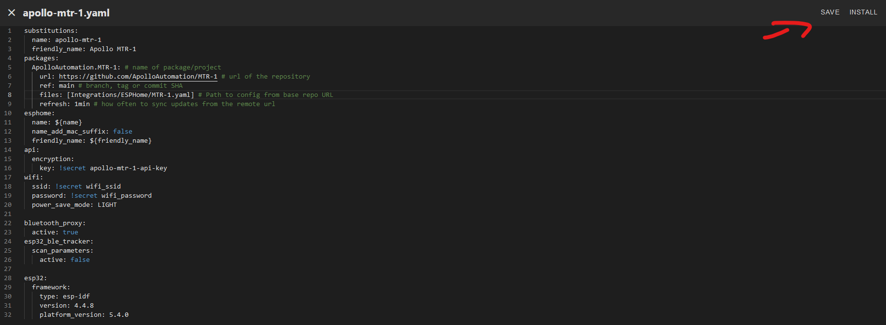

# Bluetooth Proxy

This guide shows you how to make your Apollo device act as a "BLE Proxy" which lets Bluetooth devices talk back to home assistant using Apollo devices as the "next hop"!

#### Method 1: Switch to \_BLE.yaml fork

1\. Open the Esphome Device Builder.



2\. If you do not have it installed, [go here](https://esphome.io/guides/getting_started_hassio.html#installing-esphome-device-compiler "Install Esphome Device Builder.") and then move on to step 3.

3\. Click "Edit" as shown below.



4\. Add a \# before the packages line and the line after it as shown in the image below.



5\. Copy the code inside the codeblock below.

```yaml
packages:
  ApolloAutomation.MTR-1: # name of package/project
    url: https://github.com/ApolloAutomation/MTR-1 # url of the repository
    ref: main # branch, tag or commit SHA
    files: [Integrations/ESPHome/MTR-1_BLE.yaml] # Path to config from base repo URL
    refresh: 1min # how often to sync updates from the remote url
```

!!! success "Replace MTR-1 in all three areas of the code you copied above with MSR-2, AIR-1 etc."

    Scroll down and follow method \#2, or manually replace "MTR-1" with "MSR-2", "AIR-1", or whichever sensor you're using in each instance.

6\. Paste the code as shown below directly below the yaml you just edited above. Make sure the spaces look the same and there are no red lines under any of the code.



7\. Click save then Install in the top right.



8\. Click "Wirelessly" and let it finish compiling then installing.



9\. When you see this "OTA Successful" it has finished and you can click "Close" in the bottom right.



10\. You are finished and your Apollo device is now acting as a Bluetooth Proxy!

---

#### Method 2: Manually enter the BLE proxy yaml

1\. Open the Esphome Device Builder.


2\. If you do not have it installed, [go here](https://esphome.io/guides/getting_started_hassio.html#installing-esphome-device-compiler "Install Esphome Device Builder.") and then move on to step 3.

3\. Click "Edit" as shown below.


4\. Copy the code inside the codeblock below.

```yaml
  power_save_mode: LIGHT
```

5\. Paste the code as shown below - make sure the spaces look the same and there are no red lines under any of the code.<br>

6\. Copy the code inside the codeblock below.

```yaml
bluetooth_proxy:
  active: true
esp32_ble_tracker:
  scan_parameters:
    active: false
```

7\. Paste the code on a new line at the very bottom of the file as shown below.



8\. Click save then Install in the top right.



8\. Click "Wirelessly" and let it finish compiling then installing.


9\. When you see this "OTA Successful" it has finished and you can click "Close" in the bottom right.


10\. You are finished and your Apollo device is now acting as a Bluetooth Proxy!