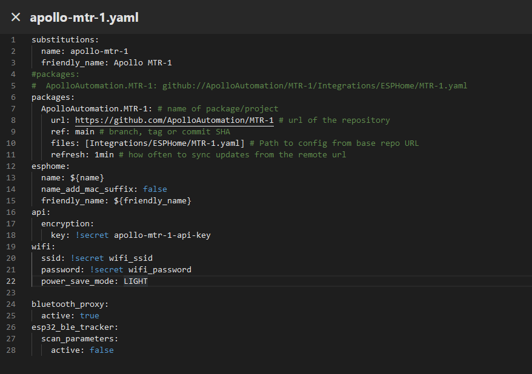
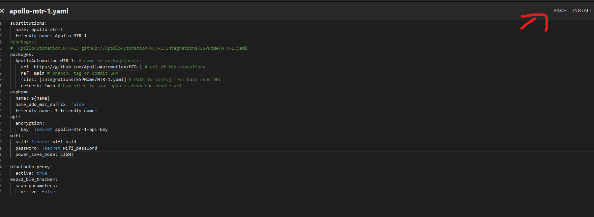

# Bluetooth Proxy

This guide shows you how to make your Apollo device act as a "BLE Proxy" which lets Bluetooth devices talk back to home assistant using Apollo devices as the "next hop"!

1\. Open the Esphome Compiler (previously called the esphome dashboard.


2\. If you do not have it installed, [go here](https://esphome.io/guides/getting_started_hassio.html#installing-esphome-device-compiler "Install ESPHome Device Compiler") and then move on to step 3.

3\. Click "Edit" as shown below.


4\. Copy the code inside the codeblock below.

```yaml
  power_save_mode: LIGHT
```

5\. Paste the code as shown below - make sure the spaces look the same and there are no red lines under any of the code.<br>

6\. Copy the code inside the codeblock below.

```yaml
bluetooth_proxy:
  active: true
esp32_ble_tracker:
  scan_parameters:
    active: false
```

7\. Paste the code on a new line at the very bottom of the file as shown below.



8\. Click save then Install in the top right.



8\. Click "Wirelessly" and let it finish compiling then installing.


9\. When you see this "OTA Successful" it has finished and you can click "Close" in the bottom right.


10\. You are finished and your Apollo device is now acting as a Bluetooth Proxy!