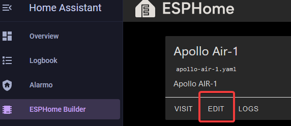
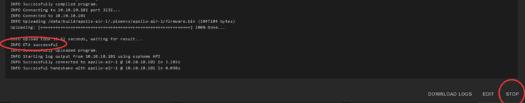

# How To Change The Update Frequency Of Sensors

1\. Select the ESPHome Builder in the sidebar then click "EDIT" on the device you want to change.



2\. Insert the YAML for the sensor you want to edit(The example below is for our AIR-1 SEN55 sensor).

```yaml
sensor:
  - platform: sen5x
    id: !extend sen55
    update_interval: 5s
```

!!! tip "You might also want to add force_update: true to make your sensor show the frequent updates in the gui."

    **force\_update** (*Optional*, boolean): If true, this option will force the frontend (usually Home Assistant) to create a state changed event when the sensor updates even if the value stayed the same. Some applications like Grafana require this when working with Home Assistant, but beware it can significantly increase the database size. Defaults to `false`.

3\. In the top right of the same screen click "SAVE" and then "INSTALL".

4\. Once you see "INFO OTA successful" you are done. Click "STOP" to exit.

