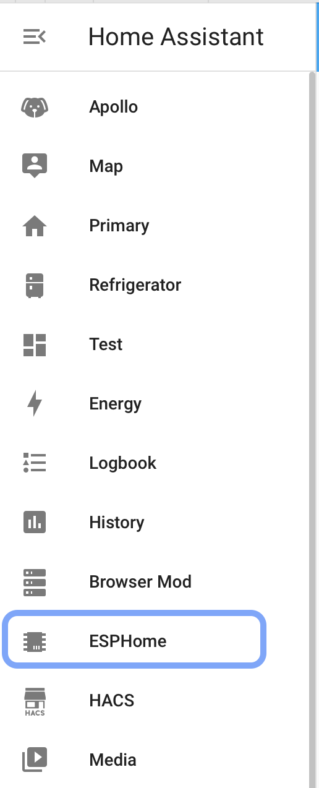
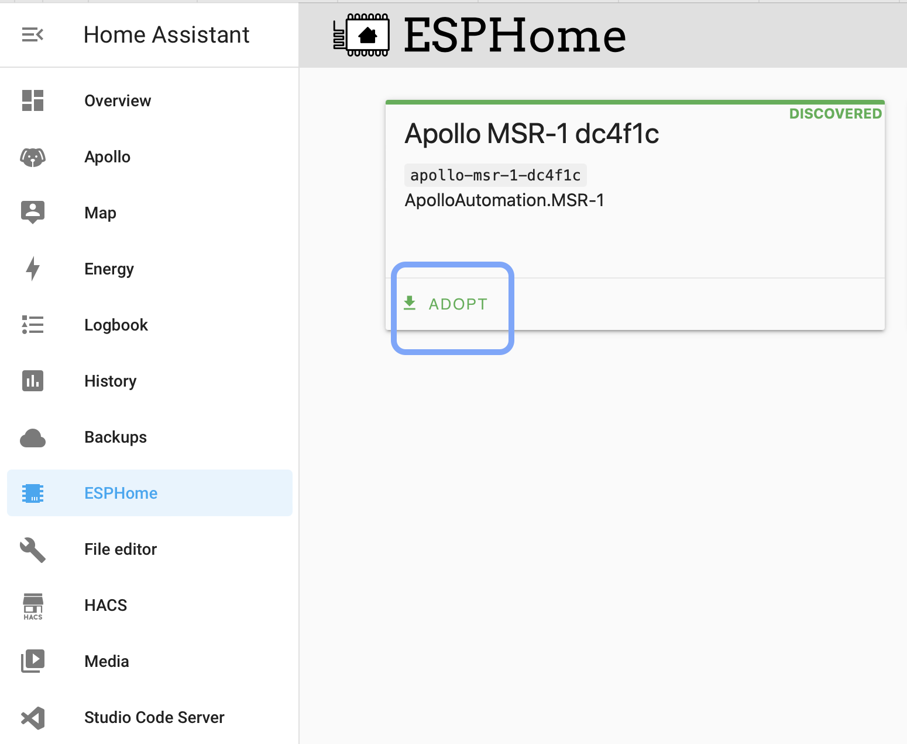
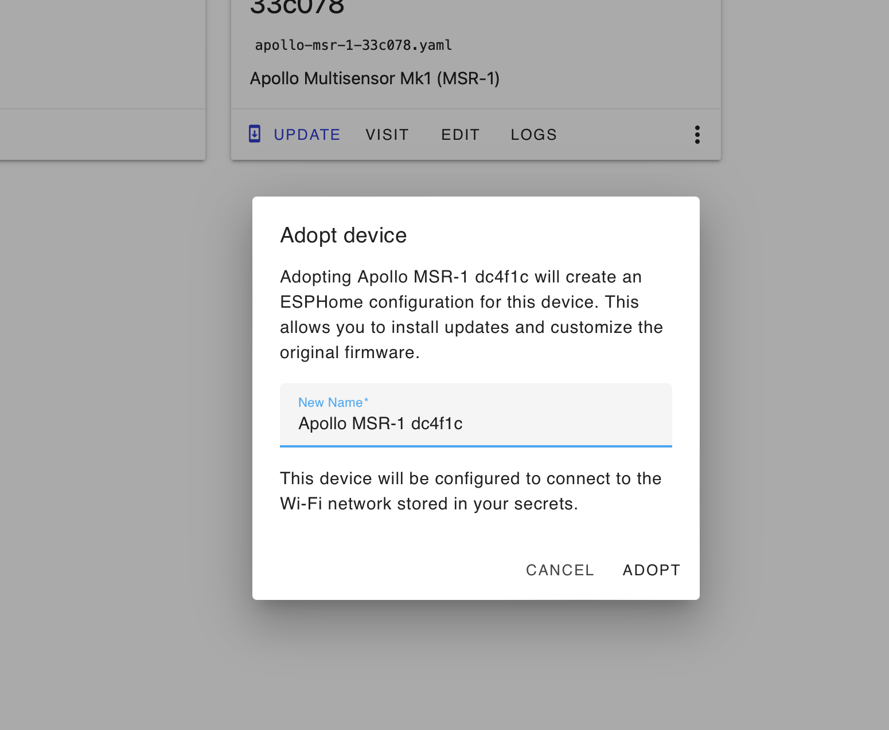
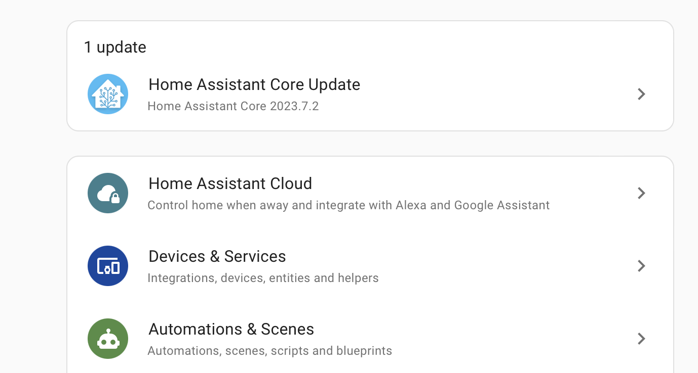
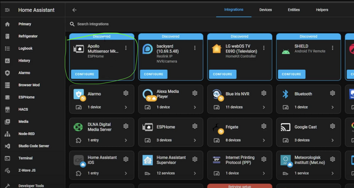
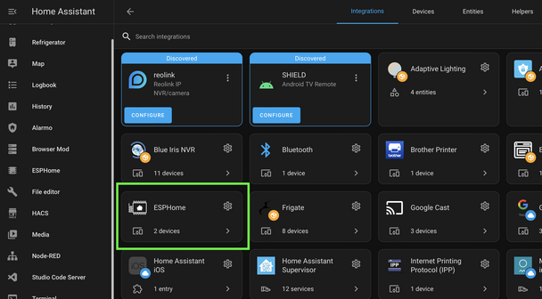
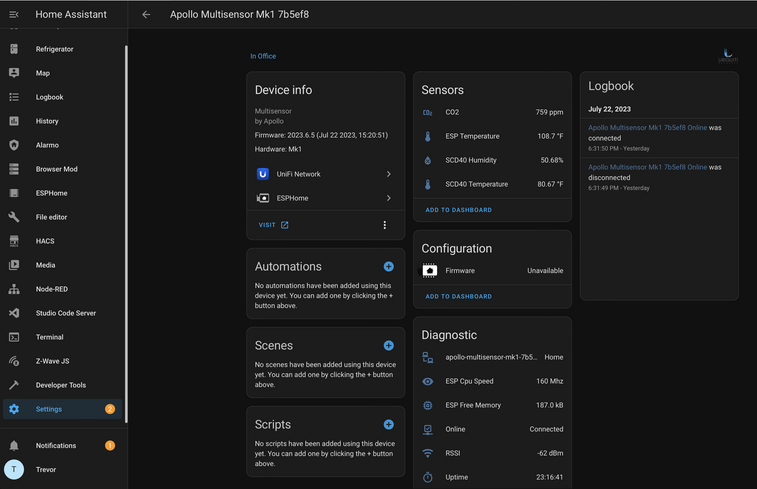

# Getting Started

This will walk you through the process of connecting your new Apollo Automation sensor to Home Assistant through ESPHome. If at any point you get stuck, join our [Discord](https://discord.gg/mMNgQPyF94) for some help.

### Connecting Through Hotspot

To connect through the sensor's onboard hotspot follow the below:

1. Plug the sensor into a quality power brick. They require 5v and under an amp so most phone chargers will be fine. ESP devices are sensitive to power fluctuations and users have had some issues with really cheap power bricks. If your device is restarting or unavailable please try a different power brick.
2. On your phone or PC, open the wifi settings and connect to "Apollo MSR-1 Hotspot", it might take a minute for the wifi network to show up
3. Once connected it should automatically open a dashboard for your sensor 
    - If this does not automatically open the dashboard, please open your web browser and go to [http://192.168.4.1](http://192.168.4.1)
4. Select the wifi network that you would like your sensor to connect to
5. Input the wifi password. After connecting, the sensor's dashboard will automatically close. You've successfully connected your sensor, please check out the "Connecting Sensor To Home Assistant" section for the next steps.

### Connecting To ESPHome Addon

You can connect to the ESPHome addon in Home Assistant to easily update your device. If you don't have ESPHome addon installed you can follow the steps here: [Installing ESPHome Dashboard](https://esphome.io/guides/getting_started_hassio.html)

Make sure to fill out your Wi-Fi details in the SECRETS section by clicking on the SECRETS Image below.


```yaml
# Your Wi-Fi SSID and password - keep the quotes and just replace the name and password between the quotes!
wifi_ssid: "your-wifi-ssid-here"
wifi_password: "your-wifi-pass-here"
```

1. 1. Once installed you'll have the addon's icon on the left side of your HA instance: 
        1. 
        2. Click on adopt for your sensor
        3. Then adopt again
    
    
    
    ### Connecting Sensor To Home Assistant
    
    
    1. **Once you connect your sensor to wifi through the above process, open up Home Assistant. Then in the bottom left click on “Settings”**
    
    
    
    
    2. **From there click on “Devices And Services”**
    
    
    
    
    3. **Look for the discovered sensor. It should be named “apollo-msr-mk1” with some random letters and numbers (Those come from the device's mac address). Click on “Configure” and then “Submit”.**
        
        
        1. **If you do not see the device as discovered, make sure you have the ESPHome integration installed to Home Assistant you can find [their instructions here](https://esphome.io/guides/getting_started_hassio.html#connecting-your-device-to-home-assistant)**
    
    
    
    
    4. **Add the sensor to ESPHome. It will now show up in the ESPHome integration**
    
    
    
    
    5. **The sensor has now been added to Home Assistant and you can use it as you please. For ideas please visit our ideas section or join our [Discord](https://discord.gg/mMNgQPyF94)**
    
    
    
    #### 6. Next steps:
    
    #####   
    Head on over to the CO2 Calibration page [https://wiki.apolloautomation.com/books/general/page/co2-calibration](https://wiki.apolloautomation.com/books/general/page/co2-calibration) to calibrate your new sensor.
    
    ##### Note: This is not necessary if you did not purchase the CO2 sensor addon!  
    
    
    ### Sensors
    
    You should now have the sensor added! If you have any problems or need help please join our [Discord](https://discord.gg/mMNgQPyF94) and post in the #support channel. Or just join to check out product development and community spotlights. Our team monitors that and can quickly respond there. Or visit our [ideas section](https://wiki.apolloautomation.cloud/Ideas/MultisensorMk1) to find cool ways to display the information
    
    ### Looking For Ideas On How To Use Your Sensor?
    
    
    - Graph Co2 Over Time
    - Turn The LED Red When C02 Is Over 1000 ppm
    - Send You An Alert When Motion Is Detected After 11 pm
    
    Or check out our #show-off channel in the Apollo [Discord](https://discord.gg/mMNgQPyF94) for community submissions