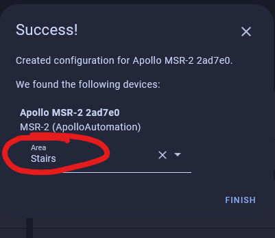

# Getting Started

This will walk you through the process of connecting your new Apollo Automation sensor to Home Assistant through ESPHome. If at any point you get stuck, join our [Discord](https://dsc.gg/apolloautomation) for some help.

### Connecting Through Hotspot

To connect through the sensor's onboard hotspot follow the below:

1. Plug the sensor into a quality power brick. They require 5v and under an amp so most phone chargers will be fine. ESP devices are sensitive to power fluctuations and users have had some issues with really cheap power bricks. If your device is restarting or unavailable please try a different power brick.
2. On your phone or PC, open the WiFi settings and connect to "Apollo MSR-2 Hotspot", it might take a minute for the WiFi network to show up.

   

3. Once connected it should automatically open a dashboard for your sensor

   If this does not automatically open the dashboard, please open your web browser and go to [http://192.168.4.1](http://192.168.4.1)

   

4. Select the WiFi network that you would like your sensor to connect to.
5. Input the WiFi password. After connecting, the sensor's dashboard will automatically close. You've successfully connected your sensor, please check out the "Connecting Sensor To Home Assistant" section for the next steps.

   

### Connecting To ESPHome Device Compiler (previously ESPHome Addon)

Note: You can skip the esphome device compiler completely if you do not want to rename your sensor or make edits to the yaml. [Please Skip to the next part by clicking here!](https://wiki.apolloautomation.com/products/general/setup/getting-started/#connecting-to-home-assistant-via-esphome-integration)

You can add the ESPHome Device Compiler addon in Home Assistant to easily update your device or edit the yaml. If you don't have ESPHome Device Compiler addon installed you can follow the steps here: <a href="https://esphome.io/guides/getting_started_hassio.html#installing-esphome-device-compiler" target="_blank" rel="noopener">Installing The ESPHome Device Compiler.</a>

Make sure to fill out your Wi-Fi details in the SECRETS section by clicking on the SECRETS Image below.


```yaml
# Your Wi-Fi SSID and password - keep the quotes and just replace the name and password between the quotes!
wifi_ssid: "your-wifi-ssid-here"
wifi_password: "your-wifi-pass-here"
```

1\.


1. &nbsp;
2. Once installed you'll have the addon's name in your sidebar.
   1. 1. 
      2. Click on adopt for your sensor
      3. Then adopt again

   

### Connecting to Home Assistant via ESPHome Integration:

1\. Click the "Notification" Icon in the bottom left.


2\. Click "check it out" to go to the integrations page and see the new device that was found.


3\. Click "ADD" to begin adding the device to home assistant.


4\. Click "SUBMIT" to confirm you want to add your new Apollo device to home assistant.


5\. Give it an area and click "FINISH".

