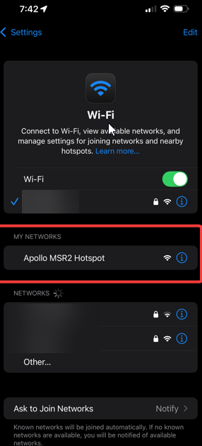

# Getting Started

This will walk you through the process of connecting your new Apollo Automation sensor to Home Assistant through ESPHome. If at any point you get stuck, join our <a href="https://dsc.gg/apolloautomation" target="_blank" rel="noopener">Discord</a> for some help.

### Connecting Through Hotspot

To connect through the sensor's onboard hotspot follow the below:

1\. Plug the sensor into a quality power brick. They require 5v and under an amp so most phone chargers will be fine. ESP devices are sensitive to power fluctuations and users have had some issues with really cheap power bricks. If your device is restarting or unavailable please try a different power brick.

2\. On your phone or PC, open the WiFi settings and connect to "Apollo MSR-2 Hotspot", it might take a minute for the WiFi network to show up.



3\. Once connected it should automatically open a dashboard for your sensor

If this does not automatically open the dashboard, please open your web browser and go to [http://192.168.4.1](http://192.168.4.1)

4\. Select the WiFi network that you would like your sensor to connect to or scroll to the bottom and type in your Wi-Fi network then click "**Save**".


!!! tip "Tip for Mesh Wi-Fi systems or multiple Access Points"

    If you have multiple access points or a mesh system please manually type in your Wi-Fi network so it will join with the strongest signal!

5\. Once connected, the sensor's dashboard will automatically close. You've successfully connected your sensor to your Wi-Fi.

[Click here for next steps!](https://wiki.apolloautomation.com/products/general/setup/getting-started/#connecting-to-home-assistant-via-esphome-integration){                         .md-button .md-button--primary }

### Connecting with <a href="https://www.home-assistant.io/integrations/improv_ble" target="_blank" rel="noopener">Improv via BLE</a>

!!! note "Pre-requirement:"

    Bluetooth built in such as a raspberry pi or at least one ESP32 BLE Proxy. If you have already followed the "Connecting through Hotspot" please skip this section.

1\. Navigate to settings -&gt; integrations then click the "**ADD**" button below your new Apollo device!


2\. Click submit when it asks if you want to setup your new device and shows you a MAC address.


3\. Type in your Wi-Fi name and password in the two fields.


4\. Wait for it to finish, you will see the image below while it connects.


5\. <a href="https://my.home-assistant.io/redirect/config_flow_start?domain=esphome" target="_blank" rel="noopener">Click the link shown in the image below</a> (do not click close).


6\. When successful, you will see this image appear!


### Connecting To ESPHome Device Builder

!!! tip "Skip the ESPHome Device Builder unless..."

    Feel free to [skip to the next section by clicking here](https://wiki.apolloautomation.com/products/general/setup/getting-started/#connecting-to-home-assistant-via-esphome-integration "Click to jump to the ESPHome Integration steps!")unless you need to rename your sensor or do manual edits to the yaml

You can add the ESPHome Device Builder addon in Home Assistant to easily update your device or edit the yaml. If you don't have ESPHome Device Builder addon installed you can [follow the steps here](https://esphome.io/guides/getting_started_hassio.html#installing-esphome-device-compiler "Getting Started guide for installing ESPHome Device Builder").

Make sure to fill out your Wi-Fi details in the SECRETS section by clicking on the SECRETS Image below.


```yaml
# Your Wi-Fi SSID and password - keep the quotes and just replace the name and password between the quotes!
wifi_ssid: "your-wifi-ssid-here"
wifi_password: "your-wifi-pass-here"
```

1\. Click the ESPHome Builder in your sidebar then click "**TAKE CONTROL**" for your new Apollo Device!


2\. Rename your sensor here (this only renames the sensor in the ESPHome Device Compiler's Dashboard) or skip it and continue on by clicking "**TAKE CONTROL**" again as shown below.


3\. Click "**INSTALL**" (DO NOT click skip!) and let your device get adopted into the ESPHome Device Builder. Please have patience as this takes a few minutes to compile and then install to your new Apollo device!


4\. Once you see "**INFO OTA successful**" you are done. Click "**STOP**" to exit.


5\. Your new device is now adopted into the ESPHome Device Builder and you can move on to Integrating with Home Assistant via the ESPHome Integration below!

### Connecting to Home Assistant via ESPHome Integration:

1\. Click the "**Notifications**" Icon in the bottom left.


2\. Click "**Check it out**" to go to the integrations page and see the new device that was found.


3\. Click "**ADD**" to begin adding the device to home assistant.


4\. Click "**SUBMIT**" to confirm you want to add your new Apollo device to home assistant.


5\. Give it an area and click "**FINISH**".


6\. Your device is now added to home assistant via the ESPHome integration, and you can easily navigate to it by going to settings -&gt; <a href="http://homeassistant.local:8123/config/integrations/integration/esphome" target="_blank" rel="noopener">ESPHome integration</a> -&gt; click on the name of your new device!

[Click here to join our Discord for fast support! :simple-discord:](https://dsc.gg/apolloautomation){                           .md-button .md-button--primary }