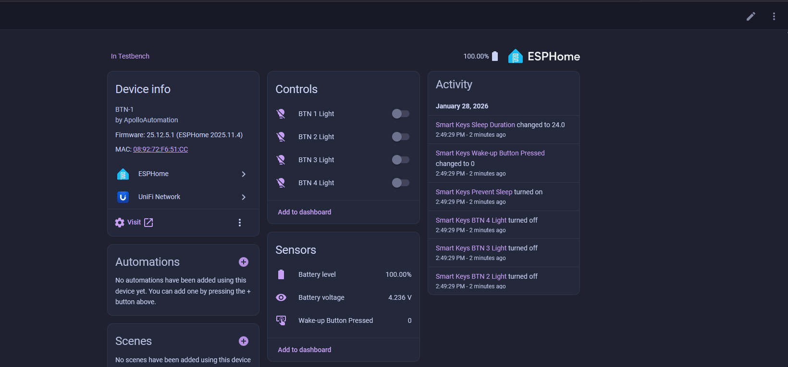

# Renaming Apollo Devices

##### ESPHome Integration - Part 1

1\. Head to the <a href="http://homeassistant.local:8123/config/integrations/integration/esphome" title="Click me to go to the ESPHome integrations page" target="_blank" rel="noreferrer nofollow noopener">ESPHome Integrations page</a>.

2\. On the device you would like to rename, click the pencil icon and enter in a new name then click **Update** and finally click the name you just created.

3\. Click the 3 dots in the top right and select **Recreate Entity IDs** then select **Update**.

!!! success "It's okay if there are some entities that cannot be regenerated!"

    You will likely run into a popup showning that 2 entity IDs cannot be regenerated because they are not available. This is fine, we can manually fix these later or just ignore them as they are disabled entities and not expected to be used.

4\. Scroll down to the Diagnostic section and click on **\+2 disabled entities**. Select each entity and replace the old name with the new name. Make sure to replace spaces with underscores as shown in the gif below!

##### ESPHome Integration - Part 2

This section only changes the device name shown in the ESPHome integration page. It is safe to skip, but we recommend doing it to keep naming consistent.

1\. Head to the <a href="http://homeassistant.local:8123/config/integrations/integration/esphome" title="Click me to go to the ESPHome integrations page" target="_blank" rel="noreferrer nofollow noopener">ESPHome Integrations page</a>.

2\. On the device you would like to rename, click the 3 dots icon and select **Rename** and type in your new name then click **OK**.

!!! success "The next section is not necessary unless you use ESPHome Device Builder!"

    The next section is for ESPHome device builder which is for tinkerers and advanced users to take control of their device and edit the yaml. Please skip the next section if you do not use ESPHome Device Builder!

##### ESPHome Device Builder

1\. Make sure you are already using the ESPHome Device Builder app as <a href="https://wiki.apolloautomation.com/products/general/setup/getting-started/#connecting-to-esphome-device-builder" target="_blank" rel="noreferrer nofollow noopener">gone over in the getting started wiki articles</a>.

2\.