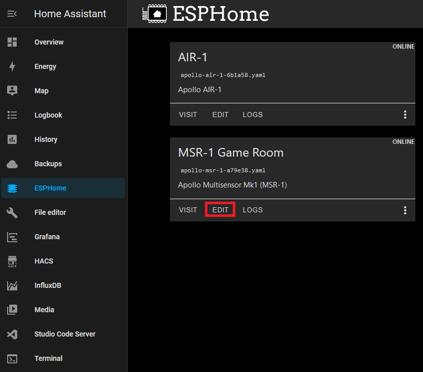
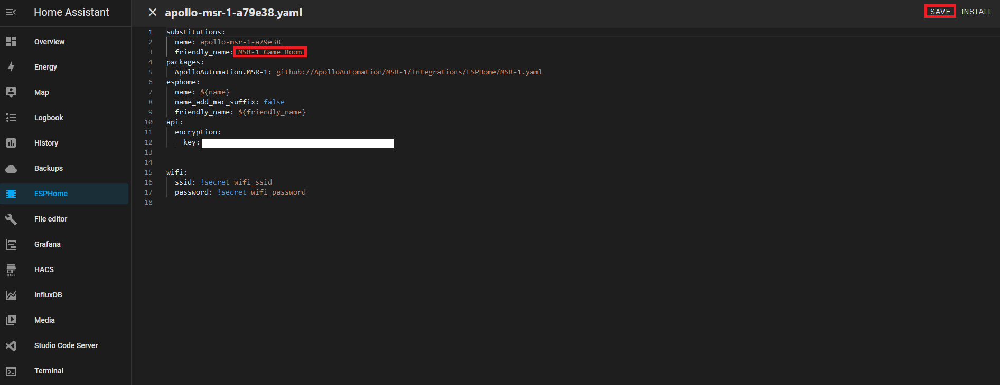

# Renaming Apollo Devices

##### ESPHome Integration - Part 1

1\. Head to the <a href="http://homeassistant.local:8123/config/integrations/integration/esphome" title="Click me to go to the ESPHome integrations page" target="_blank" rel="noreferrer nofollow noopener">ESPHome Integrations page</a>.

2\. Click the 3 dots then "Rename" as shown in the image below.

3\. Give it a new name such as "Kitchen mmWave Sensor" and click "OK".

##### ESPHome Integration Part 2

1\. Click "device" as shown in the image below.

2\. Click the pencil in the top right then repeat your new name here such as "Kitchen mmWave Sensor" and click "UPDATE".

\:fontawesome-solid-pencil:

##### ESPHome Addon

1\. Select the ESPHome addon in the sidebar

2\. Select Edit on the device you want to rename

3\. Change the friendly\_name and save it

These new names can be used in automations.