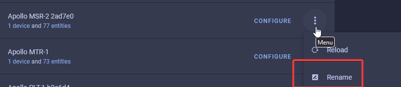
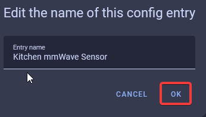
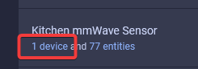
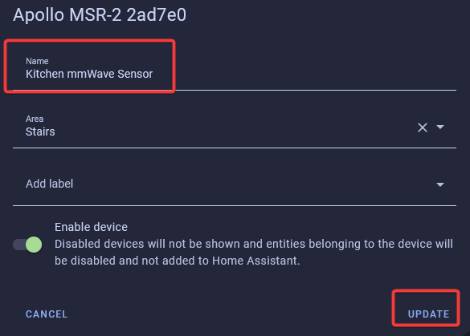
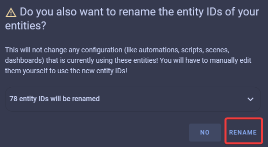
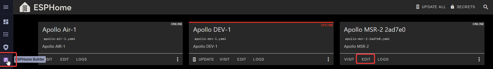
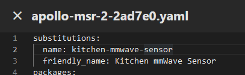
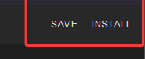

# Renaming Apollo Devices

##### ESPHome Integration - Part 1

1\. Head to the <a href="http://homeassistant.local:8123/config/integrations/integration/esphome" title="Click me to go to the ESPHome integrations page" target="_blank" rel="noreferrer nofollow noopener">ESPHome Integrations page</a>.

2\. Click the 3 dots then "Rename" as shown in the image below.

3\. Give it a new name such as "Kitchen mmWave Sensor" and click "OK".

##### ESPHome Integration - Part 2

1\. Head to the <a href="http://homeassistant.local:8123/config/integrations/integration/esphome" title="Click me to go to the ESPHome integrations page" target="_blank" rel="noreferrer nofollow noopener">ESPHome Integrations page</a>.

2\. Click "device" as shown in the image below.

3\. Click the pencil in the top right then repeat your new name here such as "Kitchen mmWave Sensor" and click "UPDATE".

4\. Click "RENAME" and it will update all of your entities to use the updated name!

##### ESPHome Addon

1\. Select the ESPHome Builder in the sidebar then click "EDIT" on the device you want to rename.

!!! danger "This is code and requires you to follow the directions carefully."

    Editing the YAML here means even a space matters. Follow the guide just as shown and ask questions if you need help!

2\. Change the "name" to "kitchen-mmwave-sensor" or similar. Do not use any spaces or caps here, only numbers, letters, and hypens. This will be your new hostname i.e. kitchen-mmwave-sensor.local.

3\. Change the "friendly\_name" to "Kitchen mmWave Sensor" or similar. This will be the name used in Home Assistant for your Device and your entities unless you override it in the ESPHome Integration.

4\. Click "SAVE" then "INSTALL" in the top right.

